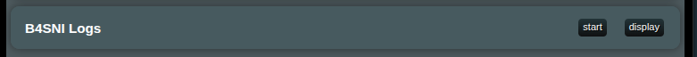

# B4SNI Logs - SNI Traffic Monitor

## What is B4SNI Logs?

B4SNI Logs is a network monitoring feature in `XRAYUI` that captures and displays `Server Name Indication` (SNI) information from your network traffic. SNI is the hostname that devices request when making HTTPS connections, allowing you to see which websites and services are being accessed through your network.

## How to Use

### Starting the Monitor

1. Navigate to the **B4SNI Logs** section in your `XRAYUI` interface (very bottom of the main screen)
   
2. Click the **start** button to begin capturing SNI data
3. The button will change to **Stop** when the service is running

### Viewing Logs

1. Click the **display** button to open the log viewer
2. Logs will automatically refresh every 3 seconds while the window is open

### View Modes

The log viewer provides three different tabs to analyze your traffic:

#### By Device

Groups all captured domains by the LAN device that accessed them. Each device appears as a collapsible card showing:

- Device name (or IP address if unrecognized) and total hit count
- A table of all domains accessed by that device
- Per-domain hit count, protocol badges, and last seen time
- **+ Rule** button on each domain row to quickly add it to a routing rule

Cards are sorted by total hits, so the most active devices appear first.

#### By Domain

An aggregated table showing all captured domains across all devices, sorted by hit count:

| Column | Description |
| --- | --- |
| Domain | The SNI domain name |
| Hits | Total number of connections to this domain |
| Protocols | `TCP` (blue) and/or `UDP` (yellow) badges |
| Devices | Tags showing which devices accessed this domain |
| Last Seen | Timestamp of the most recent connection |
| Action | **+ Rule** button to add the domain to a routing rule |

Use the search box to filter domains by name.

#### Live Stream

The real-time log view showing individual connection events in reverse chronological order. Each entry shows:

| Field | Description |
| --- | --- |
| Time | When the connection was made (HH:MM:SS format) |
| Protocol | Either `TCP` (blue badge) or `UDP` (yellow badge) |
| Source | The device making the connection — shows device name if recognized, otherwise IP address, plus the port number |
| Destination | The server being connected to (IP:port) |
| SNI | The domain name being accessed (e.g., google.com, netflix.com) |

Use the per-column search boxes to filter by Protocol, Source, Destination, or SNI.

### Statistics Bar

At the top of the log viewer, you'll see:

- **Total**: Total number of connections logged
- **TCP/UDP**: Breakdown by protocol type
- **Unique SNI**: Number of different domains accessed
- **Top Domain**: The most frequently accessed domain and its hit count
- **Most Active Device**: The device with the most connections

### Adding Domains to Routing Rules

You can add domains directly from SNI logs to your Xray routing rules without leaving the log viewer:

1. Click the **+ Rule** button next to any domain
2. A popover will appear listing your existing routing rules
3. Select an existing rule to add the domain to, **or** choose **New rule** and provide a rule name and outbound tag
4. Click **Confirm** to add the domain

#### Bulk Selection

In the **By Device** and **By Domain** views, you can select multiple domains at once:

- Use the checkbox next to each domain to select it individually
- In **By Device** view, use the device-level checkbox to select all domains for a device
- In **By Domain** view, use the top checkbox to select all visible domains
- When domains are selected, a bulk action bar appears — click **Add selected to rule** to add them all at once

### Managing Logs

- **Clear Logs**: Click to remove all captured logs and start fresh
- **Export CSV**: Download the current view as a spreadsheet file. The exported columns depend on the active tab:
  - **Live Stream**: Time, Protocol, Source IP, Source Port, Device, Dest IP, Dest Port, SNI
  - **By Domain**: Domain, Hits, Protocols, Devices, First Seen, Last Seen
  - **By Device**: Device, IP, Domain, Hits, Protocols
- **Raw**: View the raw log file in a new browser tab

### Stopping the Monitor

Click the **stop** button when you're done monitoring to conserve system resources.

### Privacy Note

B4SNI Logs only captures the domain names (SNI), not the actual content of your internet traffic. It's like seeing the address on an envelope without opening the letter.

## Troubleshooting

### No Logs Appearing

- Make sure the service is started (`start` button clicked)
- Wait a few seconds for traffic to be captured
- Try refreshing the page
- Check if there's actual network activity

### Device Names Not Showing

- Device names only appear for recognized devices on your network
- New devices may take time to be identified
- Guest devices might only show IP addresses

### Service Won't Start

- Another monitoring service might be running
- Try stopping and starting again
- Refresh the XRAYUI interface

### Logs Growing Too Large

- The system automatically limits log file size and rotates logs
- Use "Clear Logs" periodically to start fresh
- Export important logs before clearing

## Frequently Asked Questions

**Q: Does this slow down my internet?**

A: No, B4SNI Logs operates passively and doesn't impact network performance.

**Q: Can I see what people are browsing?**
A: You can see domain names (like youtube.com) but not specific pages or content.

**Q: How long are logs kept?**

A: Logs are kept until you clear them or restart the service. The system automatically manages file size.

**Q: Can I monitor specific devices only?**

A: All traffic is monitored, but you can use the **By Device** tab to focus on a specific device, or use filters in **Live Stream** to view traffic from a particular source.

**Q: Can I add monitored domains to routing rules?**

A: Yes! Use the **+ Rule** button on any domain row, or select multiple domains and use bulk add. This lets you quickly build routing rules based on real traffic you observe.
