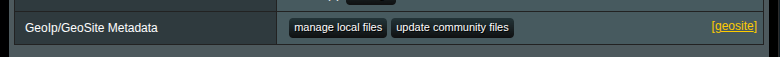
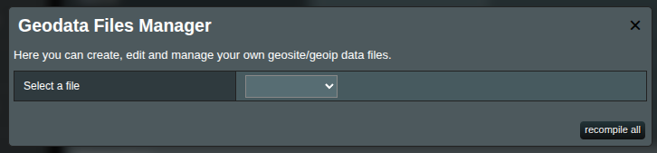
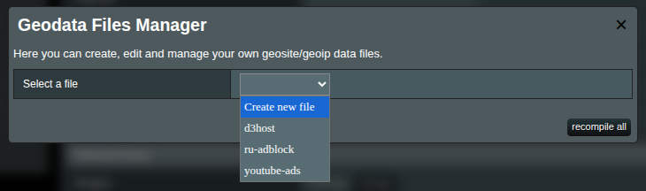
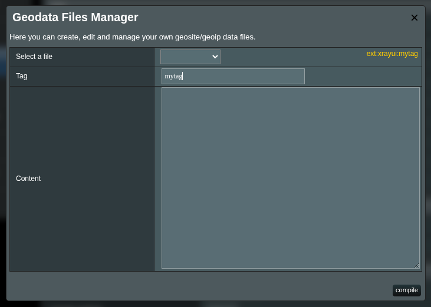
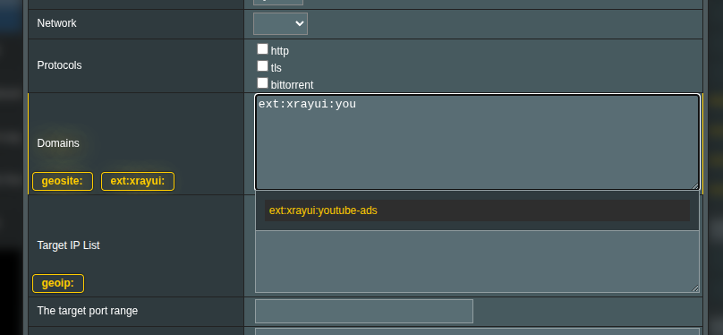

# Custom Geosite Files

Sometimes it is crucial to add many domains to the rules. Due to MerlinWRT firmware limitations, it is not possible to include large lists directly in the UI.

Instead, you can create custom geosite domain files and reference them with tags in your rules.


## What Are Geosite Files?

In **Xray**, geosite files are a way to group domains into reusable sets (known as _tags_).  
These tags can then be referenced inside your routing rules to decide how traffic should be handled (e.g., direct, proxy, block).

Geosite files are essentially collections of domain patterns. They support different match types:

- `domain:` – matches a domain and all its subdomains (e.g., `domain:google.com` matches `google.com` or subdomains e.g. `mail.google.com`).
- `full:` – matches the domain exactly (e.g., `full:github.com` matches only `github.com`).
- `regexp:` – matches domains using regular expressions (e.g., `regexp:.*\.gov`).
- `keyword:` – matches domains containing the keyword (e.g., `keyword:bank`).

Xray uses a prebuilt geosite database (`/opt/sbin/geosite.dat`) by default, but with XRAYUI you can extend this database by creating your own custom geosite files (stored inside `/opt/sbin/xrayui`).  
This gives you full control to group specific domains into custom tags for routing rules.

For example, you can create a custom group of streaming sites:

```text
domain:netflix.com
domain:hulu.com
domain:disneyplus.com
```

and then use the tag `ext:xrayui:streaming` inside your rules.

---

## General Information

There are two ways to add domains to the XRAYUI custom geosite file:

- Using the UI interface. However, Merlin Firmware still limits large domain lists (8000 characters limit per file).
- Creating a file directly on the router and recompiling the geosite data file from the UI (no limitation size).

---

## Interface Overview

In the `Routing` section, locate the **Geoip/GeoSite Metadata** row and click the **manage local files** button.  


A popup window will appear:  
  


- Select a file from the dropdown list to either create a new one or manage an existing file.
- Click the **recompile all** button to rebuild all existing files into a geosite file.

When you select a file (new or existing), additional options will appear:  


- Provide a common name (**tag**) for the group of domains you are listing.
- **Content** – add the domains you want included in the geosite file.  
  ::: tip domains
  You can apply standard geosite rules to your list (e.g., prefixes such as `domain:`, `regexp:`, `full:`).
  :::

Click the **compile** button to recompile the geosite file.

::: info
Note the yellow `ext:xrayui:xxxx` label in the top-right corner. This is the tag you will use in your rules. You can copy and paste it later.
:::

---

## Updating Domains Directly

If you have a very large domain list, you cannot upload it through the web interface due to MerlinWRT firmware limitations.  
However, you can still add it manually.

1. Create a file without an extension (for example: `mydomains`).
2. Upload this file to the `/opt/share/xrayui/data` directory.

Next, go to **manage local files** in the `Routing` section:  


Click the **recompile all** button. This recompiles all files inside `/opt/share/xrayui/data` without needing to edit them in the UI.

Finally, use the tag `ext:xrayui:mydomains` in your rules as usual.

---

## Example Usage in Xray Rules

Once your geosite file is ready, you can use it in your `routing` rules. For example:



Notice the autocomplete feature. This will help you to correctly select the right group of domains from the list.
