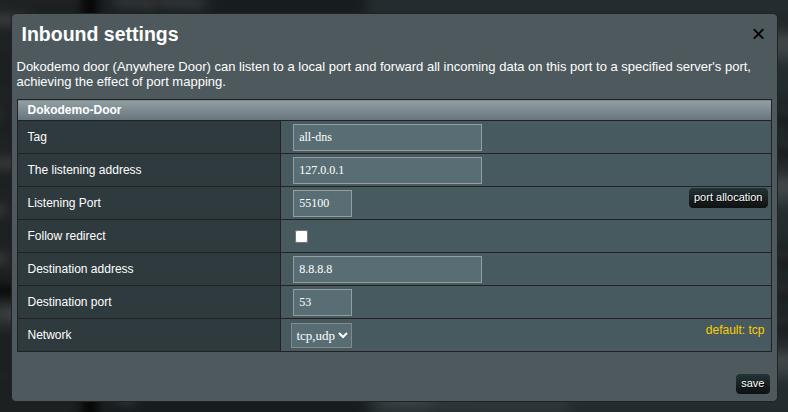
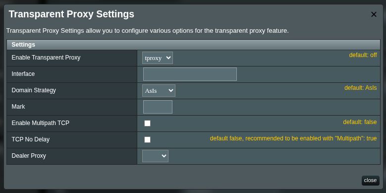
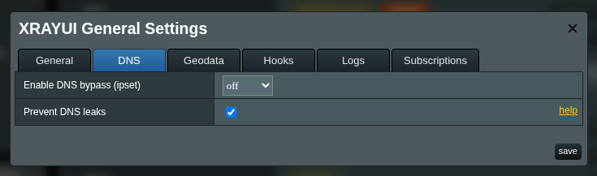
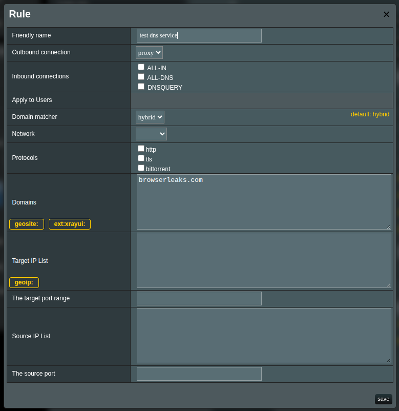

# DNS leaks and how to avoid them

A DNS leak occurs when DNS (Domain Name System) requests go outside your encrypted tunnel. This allows your ISP or other parties on the path to see the domains you look up, even if your traffic itself is proxied or VPN-encrypted.

In this guide, “no DNS leak” means your DNS queries do not leave directly via your ISP link. They should traverse your tunnel (e.g., to your VPS) or another path you control.

## Am I leaking?

Use any of these test services:

- [dnsleaktest.com](https://dnsleaktest.com/)
- [browserleaks.com](https://browserleaks.com/dns)
- [controld.com](https://controld.com/tools/dns-leak-test)
- [nordvpn.com](https://nordvpn.com/dns-leak-test/)
- [surfshark.com](https://surfshark.com/dns-leak-test)
- [atrill.com](https://www.astrill.com/dns-leak-test)

::: tip How to read the results

- Ignore the final “protected/not protected” labels. Many services flag “not protected” if you aren’t using their resolver.
- Focus on the list of DNS server IPs and their locations.
- If the listed DNS servers are in your VPS location (or the resolver you chose) and you do not see your ISP’s DNS routed through your home country, you are not leaking to the ISP.
  :::

**Solution**: add a separate DNS inbound that explicitly dials a resolver and sends it via your outbound tunnel.

## How to configure XRAYUI

> [!important]
> This manual is only applicable to the `XRAYUI v0.57.2` and above. You can check your version by executing the command `xrayui version`.

Your main inbound (e.g., dokodemo-door with `Follow redirect` = ON) is for transparent interception (TPROXY). It forwards to the original destination. When the router’s DNS forwarder (dnsmasq) talks to 127.0.0.1, there is no “original destination,” which can cause loops and cannot reliably forward DNS upstream.

### Create a dedicated DNS inbound

Add a new DOKODEMO inbound:

- Port: choose a local port for DNS inbound (e.g., 55100)
- Follow redirect: **OFF**
- Destination address: a public resolver you trust (e.g., 8.8.8.8, 1.1.1.1, AdGuard) or your own DNS on the VPS
- Destination port: 53
- Network: udp,tcp
- Save.



> [!note]
> Notice the checkbox `Follow redirect` is unchecked. This is important setting to make DNS not to leak. Dont't turn it on for this inbound configuration.

### Configure transport (tproxy) and dialer

Open Transport for this DNS inbound → Transparent Proxy (tproxy) → Manage:

- Enable tproxy for this inbound (select `tproxy`).
- Close this window and `apply` configuration changes in the main form.



This pins the DNS outbound path to your tunnel, independent of routing rules.

### Enable “Prevent DNS leaks”

Go to `General Settings` → `DNS` and turn on `Prevent DNS leaks`.
This forces the router (dnsmasq) to use only your Xray DNS inbound and disables alternate system resolvers.


> [!warning]
> This switch does not create or configure the inbound; enable it after the DNS inbound is working. Turning it on too early can temporarily break name resolution.

## Testing

For testing, create an additional rule that proxies traffic through your outbound and list the test services in it (for example, `browserleaks.com`).

```text
browserleaks.com
```



Open `browserleaks.com` and verify that all reported sources come from your VPS.
