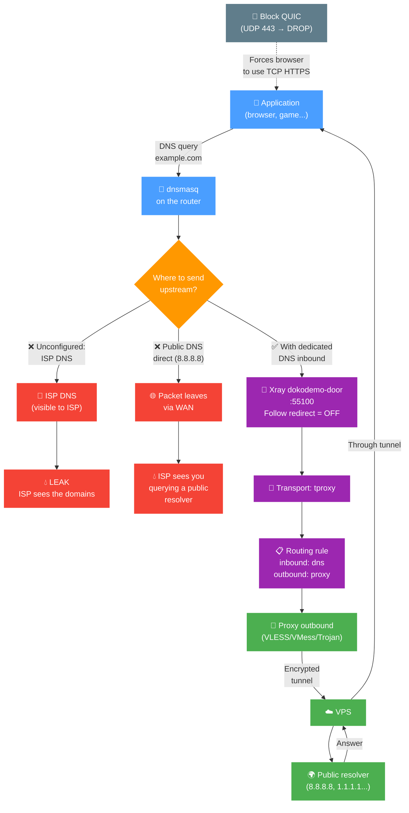
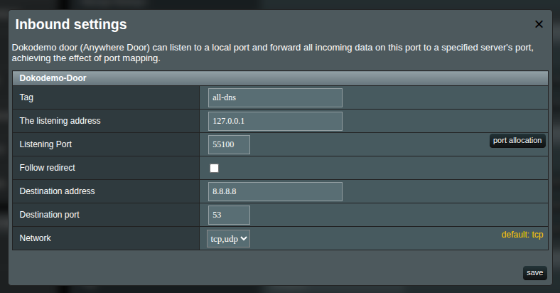
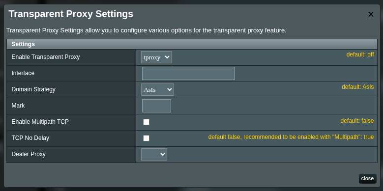
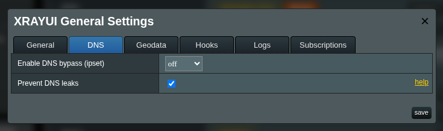
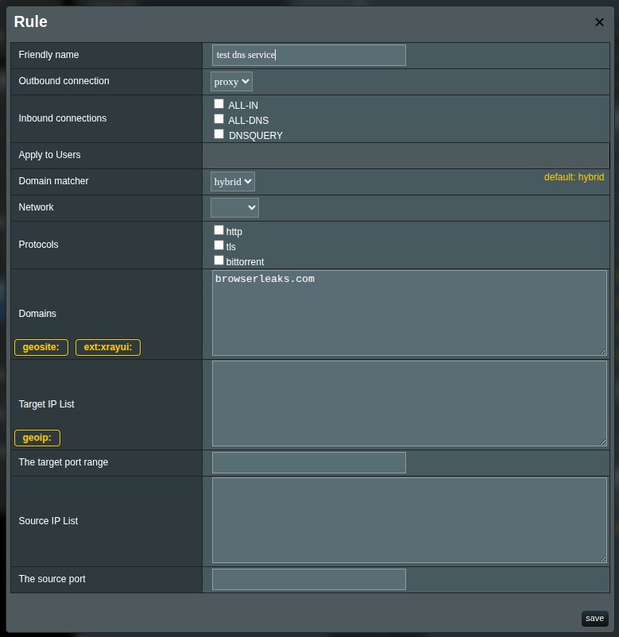

# DNS leaks and how to avoid them

A DNS leak occurs when DNS (Domain Name System) requests go outside your encrypted tunnel. This allows your ISP or other parties on the path to see the domains you look up, even if your traffic itself is proxied or VPN-encrypted.

In this guide, “no DNS leak” means your DNS queries do not leave directly via your ISP link. They should traverse your tunnel (e.g., to your VPS) or another path you control.

## Am I leaking?

Use any of these test services:

- [dnsleaktest.com](https://dnsleaktest.com/)
- [browserleaks.com](https://browserleaks.com/dns)
- [controld.com](https://controld.com/tools/dns-leak-test)
- [nordvpn.com](https://nordvpn.com/dns-leak-test/)
- [surfshark.com](https://surfshark.com/dns-leak-test)
- [atrill.com](https://www.astrill.com/dns-leak-test)

::: tip How to read the results

- Ignore the final “protected/not protected” labels. Many services flag “not protected” if you aren’t using their resolver.
- Focus on the list of DNS server IPs and their locations.
- If the listed DNS servers are in your VPS location (or the resolver you chose) and you do not see your ISP’s DNS routed through your home country, you are not leaking to the ISP.
  :::

**Solution**: add a separate DNS inbound that explicitly dials a resolver and sends it via your outbound tunnel.

## How a leak happens and how to close it

The chart below shows a DNS query's path before and after setting up a dedicated DNS inbound.


```mermaid
flowchart TD
    App["📱 Application<br/>(browser, game...)"] -->|"DNS query<br/>example.com"| Dnsmasq["🛜 dnsmasq<br/>on the router"]

    Dnsmasq --> Decide{"Where to send<br/>upstream?"}

    Decide -->|"❌ Unconfigured:<br/>ISP DNS"| ISP["🏢 ISP DNS<br/>(visible to ISP)"]
    ISP --> Leak["💧 LEAK<br/>ISP sees the domains"]

    Decide -->|"❌ Public DNS<br/>direct (8.8.8.8)"| QuicLeak["🌐 Packet leaves<br/>via WAN"]
    QuicLeak --> Leak2["💧 ISP sees you<br/>querying a public<br/>resolver"]

    Decide -->|"✅ With dedicated<br/>DNS inbound"| DnsInbound["🚪 Xray dokodemo-door<br/>:55100<br/>Follow redirect = OFF"]

    DnsInbound --> TProxy["🔀 Transport: tproxy"]
    TProxy --> Route["📋 Routing rule<br/>inbound: dns<br/>outbound: proxy"]
    Route --> Proxy["🔐 Proxy outbound<br/>(VLESS/VMess/Trojan)"]
    Proxy -->|"Encrypted<br/>tunnel"| VPS["☁️ VPS"]
    VPS --> Resolver["🌍 Public resolver<br/>(8.8.8.8, 1.1.1.1...)"]
    Resolver -->|"Answer"| VPS
    VPS -->|"Through tunnel"| App

    QuicBlock["🚫 Block QUIC<br/>(UDP 443 → DROP)"] -.->|"Forces browser<br/>to use TCP HTTPS"| App

    style App fill:#4a9eff,color:#fff,stroke:none
    style Dnsmasq fill:#4a9eff,color:#fff,stroke:none
    style Decide fill:#ff9800,color:#fff,stroke:none
    style ISP fill:#f44336,color:#fff,stroke:none
    style Leak fill:#f44336,color:#fff,stroke:none
    style QuicLeak fill:#f44336,color:#fff,stroke:none
    style Leak2 fill:#f44336,color:#fff,stroke:none
    style DnsInbound fill:#9c27b0,color:#fff,stroke:none
    style TProxy fill:#9c27b0,color:#fff,stroke:none
    style Route fill:#9c27b0,color:#fff,stroke:none
    style Proxy fill:#4caf50,color:#fff,stroke:none
    style VPS fill:#4caf50,color:#fff,stroke:none
    style Resolver fill:#4caf50,color:#fff,stroke:none
    style QuicBlock fill:#607d8b,color:#fff,stroke:none
```

The red branches are leak scenarios: queries exit via the ISP link. The green branch is the correct path: the DNS inbound intercepts queries, the routing rule steers them to the proxy outbound, and they reach the public resolver from the VPS side. QUIC blocking isn't strictly a DNS concern — it closes a parallel channel the browser could otherwise use to reveal your real IP around the proxy.

## How to configure XRAYUI

> [!important]
> This manual is only applicable to the `XRAYUI v0.58.0` and above. You can check your version by executing the command `xrayui version`.

Your main inbound (e.g., dokodemo-door with `Follow redirect` = ON) is for transparent interception (TPROXY). It forwards to the original destination. When the router’s DNS forwarder (dnsmasq) talks to 127.0.0.1, there is no “original destination,” which can cause loops and cannot reliably forward DNS upstream.

### Create a dedicated DNS inbound

XRAYUI accepts **either** of two inbound shapes as a valid DNS entry point:

**Pattern A — `dokodemo-door` (transparent forwarder)**

Add a new DOKODEMO inbound:

- Port: choose a local port for DNS inbound (e.g., 55100)
- Follow redirect: **OFF**
- Destination address: a public resolver you trust (e.g., 8.8.8.8, 1.1.1.1, AdGuard) or your own DNS on the VPS
- Destination port: 53
- Network: udp,tcp
- Save.



> [!note]
> Notice the checkbox `Follow redirect` is unchecked. This is important setting to make DNS not to leak. Dont't turn it on for this inbound configuration.

**Pattern B — xray `dns` protocol inbound (lighter alternative)**

If you prefer xray to handle DNS internally via its `dns.servers[]` block, you can use the `dns` protocol inbound instead. Add an inbound with `protocol: "dns"` (e.g., on port 5353), populate `dns.servers[]` at the top of the config, and add a routing rule that sends the dns inbound's tag to your proxy outbound. This skips the tproxy step entirely — xray's DNS subsystem resolves queries using `dns.servers[]` and the answers travel through the proxy outbound.

Either pattern satisfies the "Prevent DNS leaks" guard. The rest of this guide assumes Pattern A; if you went with Pattern B, you can skip the next section (transport/tproxy) since `dns` inbounds don't need it.

### Configure transport (tproxy) and dialer

Open Transport for this DNS inbound → Transparent Proxy (tproxy) → Manage:

- Enable tproxy for this inbound (select `tproxy`).
- Close this window and `apply` configuration changes in the main form.



This pins the DNS outbound path to your tunnel, independent of routing rules.

### Enable “Prevent DNS leaks”

Go to `General Settings` → `DNS` and turn on `Prevent DNS leaks`.

When enabled, XRAYUI does two things:

1. **dnsmasq lockdown** — `no-resolv` is appended and `servers-file=` (the WAN-provided resolvers) is commented out. dnsmasq forwards queries only to the dedicated Xray DNS inbound.
2. **Firewall safety net** — a `XRAYUI_DNS_LOCK` chain is hooked into `filter:OUTPUT` and `filter:FORWARD`, dropping every UDP/TCP packet destined to port 53. The DNS inbound listens on a non-53 port (e.g. 55100) so it is unaffected; legitimate DNS leaving the router does so as the proxy protocol (e.g. TCP/443), not UDP/53. This catches:
   - dnsmasq misconfigurations or other router-local processes that try to query upstream directly.
   - LAN clients that hardcode `8.8.8.8` / `1.1.1.1` and slip past TPROXY.



> [!important]
> The toggle is **guarded**: XRAYUI refuses to enable it unless a dedicated DNS inbound (dokodemo-door, destination port 53, follow redirect off) is present in the configuration. Set up the inbound first (steps above), then turn the switch on. If you somehow end up with the toggle on and no DNS inbound (e.g. after editing the config by hand), the firewall lock is skipped — a warning is logged — so you don't lose all DNS resolution. Fix the inbound and re-apply.

### Troubleshooting

- **Name resolution stops working after enabling the switch** — check that the dedicated DNS inbound is actually listening (`netstat -lun | grep <port>`) and that its routing rule sends the `dns` inbound through the proxy outbound. Disable the switch, fix the configuration, and re-enable.
- **A specific device still leaks** — the firewall lock blocks UDP/TCP 53 only. Devices using DoH (HTTPS, port 443) or DoT (TCP 853) bypass the lock. Block QUIC closes the UDP/443 path; for TCP/443 DoH you currently need to block specific resolver IPs at the firewall or via routing rules.
- **Router itself can't resolve names** — dnsmasq must forward to the inbound. Check `/etc/dnsmasq.conf` for the `server=<ip>#<port>` line generated by XRAYUI; if missing, the inbound discovery jq filter didn't match (verify the inbound's `settings.port` is `53`).

### Block QUIC

QUIC is a protocol that uses UDP port 443. In some cases, QUIC traffic may bypass the transparent proxy, which can cause your real IP address to leak — especially over IPv6.

Go to `General Settings` → `DNS` and enable **Block QUIC**.
This will reject all QUIC (UDP 443) traffic at the firewall level, forcing your browser and apps to fall back to regular TCP HTTPS, which is properly proxied through Xray.

> [!note]
> Blocking QUIC does not break websites. All modern browsers seamlessly fall back to HTTPS over TCP when QUIC is unavailable. You may notice a small initial delay on the first connection to some sites.

## Testing

For testing, create an additional rule that proxies traffic through your outbound and list the test services in it (for example, `browserleaks.com`).

```text
browserleaks.com
browserleaks.org
browserleaks.net
```



Open `browserleaks.com` and verify that all reported sources come from your VPS.
