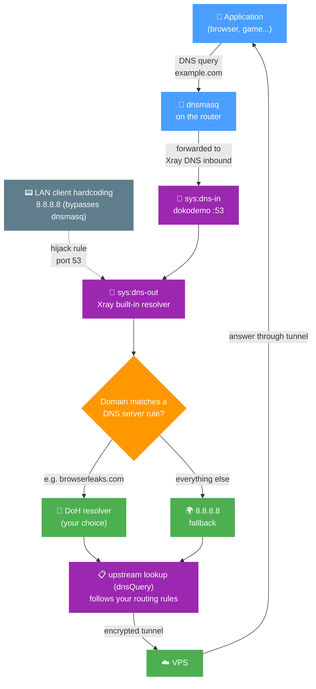

# DNS leaks and how to avoid them

A DNS leak occurs when DNS (Domain Name System) requests go outside your encrypted tunnel. This allows your ISP or other parties on the path to see the domains you look up, even if your traffic itself is proxied or VPN-encrypted.

In this guide, “no DNS leak” means your DNS queries do not leave directly via your ISP link. They should traverse your tunnel (e.g., to your VPS) or another path you control.

## Am I leaking?

Use any of these test services:

- [dnsleaktest.com](https://dnsleaktest.com/)
- [browserleaks.com](https://browserleaks.com/dns)
- [controld.com](https://controld.com/tools/dns-leak-test)
- [nordvpn.com](https://nordvpn.com/dns-leak-test/)
- [surfshark.com](https://surfshark.com/dns-leak-test)
- [atrill.com](https://www.astrill.com/dns-leak-test)

::: tip How to read the results

- Ignore the final “protected/not protected” labels. Many services flag “not protected” if you aren’t using their resolver.
- Focus on the list of DNS server IPs and their locations.
- If the listed DNS servers are in your VPS location (or the resolver you chose) and you do not see your ISP’s DNS routed through your home country, you are not leaking to the ISP.
  :::

## Why a leak happens

The leak is **not** about your proxied connections. When you open a site through Xray, the hostname is handed to your VPS and resolved there, so the connection itself doesn’t leak. The leak is a **separate** DNS query: your browser or operating system asks the router (dnsmasq) to resolve a name, and dnsmasq forwards that question to whatever upstream it was given — often your ISP. That upstream query is what leak-test sites measure.

To close it, XRAYUI turns Xray into the **resolver** for the router: it intercepts those queries, answers them with Xray's built-in DNS server, and sends the actual lookups out through your tunnel — optionally using DNS-over-HTTPS (DoH) for specific domains.


```mermaid
flowchart TD
    App["📱 Application<br/>(browser, game...)"] -->|"DNS query<br/>example.com"| Dnsmasq["🛜 dnsmasq<br/>on the router"]
    Dnsmasq -->|"forwarded to<br/>Xray DNS inbound"| DnsIn["🚪 sys:dns-in<br/>dokodemo :53"]
    Bypass["📟 LAN client hardcoding<br/>8.8.8.8 (bypasses dnsmasq)"] -.->|"hijack rule<br/>port 53"| Resolver

    DnsIn --> Resolver["🧠 sys:dns-out<br/>Xray built-in resolver"]
    Resolver --> Pick{"Domain matches a<br/>DNS server rule?"}
    Pick -->|"e.g. browserleaks.com"| Doh["🔐 DoH resolver<br/>(your choice)"]
    Pick -->|"everything else"| Fallback["🌍 8.8.8.8<br/>fallback"]
    Doh --> Upstream["📋 upstream lookup (dnsQuery)<br/>follows your routing rules"]
    Fallback --> Upstream
    Upstream -->|"encrypted tunnel"| VPS["☁️ VPS"]
    VPS -->|"answer through tunnel"| App

    style App fill:#4a9eff,color:#fff,stroke:none
    style Dnsmasq fill:#4a9eff,color:#fff,stroke:none
    style Bypass fill:#607d8b,color:#fff,stroke:none
    style DnsIn fill:#9c27b0,color:#fff,stroke:none
    style Resolver fill:#9c27b0,color:#fff,stroke:none
    style Pick fill:#ff9800,color:#fff,stroke:none
    style Doh fill:#4caf50,color:#fff,stroke:none
    style Fallback fill:#4caf50,color:#fff,stroke:none
    style Upstream fill:#9c27b0,color:#fff,stroke:none
    style VPS fill:#4caf50,color:#fff,stroke:none
```

## How to configure XRAYUI

> [!important]
> This manual applies to **XRAYUI v0.68.0** and above. You can check your version with `xrayui version`. On older versions DNS leak protection was a manual, multi-step setup; if you followed the old guide, simply enable the switch below — XRAYUI rebuilds the wiring for you.

It is now a single switch. You no longer create a DNS inbound, a DNS outbound, transport settings, or routing rules by hand — XRAYUI provisions and maintains all of that automatically.

### Enable DNS leak protection

Open the **DNS** section (advanced mode) and turn on **DNS leak protection**.

Then choose, in **Route DNS through**, which proxy outbound your DNS should travel through. That’s the tunnel your lookups exit from.

That’s it. On apply, XRAYUI creates and keeps in sync:

- a dedicated DNS inbound (`sys:dns-in`) that dnsmasq forwards the router’s queries to;
- a DNS outbound (`sys:dns-out`) — Xray’s built-in resolver;
- routing rules that hand intercepted queries to the resolver and send the resolver’s **own** upstream lookups out through the proxy you picked;
- a hijack rule that catches LAN clients which bypass dnsmasq with a hardcoded resolver (e.g. `8.8.8.8`) and answers them from the tunnel instead of letting them leak.

### Choose your resolvers (DoH and per-domain targets)

In the same DNS section, open **Servers**. This is where you decide *how* names are resolved:

- Add a **DoH resolver** by entering its URL as the server address, e.g. `https://xbox-dns.ru/dns-query` or `https://cloudflare-dns.com/dns-query`.
- Give a server **domain rules** to use it only for specific names — for example route `browserleaks.com`, `browserleaks.org`, `browserleaks.net` to a DoH resolver of your choice.
- Leave a plain resolver such as `8.8.8.8` **at the bottom of the list** as a catch-all fallback. Its lookups still ride the tunnel, so it does not leak.

Order matters: the first server whose domain rules match wins; the fallback (no rules) handles everything else.

```text
https://xbox-dns.ru/dns-query     → browserleaks.com, browserleaks.org, browserleaks.net
8.8.8.8                            → (no rules — fallback for everything else)
```


XRAYUI does not add any servers for you — the list stays fully under your control. Make sure it contains at least one catch-all server (no domain rules) as a fallback; XRAYUI shows a warning while none is set.

### Optional hardening

Go to **General Settings → DNS**:

- **Block QUIC** — see below. Recommended.

With DNS leak protection on, XRAYUI also locks the router down so stray DNS cannot escape: dnsmasq is told to forward **only** to Xray (`no-resolv`, the WAN-provided resolvers are commented out), and a firewall chain drops any UDP/TCP packet to port 53 that isn’t going to the Xray DNS path. This catches router-local processes and LAN clients that try to reach an upstream resolver directly.

### Troubleshooting

- **Name resolution stops working after enabling the switch** — make sure you picked a real proxy outbound in **Route DNS through** (if no proxy outbound exists, add a VLESS/VMess/Trojan outbound first). Check that the proxy itself is up; with a catch-all DoH/fallback, all DNS depends on the tunnel being reachable.
- **A specific device still leaks** — the firewall lock and the hijack rule cover plain UDP/TCP 53. A device using its own DoH (HTTPS, port 443) or DoT (TCP 853) bypasses them. **Block QUIC** closes the UDP/443 path; for TCP/443 DoH you currently need to block the resolver’s IPs at the firewall or via routing rules.
- **The test shows two resolver sets: your chosen DoH plus datacenter resolvers in your VPS region** (e.g. “Microsoft Corporation” for an Azure VPS, “Amazon” for AWS) — the second set comes from your **exit server**, not from your network. If the server-side Xray inbound has sniffing with `destOverride` (Marzban, x-ui and similar panel templates enable it by default), the server re-resolves every sniffed hostname with its own system DNS — usually the cloud provider’s resolver — so leak tests see both it and your DoH. It also silently overrides the answers of the resolver you picked. Fix it on the VPS: add `"routeOnly": true` next to `destOverride` in the inbound’s `sniffing` block and restart Xray/the panel. The server will then connect to the IPs your router already resolved.
- **Router itself can’t resolve names** — dnsmasq must forward to the Xray DNS inbound. Check `/etc/dnsmasq.conf` for the `server=127.0.0.1#…` line XRAYUI generates; if it’s missing, the inbound wasn’t discovered — disable and re-enable the switch, then re-apply.

### Block QUIC

QUIC is a protocol that uses UDP port 443. In some cases, QUIC traffic may bypass the transparent proxy, which can cause your real IP address to leak — especially over IPv6.

Go to **General Settings → DNS** and enable **Block QUIC**. This rejects all QUIC (UDP 443) traffic at the firewall level, forcing your browser and apps to fall back to regular TCP HTTPS, which is properly proxied through Xray.

> [!note]
> Blocking QUIC does not break websites. All modern browsers seamlessly fall back to HTTPS over TCP when QUIC is unavailable. You may notice a small initial delay on the first connection to some sites.

## Testing

1. In **Servers**, add a DoH resolver and give it the test domains as its domain rules:

   ```text
   browserleaks.com
   browserleaks.org
   browserleaks.net
   ```

2. Apply, then open [browserleaks.com/dns](https://browserleaks.com/dns) and verify that the reported DNS servers come from your VPS / the DoH resolver you chose — not your ISP.
