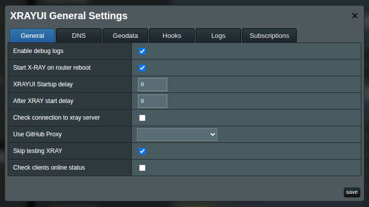
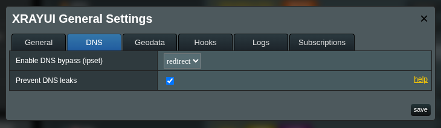
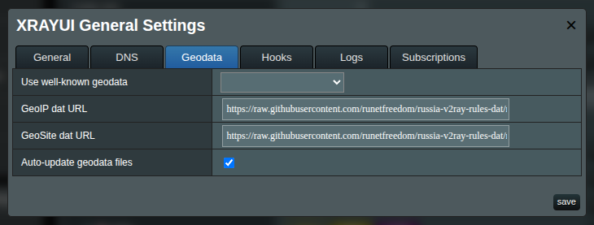
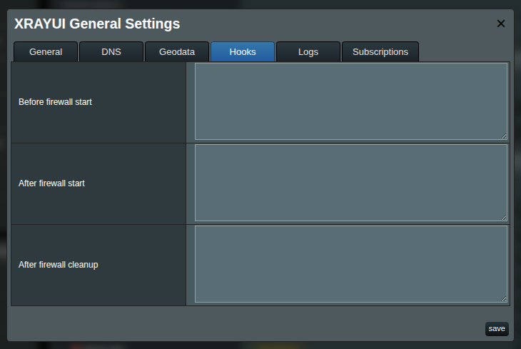
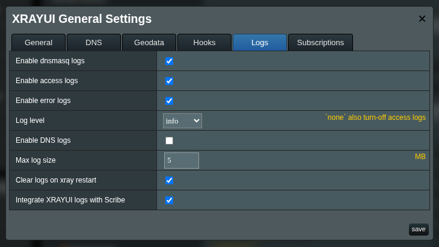
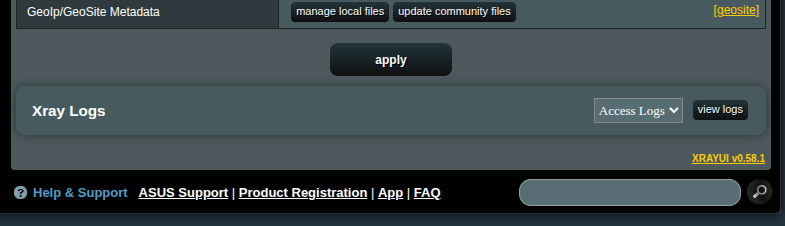
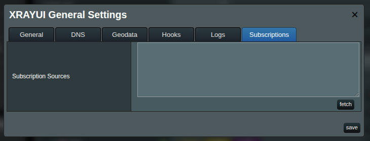

# Guide to General Options

The **General Options** modal centralizes how XRAYUI behaves on your ASUSWRT-Merlin router: startup sequencing, DNS behavior, geodata sources, logs, and subscription management.

Open: click **General Options** in the **Configuration** section.  
Save changes by clicking **Save** at the bottom of the dialog.

[[toc]]

## Tabs overview

- **General** — utility toggles and startup flow
- **DNS** — ipset bypass/redirect mode and DNS-leak protection
- **Geodata** — choose and auto-update your GeoIP/GeoSite databases
- **Hooks** — run custom shell snippets before/after firewall changes
- **Logs** — control log types, sizes, levels, and integrations
- **Subscriptions** — paste subscription URLs and fetch available outbounds

## General

### Enable debug logs

Enables verbose XRAYUI logs. Useful for troubleshooting. Disable on stable setups to reduce log size and noise.

::: tip xray logs
Do not mix up with **Xray** logs (application logs), which are configured in the **Logs** tab.
:::

### Start Xray on router reboot

When enabled, XRAYUI starts Xray during system boot.

::: warning
If you are experimenting with settings, it’s strongly recommended to turn off this option. A broken configuration can cause boot loops if Xray restarts on every boot.
:::

#### XRAYUI Startup delay

Wait time (seconds) after boot before launching Xray. Use this if WAN, USB/JFFS, or other services need time to initialize. Typical range: 5–20 seconds on slower devices. You can set it to `0`.

#### After XRAY start delay

Additional wait (seconds) after Xray starts, before XRAYUI continues with follow-up steps such as applying firewall rules. Default is **10** seconds. You can set it to `0`.

::: tip Why?
Starting Xray and applying XRAYUI rules are both resource-intensive. On some devices, spacing them out avoids spikes that can slow or stall the system.
:::

### Check connection to xray server

Verifies outbound connectivity at startup. XRAYUI temporarily inserts a system rule and a short-lived SOCKS inbound (tagged `sys`, hidden from the UI) and performs a probe via `ip-api.com`. The UI indicates success/failure per outbound.

### Use GitHub Proxy

Select a proxy base URL for downloading from GitHub (Xray updates, geodata files, etc.). Leave empty to download directly from GitHub. Useful when GitHub is blocked or rate-limited (for example, in mainland China).

### Skip testing Xray

Skips the configuration validation step (`xray -test`) before starting Xray. Faster, but not recommended unless you’re confident in your configuration.

::: warning
Disabling this option makes it impossible for XRAYUI to show real configuration errors before start.
:::

### Check clients online status

If you use Xray as a server (clients connect via Xray apps), XRAYUI can periodically check whether clients are online. This improves visibility at the cost of a small amount of extra processing.

## DNS

### Enable DNS bypass (ipset)

Controls how domain decisions are mirrored into kernel ipsets for fast-path routing:

- **OFF** — `ipset` is disabled; routing behaves as if this feature didn’t exist.
- **BYPASS** — domains mapped to the `FREEDOM` outbound go directly to the internet; everything else remains proxied.
- **REDIRECT** — the inverse: only domains **not** mapped to `FREEDOM` are proxied; all other traffic goes direct.

::: note
Regex-based domains (entries starting with the `regexp:` prefix) cannot be inserted into ipsets and are ignored by this feature. They still apply inside Xray’s own matching engine.
:::

::: tip
In `REDIRECT` mode, explicit rules that send domains to `FREEDOM` become redundant and can be removed.
:::

### Prevent DNS leaks

Sends DNS via your Xray path to prevent leaking queries. Do not enable without a compatible Xray DNS configuration. Read more [about DNS leaks here](dns-leak).

## Geodata

### GeoIP dat URL

Direct URL to `geoip.dat`.

### GeoSite dat URL

Direct URL to `geosite.dat`.

::: tip
Use **Use well-known geodata** to quickly prefill both URLs from a trusted source.
:::

Common sources included in the dropdown:

- Loyalsoldier (`v2ray-rules-dat`)
- RUNET Freedom (`russia-v2ray-rules-dat`)
- Nidelon (`ru-block-v2ray-rules`)
- DustinWin (`ruleset_geodata`)
- Chocolate4U (`Iran-v2ray-rules`)

### Auto-update geodata files

Periodically refreshes geodata files in the background. This option will also recompile [your custom geodata files](custom-geodata#managing-files-via-the-ui).

::: info
A cron job is created to download fresh geodata every night at **03:00**.
:::

## Hooks

XRAYUI can run short shell snippets at specific points in the firewall lifecycle. Do not add a shebang (`#!/bin/sh`); it is added automatically.

- **Before firewall start** — runs immediately before XRAYUI applies firewall rules.
- **After firewall start** — runs right after rules are applied.
- **After firewall cleanup** — runs after XRAYUI removes its rules during stop/restart.

Keep hook scripts short and idempotent. Use them for firewall-specific adjustments that aren’t modeled in the UI.

## Logs

These settings control how XRAYUI exposes **Xray** logs. When enabled, a **Logs** section appears at the bottom of the main page.

### Enable dnsmasq logs

Displays DNS hostnames (domain names) instead of only IPs in logs shown by XRAYUI.

### Enable access logs

Turns on Xray’s access logging.

### Enable error logs

Turns on Xray’s error logging.

### Log level

Controls verbosity of error logs. Selecting `none` also disables access logs.

Typical choices:

- `warning` or `error` for normal operation
- `info` or `debug` for troubleshooting

### Enable DNS logs

Enables DNS query logging from Xray’s DNS component. Useful for debugging rules. Expect larger logs on busy networks.

### Max log size

Maximum size (MB) before log rotation occurs automatically.

### Clear logs on xray restart

Clears logs when Xray restarts.

::: info
A cron job is created to run `logrotate` every **15 minutes**.
:::

### Integrate XRAYUI logs with Scribe

If available on your system, enables sending XRAYUI logs to [Scribe](https://github.com/AMTM-OSR/scribe) for viewing in its web interface.

## Subscriptions

This tab manages subscription sources. See the dedicated page: [Subscriptions](subscriptions).

### Subscription Sources

Paste one or more subscription URLs, one per line.  
Click **fetch** to retrieve and parse each source.  
After fetching, you can select subscription-backed outbounds within your outbound settings.
