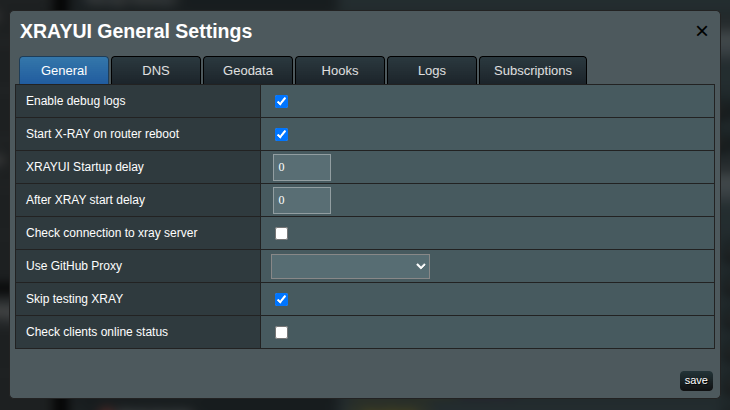
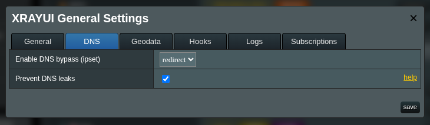
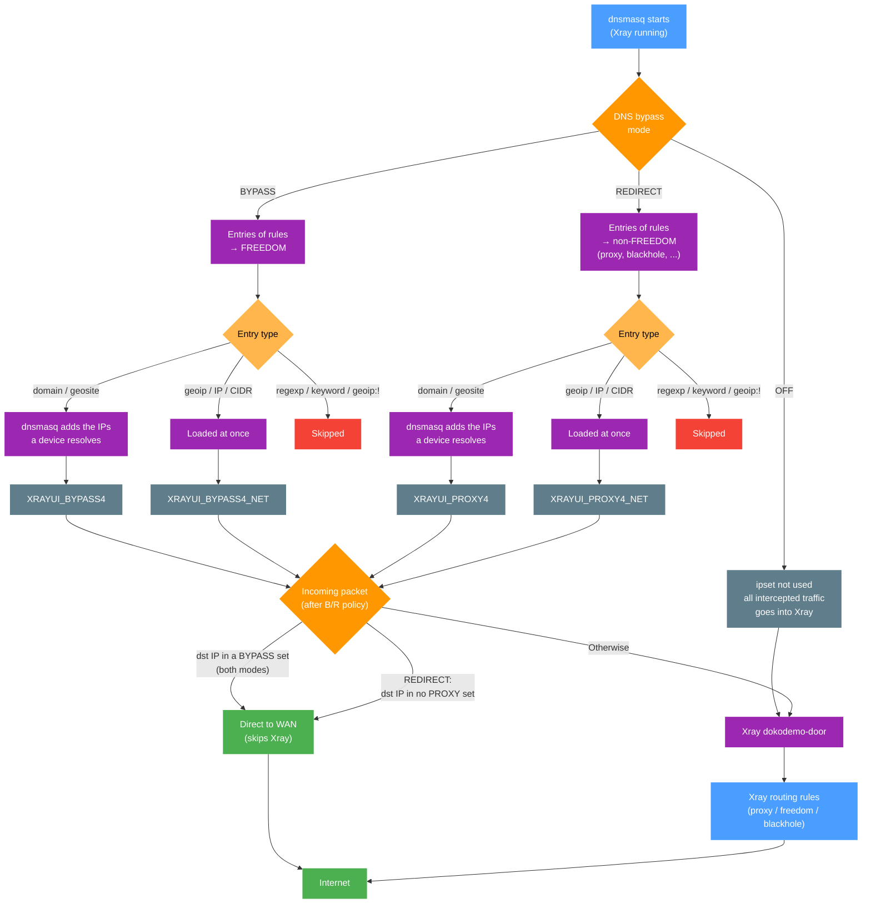
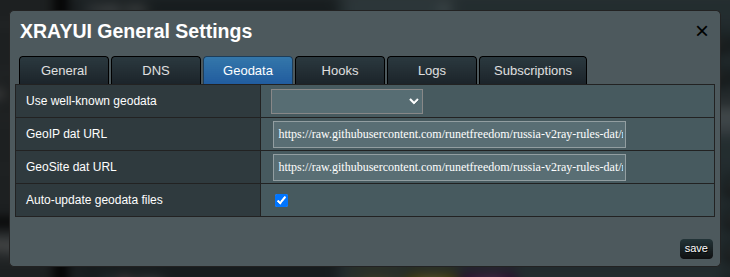
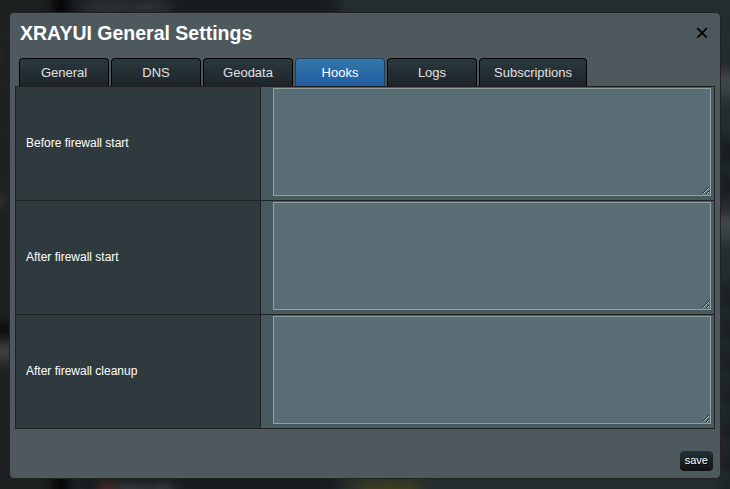
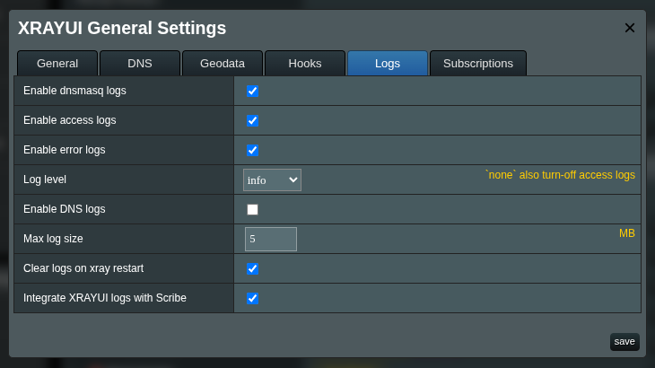
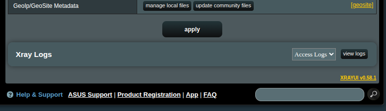
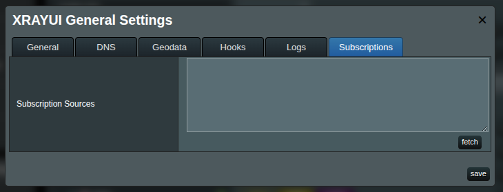

# Guide to General Options

The **General Options** modal centralizes how XRAYUI behaves on your ASUSWRT-Merlin router: startup sequencing, DNS behavior, geodata sources, logs, and subscription management.

Open: click **General Options** in the **Configuration** section.  
Save changes by clicking **Save** at the bottom of the dialog.

[[toc]]

## Tabs overview

- **General** — utility toggles and startup flow
- **DNS** — ipset bypass/redirect mode and DNS-leak protection
- **Geodata** — choose and auto-update your GeoIP/GeoSite databases
- **Hooks** — run custom shell snippets before/after firewall changes
- **Logs** — control log types, sizes, levels, and integrations
- **Subscriptions** — paste subscription URLs and fetch available outbounds

## General

### Enable debug logs

Enables verbose XRAYUI logs. Useful for troubleshooting. Disable on stable setups to reduce log size and noise.

::: tip xray logs
Do not mix up with **Xray** logs (application logs), which are configured in the **Logs** tab.
:::

### Start Xray on router reboot

When enabled, XRAYUI starts Xray during system boot.

::: warning
If you are experimenting with settings, it’s strongly recommended to turn off this option. A broken configuration can cause boot loops if Xray restarts on every boot.
:::

#### XRAYUI Startup delay

Wait time (seconds) after boot before launching Xray. Use this if WAN, USB/JFFS, or other services need time to initialize. Typical range: 5–20 seconds on slower devices. You can set it to `0`.

#### After XRAY start delay

Additional wait (seconds) after Xray starts, before XRAYUI continues with follow-up steps such as applying firewall rules. Default is **10** seconds. You can set it to `0`.

::: tip Why?
Starting Xray and applying XRAYUI rules are both resource-intensive. On some devices, spacing them out avoids spikes that can slow or stall the system.
:::

### Check connection to xray server

Enables live outbound health checks. When on, XRAYUI starts Xray with the built-in **Observatory**, which periodically opens a connection through **every** outbound to the probe URL and records whether it succeeded. The result is shown as a green/red indicator next to each outbound in the **Outbounds** section (yellow means no result yet; hover over the dot to see the delay or the error Xray reported), and the same data drives the automatic subscription failover. The system pieces XRAYUI adds for this are tagged `sys` and stay hidden in the UI.

#### Observatory probe URL

The URL the Observatory requests through each outbound. Any HTTP response that comes back through the outbound counts as a successful check — the status code is not looked at. Use an `https://` URL, so that a block page from a provider or ISP cannot pass for a working connection. Default: `https://www.google.com/generate_204`.

#### Observatory probe interval

How often (in seconds) the Observatory checks the outbounds. Default is **30** seconds.

::: warning Low-memory routers
Every check opens a connection through every outbound. With many outbounds (for example, imported from subscriptions) — especially dead or unreachable ones — a short interval can noticeably raise CPU and memory usage and, in the worst case, exhaust the router's RAM. Raise the interval if your configuration has many outbounds.
:::

### Use GitHub Proxy

Select a proxy base URL for downloading from GitHub (Xray updates, geodata files, etc.). Leave empty to download directly from GitHub. Useful when GitHub is blocked or rate-limited (for example, in mainland China).

### Skip testing Xray

Skips the configuration validation step (`xray -test`) before starting Xray. Faster, but not recommended unless you’re confident in your configuration.

::: warning
Disabling this option makes it impossible for XRAYUI to show real configuration errors before start.
:::

### Check clients online status

If you use Xray as a server (clients connect via Xray apps), XRAYUI can periodically check whether clients are online. This improves visibility at the cost of a small amount of extra processing.

## DNS

### Enable DNS bypass (ipset)

Controls how domain decisions are mirrored into kernel ipsets for fast-path routing:

- **OFF** — `ipset` is disabled; routing behaves as if this feature didn’t exist.
- **BYPASS** — domains mapped to the `FREEDOM` outbound go directly to the internet; everything else remains proxied.
- **REDIRECT** — the inverse: only domains **not** mapped to `FREEDOM` are proxied; all other traffic goes direct.

A `FREEDOM` outbound with fragment, noises, redirect, proxy protocol, a dialer proxy, a bound interface or a custom source address counts as a proxy here, so its traffic still enters Xray and those settings keep working.

```mermaid
flowchart TD
    Start["dnsmasq starts<br/>(Xray running)"] --> Mode{"DNS bypass<br/>mode"}

    Mode -->|"OFF"| NoIpset["ipset not used<br/>all intercepted traffic<br/>goes into Xray"]
    Mode -->|"BYPASS"| ExtractFree["Entries of rules<br/>→ FREEDOM"]
    Mode -->|"REDIRECT"| ExtractProxy["Entries of rules<br/>→ non-FREEDOM<br/>(proxy, blackhole, ...)"]

    ExtractFree --> Kind1{"Entry type"}
    ExtractProxy --> Kind2{"Entry type"}

    Kind1 -->|"domain / geosite"| Learn1["dnsmasq adds the IPs<br/>a device resolves"]
    Kind1 -->|"geoip / IP / CIDR"| Static1["Loaded at once"]
    Kind1 -->|"regexp / keyword / geoip:!"| Ignored1["Skipped"]

    Kind2 -->|"domain / geosite"| Learn2["dnsmasq adds the IPs<br/>a device resolves"]
    Kind2 -->|"geoip / IP / CIDR"| Static2["Loaded at once"]
    Kind2 -->|"regexp / keyword / geoip:!"| Ignored2["Skipped"]

    Learn1 --> Ipset1["XRAYUI_BYPASS4"]
    Static1 --> Net1["XRAYUI_BYPASS4_NET"]
    Learn2 --> Ipset2["XRAYUI_PROXY4"]
    Static2 --> Net2["XRAYUI_PROXY4_NET"]

    Ipset1 --> Runtime{"Incoming packet<br/>(after B/R policy)"}
    Net1 --> Runtime
    Ipset2 --> Runtime
    Net2 --> Runtime
    NoIpset --> Doko["Xray dokodemo-door"]

    Runtime -->|"dst IP in a BYPASS set<br/>(both modes)"| Direct["Direct to WAN<br/>(skips Xray)"]
    Runtime -->|"REDIRECT:<br/>dst IP in no PROXY set"| Direct
    Runtime -->|"Otherwise"| Doko

    Doko --> XRules["Xray routing rules<br/>(proxy / freedom / blackhole)"]
    Direct --> Internet["Internet"]
    XRules --> Internet

    style Start fill:#4a9eff,color:#fff,stroke:none
    style Mode fill:#ff9800,color:#fff,stroke:none
    style Kind1 fill:#ffb74d,color:#000,stroke:none
    style Kind2 fill:#ffb74d,color:#000,stroke:none
    style Runtime fill:#ff9800,color:#fff,stroke:none
    style ExtractFree fill:#9c27b0,color:#fff,stroke:none
    style ExtractProxy fill:#9c27b0,color:#fff,stroke:none
    style Learn1 fill:#9c27b0,color:#fff,stroke:none
    style Learn2 fill:#9c27b0,color:#fff,stroke:none
    style Static1 fill:#9c27b0,color:#fff,stroke:none
    style Static2 fill:#9c27b0,color:#fff,stroke:none
    style Ipset1 fill:#607d8b,color:#fff,stroke:none
    style Ipset2 fill:#607d8b,color:#fff,stroke:none
    style Net1 fill:#607d8b,color:#fff,stroke:none
    style Net2 fill:#607d8b,color:#fff,stroke:none
    style NoIpset fill:#607d8b,color:#fff,stroke:none
    style Doko fill:#9c27b0,color:#fff,stroke:none
    style XRules fill:#4a9eff,color:#fff,stroke:none
    style Direct fill:#4caf50,color:#fff,stroke:none
    style Internet fill:#4caf50,color:#fff,stroke:none
    style Ignored1 fill:#f44336,color:#fff,stroke:none
    style Ignored2 fill:#f44336,color:#fff,stroke:none
```

The top half of the chart runs every time dnsmasq starts while Xray is running. Nothing is resolved in advance: each domain becomes a dnsmasq `ipset=` rule, and a domain's addresses land in the set only when a device looks that domain up through the router's DNS. `geoip:`, IP and CIDR entries are loaded into a separate `_NET` set in one go. The bottom half is **runtime**: iptables matches the packet's destination IP against the sets and decides whether it enters Xray or goes directly to WAN.

> [!note]
> The `dst ∈ XRAYUI_BYPASS4 / XRAYUI_BYPASS4_NET → RETURN` rules are active in **both** modes (`BYPASS` and `REDIRECT`). `REDIRECT` additionally installs `dst ∉ XRAYUI_PROXY4 and ∉ XRAYUI_PROXY4_NET → RETURN`, so only packets whose destination IP landed in a "proxied" set actually reach Xray.

#### Things to know

- **Cached DNS answers.** A device that resolved a domain before a rule was added, or before Xray restarted, keeps using that answer and can go direct until it looks the domain up again. XRAYUI narrows this gap: in `REDIRECT` mode the learned addresses are saved every 30 minutes and when Xray stops, restored when it starts, and the domains written directly in the rules (plus the first domains of newly added geosite tags) are looked up right after dnsmasq starts. DNS answers handed to devices are also capped at one hour in `BYPASS` and `REDIRECT` modes, so a device asks again within an hour at most. Flushing the device's DNS cache or restarting the browser covers the rest.
- **Encrypted DNS on the device.** DoH/DoT in the browser, Android Private DNS and iCloud Private Relay never ask the router, so their destinations never reach the set. Merlin's **Prevent client auto DoH** option stops browsers that switch to DoH on their own.
- **Unsupported entries.** `regexp:`, `keyword:`, `dotless:`, plain words without a dot, negated `geoip:!` entries and domains with non-Latin letters cannot be expressed as an ipset (international domains work when written in punycode, `xn--...`). They still work inside Xray, but this feature skips them and lists them in the log.
- **Rules without a destination.** Rules that match only by source device, inbound, port or protocol have no domain or IP to put into a set, so in `REDIRECT` mode they have no effect.
- **Expiry.** Learned addresses expire 24 hours after the last lookup through dnsmasq. Removing a proxied domain from the rules clears the learned addresses.

::: tip
In `REDIRECT` mode, rules that send domains to `FREEDOM` add nothing to the ipset, but they still matter inside Xray: a direct rule for `x.example.com` placed above a proxy rule for `example.com` keeps that subdomain direct.
:::

### Prevent DNS leaks

Sends DNS via your Xray path to prevent leaking queries. Do not enable without a compatible Xray DNS configuration. Read more [about DNS leaks here](dns-leak).

### Block QUIC

Blocks QUIC (UDP 443) to prevent your real IP address from leaking through the QUIC protocol. Clients will automatically fall back to regular HTTPS. Read more [about DNS leaks here](dns-leak).

## Geodata

### GeoIP dat URL

Direct URL to `geoip.dat`.

### GeoSite dat URL

Direct URL to `geosite.dat`.

::: tip
Use **Use well-known geodata** to quickly prefill both URLs from a trusted source.
:::

Common sources included in the dropdown:

- Loyalsoldier (`v2ray-rules-dat`)
- RUNET Freedom (`russia-v2ray-rules-dat`)
- Nidelon (`ru-block-v2ray-rules`)
- DustinWin (`ruleset_geodata`)
- Chocolate4U (`Iran-v2ray-rules`)

### Auto-update geodata files

Periodically refreshes geodata files in the background. This option will also recompile [your custom geodata files](custom-geodata#managing-files-via-the-ui).

::: info
A cron job is created to download fresh geodata every night at **03:00**.
:::

## Hooks

XRAYUI can run short shell snippets at specific points in the firewall lifecycle. Do not add a shebang (`#!/bin/sh`); it is added automatically.

- **Before firewall start** — runs immediately before XRAYUI applies firewall rules.
- **After firewall start** — runs right after rules are applied.
- **After firewall cleanup** — runs after XRAYUI removes its rules during stop/restart.

Keep hook scripts short and idempotent. Use them for firewall-specific adjustments that aren’t modeled in the UI.

## Logs

These settings control how XRAYUI exposes **Xray** logs. When enabled, a **Logs** section appears at the bottom of the main page.

### Enable dnsmasq logs

Displays DNS hostnames (domain names) instead of only IPs in logs shown by XRAYUI.

### Enable access logs

Turns on Xray’s access logging.

### Enable error logs

Turns on Xray’s error logging.

### Log level

Controls verbosity of error logs. Selecting `none` also disables access logs.

Typical choices:

- `warning` or `error` for normal operation
- `info` or `debug` for troubleshooting

### Enable DNS logs

Enables DNS query logging from Xray’s DNS component. Useful for debugging rules. Expect larger logs on busy networks.

### Max log size

Maximum size (MB) before log rotation occurs automatically.

### Clear logs on xray restart

Clears logs when Xray restarts.

::: info
A cron job is created to run `logrotate` every **15 minutes**.
:::

### Integrate XRAYUI logs with Scribe

If available on your system, enables sending XRAYUI logs to [Scribe](https://github.com/AMTM-OSR/scribe) for viewing in its web interface.

## Subscriptions

This tab manages subscription sources. See the dedicated page: [Subscriptions](subscriptions).

### Subscription Sources

Paste one or more subscription URLs, one per line.  
Click **fetch** to retrieve and parse each source.  
After fetching, you can select subscription-backed outbounds within your outbound settings.
