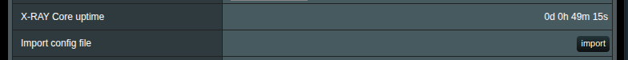
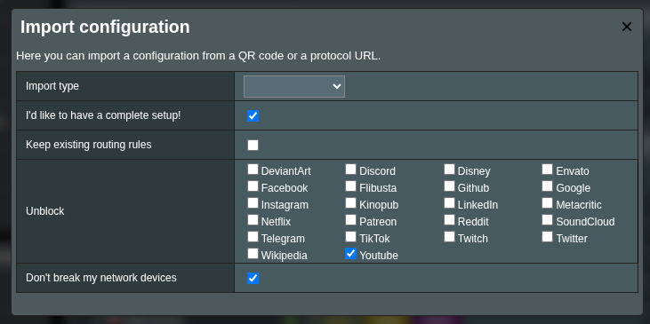
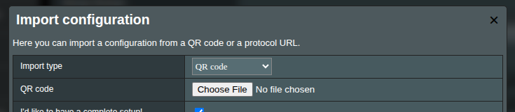
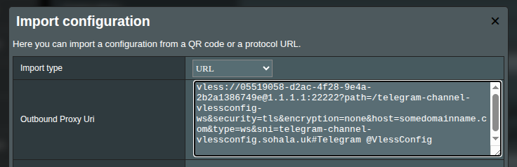
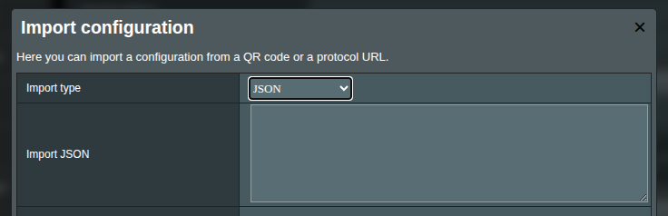
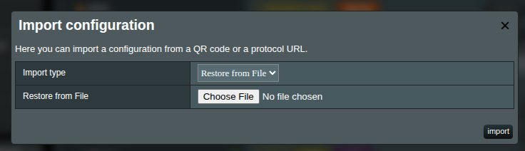

# Xray Client Importing the Configuration

XRAY UI lets you import your connection configuration so you don’t have to wrestle with a complicated setup by typing each setting manually.

Usually, VPS servers with XRAY onboard let you generate a connection string or a QR code. A typical XRAY connection string looks like this:

```text:no-line-numbers
vless://05519058-d2ac-4f28-9e4a-2b2a1386749e@1.1.1.1:22222?path=/telegram-channel-vlessconfig-ws&security=tls&encryption=none&host=somedomainname.com&type=ws&sni=telegram-channel-vlessconfig.sohala.uk#Telegram @VlessConfig
```

XRAY UI can parse that and convert it into a client configuration in seconds.

In the `Import Configuration` section, press the **Import** button:



An import manager window will pop up:



XRAYUI supports different methods of import.

> [!info]
> After importing, remember to apply your changes on the main page. Imports aren’t saved until you send them to the router. If something goes wrong during the import, just refresh the page (F5).

## QR Import

Upload a QR code containing your connection data. This performs a minimal setup by adding a new outbound configuration to the Outbounds collection.

Select an image with a QR code and press Import.

## URL Import

Paste your XRAY connection string into the text area. Typical URLs begin with `ss://`, `vless://`, `vmess://` etc.


## JSON Import

If your server provided a JSON-formatted client config (often via AmneziaWG), paste it here.


> [!warning]
> AmneziaWG sometimes installs an [outdated xray core version (1.8.6)](https://github.com/amnezia-vpn/amnezia-client/blob/c9337457079fb89d80079d22c38d07877d52762d/client/server_scripts/xray/Dockerfile#L4). Double‑check your version. Consider updating XRAY on your server or downgrading XRAY on your router with: `xrayui update xray 1.8.6`). but note that downgrading isn’t generally recommended.

## Restore from File

This isn’t strictly importing—it’s a full config restore. Select a JSON file from your system, upload it, and it replaces your router’s configuration.


## Advanced Options

Depending on the import method, you can tweak additional settings:

### I'd like to have a complete setup

Check `I’d like to have a complete setup!` and the import manager will generate all required inbounds and outbounds (`FREEDOM`, `BLACKHOLE`, `DOKODEMO`).

> [!warning]
> This overrides your current config. If you need to roll back, refresh the page.

### Keep existing routing rules

Replace your config but preserve your existing routing rules and policies by migrating them into the new setup.

### Unblock list

Select services or sites to route through your XRAY server proxy. Only choose the services that are blocked in your region.

### Don't break my network devices

By default, XRAY UI redirects all traffic to XRAY, which can disrupt IoT devices, gaming consoles, or other networked hardware. If you’re cautious, check Don’t break my network devices—only ports `80` and `443` get redirected, covering most HTTPS traffic without affecting other devices.
