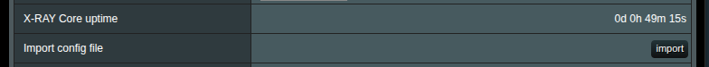
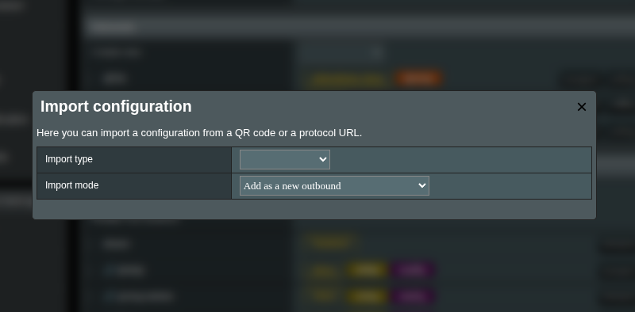
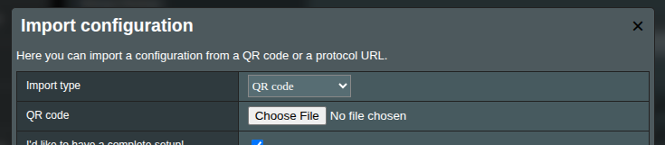
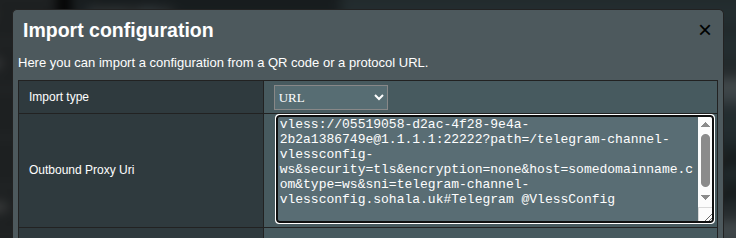
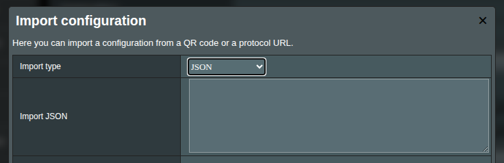
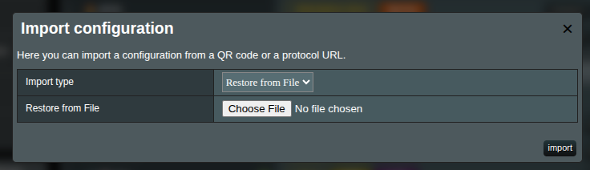
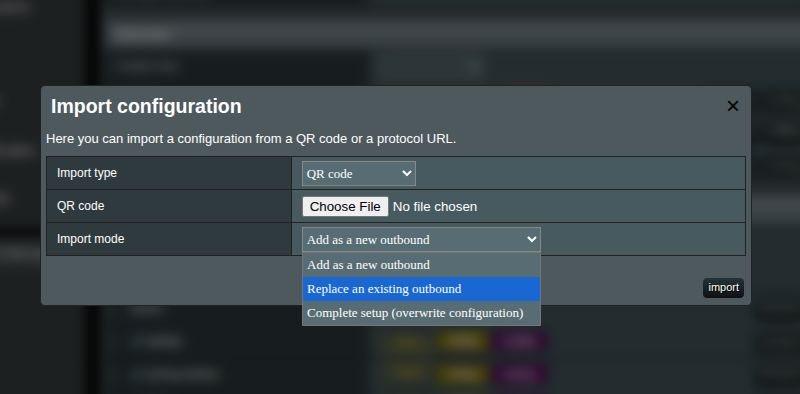

# Xray Client Importing the Configuration

XRAY UI lets you import your connection configuration so you don’t have to wrestle with a complicated setup by typing each setting manually.

Usually, VPS servers with XRAY onboard let you generate a connection string or a QR code. A typical XRAY connection string looks like this:

```text:no-line-numbers
vless://05519058-d2ac-4f28-9e4a-2b2a1386749e@1.1.1.1:22222?path=/telegram-channel-vlessconfig-ws&security=tls&encryption=none&host=somedomainname.com&type=ws&sni=telegram-channel-vlessconfig.sohala.uk#Telegram @VlessConfig
```

XRAY UI can parse that and convert it into a client configuration in seconds.

In the `Import Configuration` section, press the **Import** button:



An import manager window will pop up:



XRAYUI supports different methods of import.

> [!info]
> After importing, remember to apply your changes on the main page. Imports aren’t saved until you send them to the router. If something goes wrong during the import, just refresh the page (F5).

## QR Import

Upload a QR code containing your connection data. This performs a minimal setup by adding a new outbound configuration to the Outbounds collection.

Select an image with a QR code and press Import.

## URL Import

Paste your XRAY connection string into the text area. Typical URLs begin with `ss://`, `vless://`, `vmess://` etc.


## JSON Import

If your server provided a JSON-formatted client config (often via AmneziaWG), paste it here.


> [!warning]
> AmneziaWG sometimes installs an [outdated xray core version (1.8.6)](https://github.com/amnezia-vpn/amnezia-client/blob/c9337457079fb89d80079d22c38d07877d52762d/client/server_scripts/xray/Dockerfile#L4). Double‑check your version. Consider updating XRAY on your server or downgrading XRAY on your router with: `xrayui update xray 1.8.6`). but note that downgrading isn’t generally recommended.

## Restore from File

This isn’t strictly importing—it’s a full config restore. Select a JSON file from your system, upload it, and it replaces your router’s configuration.


## Import Mode

For QR, URL and JSON imports you can choose what happens with the imported connection:



### Add as a new outbound

The default. The imported connection is added to the Outbounds collection alongside your existing ones; nothing else in your configuration is touched.

### Replace an existing outbound

Pick one of your current outbounds in the `Replace connection` dropdown, and the imported connection will take its place. The new connection inherits the tag of the replaced one, so all your routing rules, balancers and policies keep working without any manual editing. This is the quickest way to switch to a new server while keeping the rest of your setup intact.

### Complete setup

The import manager generates all required inbounds and outbounds (`FREEDOM`, `BLACKHOLE`, `DOKODEMO`) from scratch.

> [!warning]
> This overrides your current config. If you need to roll back, refresh the page.

With complete setup you also choose a **Routing mode**:

- **Basic bypass** (recommended) — creates routing rules for the most common services (Google, Meta, Telegram, Twitter, Discord, TikTok, Netflix, Github, Cloudflare) so their traffic goes through the proxy.
- **No routing rules** — no rules are created; all traffic goes to the first outbound until you configure rules manually.
- **Keep existing routing rules** — preserves your current routing rules and policies.
