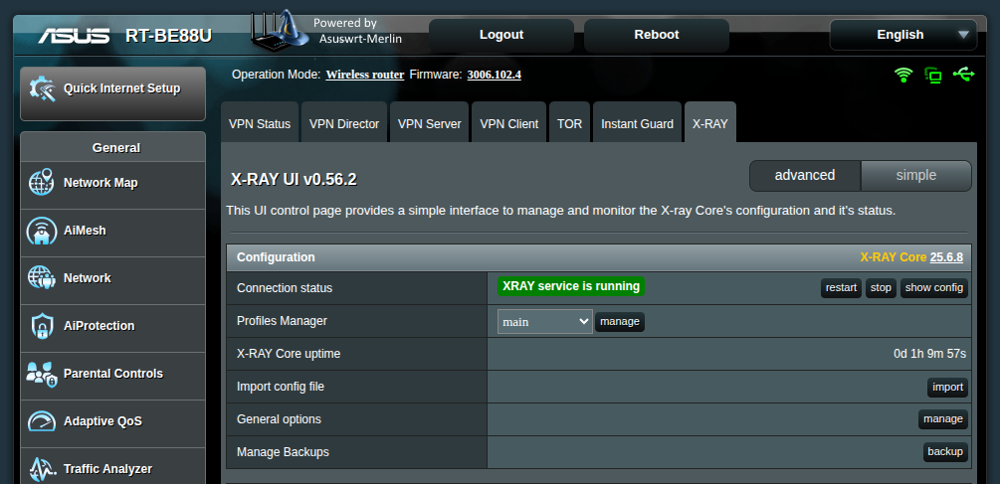
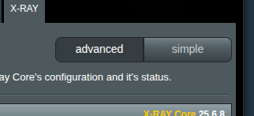
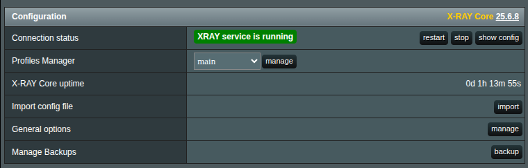
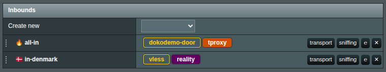
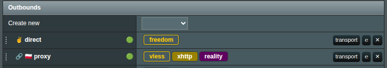
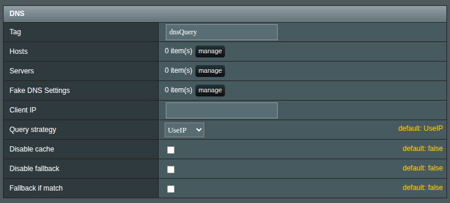
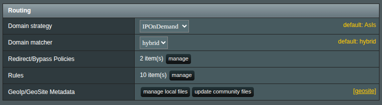
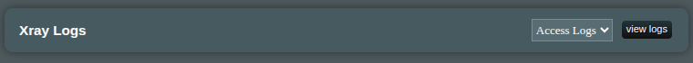

# Interface Overview

Once installed, XRAY UI offers a single-page application accessible via the VPN section:

## Settings Modes

By default, you’re in **Advanced** mode. If you’re new to XRAY’s configuration, switch to **Simple** mode—but keep in mind it unlocks only a handful of the features available in advanced mode.

## Configuration Section

In the Configuration section, you’ll find XRAY UI’s core controls:

- **Connection Status** – View, restart, or stop the X‑RAY service. Click Show Config to browse or share your current configuration.
- **Profiles Manager** – Create, manage, and delete profiles. Each profile is a separate JSON file stored in /opt/etc/xray, so you can switch configurations without poking around the router’s filesystem.
- **X‑RAY Core Uptime** – See how long X‑RAY has been running since its last restart.
- **Import Config File** – Opens the import manager for QR, URL, JSON, or file-based imports.
- **General Options** – A modal for all XRAY UI–wide settings.
- **Manage Backups** – Backup and restore your critical configuration files.

## Inbounds Section

This section mirrors the X‑RAY “inbounds” configuration, letting you set up and maintain inbound proxies.

> [!info]
> The **DOKODEMO** inbound is special. Once added, XRAY UI will automatically set firewall rules to redirect traffic to its port. You can split **DOKODEMO** into separate TCP and UDP instances for traffic separation, but creating multiple inbounds of the same type (e.g., two TCP or two UDP) is pointless.

- **Tags –** Every inbound/outbound requires a unique tag.
- **Create New** – Choose a type from the dropdown to open a configuration window.
- **Edit –** Click the protocol name (e.g., vless) or the E button to modify an inbound.
- **Transport –** Configure network and security transports (e.g., xhttp, TLS, REALITY).
- **Sniffing –** Enable packet inspection to collect and log metadata for routing decisions.
- **Reorder –** Drag the dots on the left to rearrange inbounds; the order can affect traffic handling.

## Outbounds Section

Similar to the Inbounds section, outbounds are responsible for the setup of the outbounding proxies. Sniffing here is not avilable but all other settings are pretty much the same as in the Inbounds.

## DNS Section

Set up DNS rules for XRAY’s internal DNS server. You can add fallback servers, custom entries, or blocklists as needed.

## Routing Section

Define routing rules and policies to redirect or bypass traffic. For detailed guidance on redirect/bypass policies, see the [the separate document](br-policy.md).

**GeoIP/GeoSite Metadata** – Manage community‑maintained GeoIP and GeoSite databases here. You can manually update them or import your own data.

## Apply button

When you’re ready to commit your changes, click **Apply**. XRAY UI will:

- Validate your configuration.
- Send it to the router.
- Restart the X‑RAY service.

> [!info]
> If you accidentally delete something or change your mind before applying, simply refresh the page. No settings are final until you hit Apply.

## Logs Section

View X‑RAY logs by selecting Access or Error and clicking View Logs.

> [!info]
> This section only appears if logging is enabled in **General Settings**.

## Update module and version check

In the bottom-right corner, you’ll see your installed XRAY UI version. Click it to view the changelog or update when a new version is available. A yellow exclamation mark appears to indicate updates waiting for your attention.

