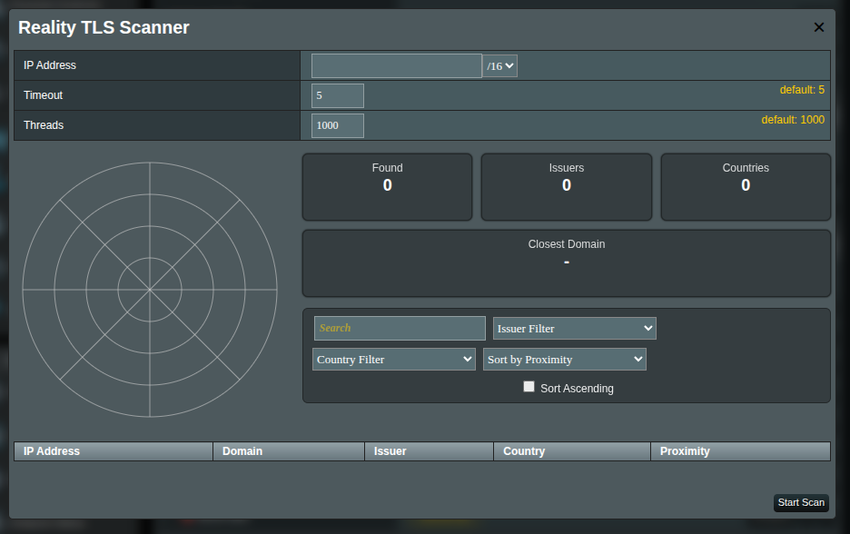

# Reality TLS Scanner (RTLS)

The Reality TLS Scanner helps you discover public TLS endpoints in a subnet and highlights the ones closest to your target IP (e.g., your VPS). It visualizes findings on a `radar` and lists them in a sortable table so you can quickly select suitable hosts for REALITY-based configurations.

## What it does

- Checks addresses in the chosen subnet (CIDR) to see if they speak TLS (HTTPS).
- Reads the server’s certificate to extract a **Domain** and **Issuer** (the certificate authority).
- Estimates how “near” each found IP is to your **target IP** and shows that as **Proximity**.
- Summarizes totals and shows a small “radar” map of where results sit within the subnet.

> [!NOTE]
> Not every IP in a subnet will run HTTPS; empty results are normal in many ranges.

## Opening the Reality TLS Scanner

1. Open `XRAYUI` in the web UI.
1. In the `Outbounds` section, find the `Reality TLS Scanner` row.  
   
1. Click the `Scan` button.
1. An RTLS Scanner window will pop up.  
   

## Inputs (top section)

Use these fields to define what to scan:

| Field             | What to enter                                                                                | Default       |
| ----------------- | -------------------------------------------------------------------------------------------- | ------------- |
| **IP Address**    | The IP you want to scan around. This is your **target/VPS** for proximity.                   | **mandatory** |
| **CIDR** dropdown | The subnet range to scan (e.g., `/8`, `/16`, `/24`). Wider CIDR = more addresses.            | `/16`         |
| **Timeout**       | Time in seconds to wait for each check. Higher values can find more, but scanning is slower. | `5`           |
| **Threads**       | How many checks run at the same time. Higher = faster, but heavier on the router.            | `1000`        |

> [!WARNING]
> Very high thread counts can make your router unresponsive. Increase gradually if needed. Experiment and monitor `resources` in a separate tab to find a suitable thread number for your router.

## Starting and stopping a scan

- Click **Start Scan** to begin. A progress label appears: “**Scanning is in progress…**”.
- Click **Stop Scan** at any time to halt the process.

You can keep the window open and watch results appear as they’re found.

## Reading the results

### Summary cards

- **Found** — Total number of discovered endpoints in this scan.
- **Issuers** — Number of distinct certificate authorities found (e.g., `Let’s Encrypt`).
- **Countries** — Number of distinct countries detected via IP geolocation.
- **Closest** — The single nearest domain/IP to your target within the chosen subnet.  
  

### Radar

A compact map of the subnet: each dot is a result. Items closer to the center are nearer to your target IP. Hover (or focus) to see a quick label with IP/domain.  

### Filters and sorting

- **Search** — Filter by IP, domain, or issuer text.
- **Issuer Filter** — Show results from a specific certificate authority.
- **Country Filter** — Show results from a specific country.
- **Sort by** — Order results by **Proximity**, **IP**, or **Domain** (toggle **Ascending** as needed).  
  

### Results table columns

- **IP Address** — The endpoint’s IP.
- **Domain** — Hostname reported by the server certificate.
- **Issuer** — Who issued the certificate (e.g., DigiCert, Let’s Encrypt).
- **Country** — Country inferred from the IP (may be missing or approximate).
- **Proximity** — How near the IP is to your target within the chosen subnet. Longer bar = closer.  
  

> [!TIP]
> A high **Proximity** percentage means the IP sits very near your target inside the selected CIDR block.

## Recommended starting points

- Want a few high-quality, browser-like targets?  
  Use a **narrow subnet** (e.g., `/24`) and keep the default **Timeout 5 / Threads 1000**. If the device feels busy, reduce **Threads** to 300–600.
- Want a broader list to pick from?  
  Try a **wider subnet** (e.g., `/16`) and be patient; this checks many more IPs.

## Good practice and etiquette

- Scan only ranges you **own** or have **explicit permission** to test.
- If your router becomes sluggish, lower **Threads** or scan a smaller range.
- Some endpoints use default certificates (e.g., from load balancers); that’s normal.

## FAQ

**What does “Closest” mean?**  
It’s the domain/IP with the highest **Proximity** score relative to your target IP inside the chosen subnet.

**Why do some rows look odd (e.g., generic or appliance names)?**  
Many devices return default certificates (reverse proxies, ingress controllers, appliances). These are still valid finds.

**Is scanning legal?**  
Policies vary. Scanning public IPs is widely done, but you are responsible for how you use it. Only scan ranges you control or have permission to test. Your ISP may prohibit scanning in its terms.
