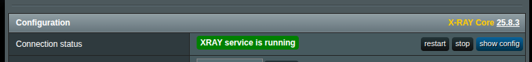
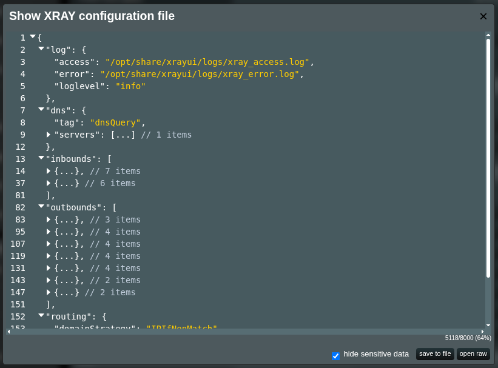

# Securely Share a Configuration File

The Xray configuration file is a JSON file located in `/opt/etc/xray`. Its structure can be large and complex, and it _always_ contains sensitive information (for example: VPS credentials, IP addresses, private and public keys, user IDs, and passwords).

When you are troubleshooting an issue, it can be helpful to share your configuration with [the community](https://t.me/asusxray). Before doing so, you must redact all sensitive data.

XRAYUI includes a built-in tool that automatically masks well-known sensitive fields in the configuration.

## How to Mask and Share a Configuration File with XRAYUI

In the **Configuration** section, click **`Show Config`**.



A modal displaying your current configuration will appear. You can review the active configuration in your browser.



::: warning
Do not copy and share the content directly from the modal. The data is unmasked and shown in raw form.
:::

In the bottom-right corner, you will find:

- **`Hide sensitive data` checkbox** — when selected, masks sensitive values in the configuration with `*` characters.
- **Save to file** — saves your current configuration as a JSON file on your computer. If the checkbox is selected, the saved file will contain masked data. Verify that all sensitive values are masked before sharing.
- **Open raw** — opens the current configuration directly in the browser.

Validate the file. You should see many fields are masked:

```json
      "streamSettings": {
        "security": "reality",
        "realitySettings": {
          "dest": "dl.google.com:443",
          "serverNames": [
            "dl.google.com"
          ],
          "privateKey": "*******************************************",
          "shortIds": [
            "****************",
            "****************",
            "****************"
          ],
          "publicKey": "*******************************************",
          "spiderX": "*"
        },
        "sockopt": {
          "domainStrategy": "UseIP"
        }
      }
```

::: caution
Never share the raw configuration. Always use **Save to file** with **Hide sensitive data** enabled.
:::

:::tip
Uncheck the checkbox and press **save to file** to quickly download your current config file in raw format.
:::
