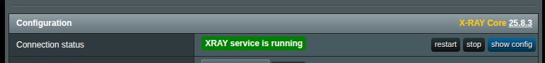
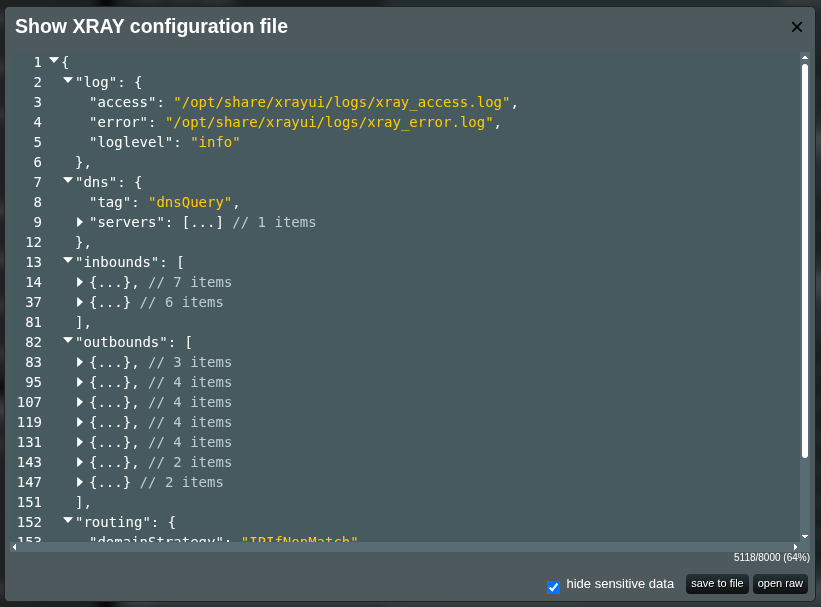

# Securely Share a Configuration File

The Xray configuration file is a JSON file located in `/opt/etc/xray`. Its structure can be large and complex, and it _always_ contains sensitive information (for example: VPS credentials, IP addresses, private and public keys, user IDs, and passwords).

When you are troubleshooting an issue, it can be helpful to share your configuration with [the community](https://t.me/asusxray). Before doing so, you must redact all sensitive data.

XRAYUI includes a built-in tool that automatically masks sensitive values in the configuration. The full list is in [What is masked](#what-is-masked).

## How to Mask and Share a Configuration File with XRAYUI

In the **Configuration** section, click **`Show Config`**.



A modal displaying your current configuration will appear. You can review the active configuration in your browser.



::: warning
Do not copy the content directly from the modal. Nested sections are collapsed there, so the copied text is incomplete and is not valid JSON. Use **Save to file** instead.
:::

In the bottom-right corner, you will find:

- **`Hide sensitive data` checkbox** — when selected, masks sensitive values in the configuration with `*` characters. It is selected again every time the modal opens.
- **Save to file** — saves the current configuration as a JSON file. If the checkbox is selected, the saved file contains masked data. Verify that all sensitive values are masked before sharing.
- **Open raw** — opens the configuration file directly in the browser. This view is never masked.

Validate the file. You should see many fields are masked:

```json
      "streamSettings": {
        "security": "reality",
        "realitySettings": {
          "dest": "*****************",
          "serverNames": [
            "*************"
          ],
          "privateKey": "*******************************************",
          "shortIds": [
            "****************",
            "****************",
            "****************"
          ],
          "publicKey": "*******************************************",
          "spiderX": "*"
        },
        "sockopt": {
          "domainStrategy": "UseIP"
        }
      }
```

::: caution
Never share the raw configuration. Always use **Save to file** with **Hide sensitive data** enabled.
:::

:::tip
Uncheck the checkbox and press **save to file** to quickly download your current config file in raw format.
:::

## What Is Masked

- Passwords, user IDs, emails, and all private and public keys.
- Server addresses and domain names, paths, and HTTP headers.
- Subscription links, including the server link kept for outbounds in the **Auto-fallback pool**.
- Share links (`vless://`, `vmess://`, `trojan://` and others) and UUIDs, in any field.
- Single public IP addresses in routing rules, DNS hosts and listen addresses.
- Any masked value that appears again elsewhere, for example in a routing rule that sends the server's domain to `direct`.

Protocols, transports, ports, tags and most of the routing rules (domain lists, IP ranges and local network addresses) stay readable, so the shared configuration is still useful for troubleshooting.
