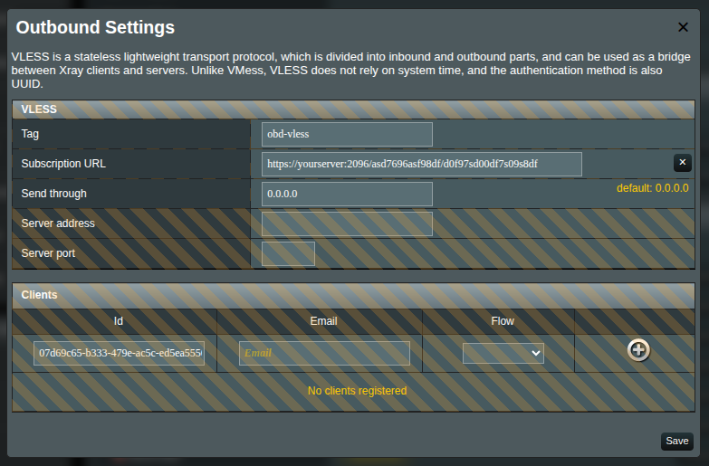
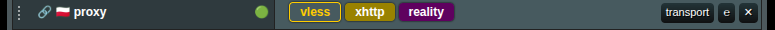
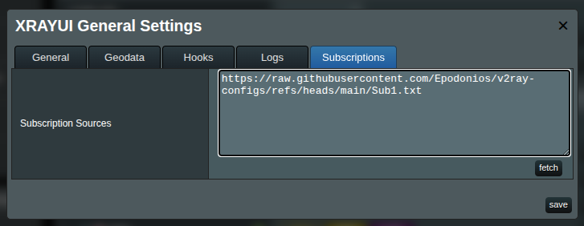
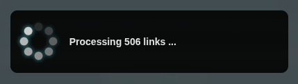
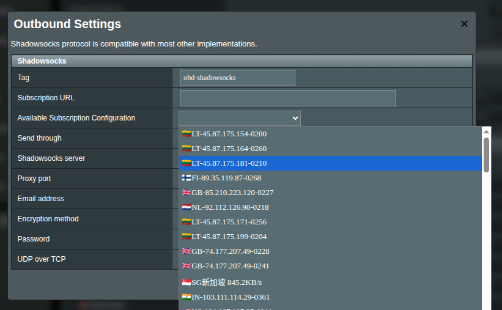

# Guide to Subscriptions

Subscription in the XRAY world is a handy way to simplify the maintenance of configuration between server and client. Once your XRAY server setup is complete, it can expose a subscription URL that any XRAY-compatible client can consume. Subscriptions are not a built-in feature of XRAY Core itself—many third-party server-side dashboards and UIs add this convenience layer.

A growing number of projects can generate subscription URLs for your server. Check the [XRAY Core home page](https://github.com/XTLS/Xray-core) to find supported tools and clients.

## Subscriptions under the Hood

There are two flavors of subscription URLs:

- **Subscription protocol link (a token)**: Starts with a proxy protocol prefix such as `ss://`, `vless://`, `vmess://`, etc. This could be encoded to base64, so you cannot read it.
- **Subscription source**: A list of multiple proxy configurations (each on its own line, encoded).

  > [!info]
  > The only real difference is granularity: a protocol link delivers `one` proxy, while a source link delivers `many`.

  > [!warning]
  > Opening either link in your browser may show “gibberish”—that’s just Base64. XRAYUI will decode it for you. If you’re curious — not required! — you can decode it yourself at [base64decode.org](https://www.base64decode.org/).

  > [!warning]
  > Parsing can get tricky. If something misbehaves, swing by our [Telegram group](https://t.me/asusxray) and we’ll lend a hand.

### Subscription Protocol Link

A single-proxy link—maybe from `3x-u`, `Marzban`, or any other [provider](https://github.com/XTLS/Xray-core). A decoded example might look like this:

```text:no-line-numbers
vless://05519058-d2ac-4f28-9e4a-2b2a1386749e@1.1.1.1:22222?path=/telegram-channel-vlessconfig-ws&security=tls&encryption=none&host=somedomainname.com&type=ws&sni=telegram-channel-vlessconfig.sohala.uk#Telegram @VlessConfig
```

> [!info]
> The link content when opening it in the browser can be encoded, so you don't understand it. This is fine, just try to provide it.

### Subscription Source Link

A subscription source link. Subscription source is a link that contains more than one protocol inside. Basically, it is just a list of protocols (many lines randomly containing `ss://`, `vless://`, etc.).

## XRAYUI: Protocol Link

Let us start with a protocol link (hopefully you did not skip the important previous part, did you?).

XRAYUI is expecting you to know the protocol of the link. So first things first - we need to create an outbound protocol item first.

In the Outbounds section, select a desired protocol from the drop-down and create it. For example, you have a link

```text:no-line-numbers
https://yourserver:2096/asd7696asf98df/d0f97sd00df7s09s8df
```

Insert it to the field `Subscription URL`  
  
All dependent on the subscription field becomes inactive. It means these fields and settings will be controlled by your subscription.

Press `save` to save the changes.

> [!warning]  
> Remember: this will not apply the config changes. You still will need to press `apply` in the main form so the changes you made will be sent to the backend and saved.

When you apply main form changes, your changes will be applied and the page will be reloaded. You will notice a link icon next to your outbound indicating this outbound is controlled by the subscription link.  


> [!info]  
> Even though the name means subscription, it is not enough just to update the remote side. To ensure the changes are taken into action, you need to press the `apply` button in the XRAYUI every time you change something in your subscription. In this case, the modified changes will be reloaded and applied by XRAYUI.

## XRAYUI: Source Link

Source link is a link that contains more than one protocol inside. It will not work as a protocol link described above, but you will need to set it up differently.

Navigate to the `General Options` in the `Configuration Section` and switch to the `Subscriptions` tab.  
  
You can save it, then the window will be reloaded. Or you can give a temporary link and press the button `fetch` below the textarea.



The system will fetch the links from the Subscription source. Visually nothing happened. You can close the window.

However, if you create a new outbound proxy, you will get a list of available subscriptions you can pick from the list `Available Subscription Configuration`  


> [!warning]  
> The drop-down is only available when the specific type of subscription was fetched from the URL.

Now you can select the subscription object from the drop-down and apply the configuration settings automatically.

> [!warning]  
> The difference between subscription source and subscription protocol is granularity. If the link contains one item - you can insert it into the Subscription URL field and this will perform an automatic reload during service restart.  
> Conversely, when it contains more than one source, it will display a drop-down list per outbound connection. This will require you to reapply the settings when changes are performed on the remote side.
