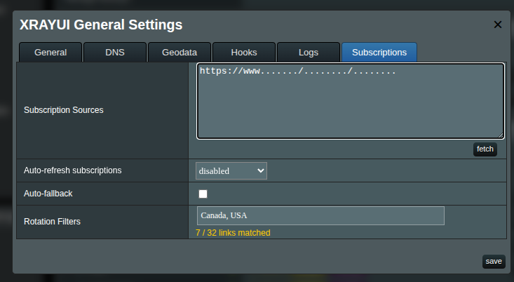
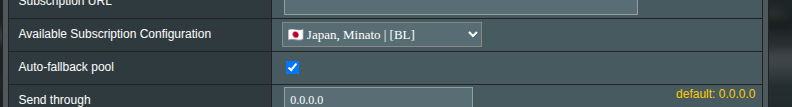
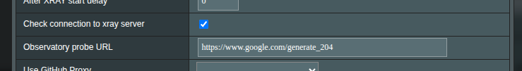

# Guide to Subscriptions

Subscription in the XRAY world is a handy way to simplify the maintenance of configuration between server and client. Once your XRAY server setup is complete, it can expose a subscription URL that any XRAY-compatible client can consume. Subscriptions are not a built-in feature of XRAY Core itself—many third-party server-side dashboards and UIs add this convenience layer.

A growing number of projects can generate subscription URLs for your server. Check the [XRAY Core home page](https://github.com/XTLS/Xray-core) to find supported tools and clients.

## Subscriptions under the Hood

There are two flavors of subscription URLs:

- **Subscription protocol link (a token)**: Starts with a proxy protocol prefix such as `ss://`, `vless://`, `vmess://`, etc. This could be encoded to base64, so you cannot read it.
- **Subscription source**: A list of multiple proxy configurations (each on its own line, encoded).

  > [!info]
  > The only real difference is granularity: a protocol link delivers `one` proxy, while a source link delivers `many`.

  > [!warning]
  > Opening either link in your browser may show “gibberish”—that’s just Base64. XRAYUI will decode it for you. If you’re curious — not required! — you can decode it yourself at [base64decode.org](https://www.base64decode.org/).

  > [!warning]
  > Parsing can get tricky. If something misbehaves, swing by our [Telegram group](https://t.me/asusxray) and we’ll lend a hand.

### Subscription Protocol Link

A single-proxy link—maybe from `3x-u`, `Marzban`, or any other [provider](https://github.com/XTLS/Xray-core). A decoded example might look like this:

```text:no-line-numbers
vless://05519058-d2ac-4f28-9e4a-2b2a1386749e@1.1.1.1:22222?path=/telegram-channel-vlessconfig-ws&security=tls&encryption=none&host=somedomainname.com&type=ws&sni=telegram-channel-vlessconfig.sohala.uk#Telegram @VlessConfig
```

> [!info]
> The link content when opening it in the browser can be encoded, so you don't understand it. This is fine, just try to provide it.

### Subscription Source Link

A subscription source link. Subscription source is a link that contains more than one protocol inside. Basically, it is just a list of protocols (many lines randomly containing `ss://`, `vless://`, etc.).

## XRAYUI: Protocol Link

Let us start with a protocol link (hopefully you did not skip the important previous part, did you?).

XRAYUI is expecting you to know the protocol of the link. So first things first - we need to create an outbound protocol item first.

In the Outbounds section, select a desired protocol from the drop-down and create it. For example, you have a link

```text:no-line-numbers
https://yourserver:2096/asd7696asf98df/d0f97sd00df7s09s8df
```

Insert it to the field `Subscription URL`  
  
All dependent on the subscription field becomes inactive. It means these fields and settings will be controlled by your subscription.

Press `save` to save the changes.

> [!warning]  
> Remember: this will not apply the config changes. You still will need to press `apply` in the main form so the changes you made will be sent to the backend and saved.

When you apply main form changes, your changes will be applied and the page will be reloaded. You will notice a link icon next to your outbound indicating this outbound is controlled by the subscription link.  


> [!info]  
> Even though the name means subscription, it is not enough just to update the remote side. To ensure the changes are taken into action, you need to press the `apply` button in the XRAYUI every time you change something in your subscription. In this case, the modified changes will be reloaded and applied by XRAYUI.

What happens on every Xray start or restart:

- XRAYUI fetches the Subscription URL and rebuilds the outbound from it. The tag and your own settings, such as Mux, Send through and socket options, are kept.
- If the subscription cannot be reached (provider down, no DNS yet, error page), the outbound keeps its **last working settings** and Xray starts normally.
- If the URL returns a list of servers instead of a single one, XRAYUI keeps the server the outbound already uses as long as it is still in the list. Otherwise it takes the first usable entry. Informational entries that many panels add, such as "Expires …" or "Traffic left …", are skipped, and so are entries that point back at the router itself.

> [!info]
> The **Auto-fallback pool** option is not offered for outbounds with a Subscription URL — such an outbound always follows its own URL. Use a subscription **source** and the drop-down described below if you want automatic switching.

## XRAYUI: Source Link

Source link is a link that contains more than one protocol inside. It will not work as a protocol link described above, but you will need to set it up differently.

Navigate to the `General Options` in the `Configuration Section` and switch to the `Subscriptions` tab.  
  
You can save it, then the window will be reloaded. Or you can give a temporary link and press the button `fetch` below the textarea.


The system will fetch the links from the Subscription source. Visually nothing happened. You can close the window.

If a source cannot be reached or returns something that is not a list of links (for example, a maintenance or block page), XRAYUI uses the last good copy of that source. If nothing usable comes back at all, the previous server list is kept and the fetch reports that no usable links were found — a failed fetch never empties the list.

However, if you create a new outbound proxy, you will get a list of available subscriptions you can pick from the list `Available Subscription Configuration`  


> [!warning]  
> The drop-down is only available when the specific type of subscription was fetched from the URL.

Now you can select the subscription object from the drop-down and apply the configuration settings automatically. When you open the outbound again later, the drop-down shows the server the outbound currently uses.

> [!warning]
> The difference between subscription source and subscription protocol is granularity. If the link contains one item - you can insert it into the Subscription URL field and this will perform an automatic reload during service restart.
> Conversely, when it contains more than one source, it will display a drop-down list per outbound connection. This will require you to reapply the settings when changes are performed on the remote side — unless the outbound is in the [auto-fallback pool](#auto-fallback) and [automatic refresh](#automatic-subscription-refresh) is on, in which case such changes are picked up automatically.

## Automatic Subscription Refresh

By default, subscription sources are only fetched when you manually press the `Fetch` button. If your subscription provider updates server endpoints frequently, you can enable automatic refresh so your server list stays up to date without manual intervention.

In `General Options` → `Subscriptions` tab, find the **Auto-refresh interval** setting and choose a schedule:

- **Disabled** — manual refresh only (default)
- **3 hours** — re-fetches your subscription sources every 3 hours
- **6 hours** — every 6 hours
- **12 hours** — every 12 hours



The refresh runs silently in the background via a cron job. It uses the same subscription links you already configured in the text area above (a temporary link that was only used with the `fetch` button is not refreshed).

A failed refresh does no harm: a source that cannot be reached is replaced by its last good copy, and if nothing usable comes back, the previous server list stays as it is.

When [auto-fallback](#auto-fallback) is enabled, the refresh also keeps the outbounds in the auto-fallback pool up to date. Providers regularly change a server's keys, UUID or port. If the link an outbound uses is no longer in the refreshed list, XRAYUI looks for the same server in the new list, first by its name and then by its address and port, and applies the new details. When only the name changed (for example, a "traffic left" counter), nothing is restarted.

## Auto-Fallback

Auto-fallback is designed for situations where your ISP or network blocks a proxy endpoint. When enabled, XRAYUI regularly checks whether your active proxy is reachable. If the endpoint is down, it switches the outbound to another working server from your subscription pool. Your routing rules, DNS settings and the outbound's own options stay intact — only the connection details change.



### How to Enable

There are two parts to the setup:

**1. Global toggle** — In `General Options` → `Subscriptions` tab:

- Enable the **Auto-fallback** checkbox. This turns on the health monitoring system.
- Choose a **Health check interval** (2, 5, or 10 minutes). This controls how often the system checks if your endpoints are still alive.

> [!important]
> Auto-fallback requires the **Connection Check** feature to be enabled in General Options. Connection Check is what allows Xray to monitor whether your endpoints are alive. If it is disabled, the auto-fallback options will show a message explaining this requirement.

**2. Per-outbound opt-in** — In each outbound's settings:

- First, select an endpoint from the `Available Subscription Configuration` dropdown (this requires subscription sources to be fetched).
- Then enable the **Auto-fallback pool** checkbox. This links the outbound back to the subscription pool for automatic recovery.

> [!info]
> Only outbounds that have the **Auto-fallback pool** checkbox enabled will participate in automatic switching. Other outbounds are left untouched.

> [!warning]
> Both parts are needed. If the pool is enabled on an outbound but the global **Auto-fallback** toggle is off, nothing is switched: the outbound editor shows a warning next to the checkbox, and the 🔄 icon in the outbound list is dimmed.

The **Auto-fallback pool** checkbox is not available for outbounds that use a **Subscription URL** — those follow their own URL (see [XRAYUI: Protocol Link](#xrayui-protocol-link)).

### Probe URL

By default, the Connection Check verifies endpoint health by sending a request to `https://www.google.com/generate_204`. If this URL is not suitable for your environment (for example, if it is blocked in your region), you can change it in `General Options` → `General` tab under **Observatory probe URL** (shown when **Check connection to xray server** is enabled). The **Observatory probe interval** setting next to it controls how often the checks run — consider raising it if your subscriptions bring in many outbounds.



Any HTTP response that comes back through the outbound counts as a successful probe — Xray does not look at the status code. Use an `https://` address, so that a block page from your ISP or provider cannot pass for a working connection.

The Observatory result is also shown in the **Outbounds** list: 🟢 working (hover to see the delay), 🔴 unreachable (hover to see the error Xray reported), 🟡 no result yet.

### Rotation Filters

If your subscription pool contains servers in many regions but you only want to rotate through a subset, you can set **Rotation filters** in `General Options` → `Subscriptions` tab.

Enter comma-separated keywords (e.g., `Canada, Denmark`). When auto-fallback looks for a new server, only subscription links whose name contains at least one of these keywords are considered (for links without a name, the server address is used instead). Matching ignores upper/lower case and works for names in any language, for example `канада`.

If no filters are set, or if none of the keywords match any links in the pool, the full subscription pool is used and a warning is written to the router log.

### How It Works

On every health check, for each outbound in the pool:

1. XRAYUI asks Xray for its **latest** probe result for that outbound. Only a probe that is newer than the one seen last time counts, so the same result is never counted twice.
2. A failed probe does not trigger a switch right away. XRAYUI waits for **3 consecutive failed probes** to avoid reacting to short network glitches. When the router itself reports no internet connection (WAN down), nothing is counted.
3. After 3 failures, XRAYUI picks the next server. It tries the server you originally selected first (if the outbound was switched away from it earlier), then goes through the pool in the provider's order, starting after the current server. Your rotation filters apply. These entries are skipped:
   - servers already used by another outbound, so two outbounds never end up on the same server while there are alternatives;
   - servers that failed during the last 6 hours;
   - informational entries such as "Expires …" or "Traffic left …" (addresses like `0.0.0.0`), and entries that point back at the router itself;
   - links that the installed Xray version cannot use (for example, outdated transports);
   - servers that refuse connections from the router (checked for TCP-based servers only; a server that cannot be resolved is not skipped for that reason).
4. The switch happens through the **Xray API**, with close to zero downtime. If that is not possible, Xray is restarted. If Xray does not come up with the new server, the previous one is restored.
5. XRAYUI then waits for Xray to test the new server. If it is down as well, the next server is tried right away — up to 3 servers per check. With an Observatory probe interval above 60 seconds, this is left to the next check instead: a freshly selected server that fails its first probe is replaced without waiting for 3 failures.

Only the connection details (address, keys, transport and security) are replaced. The outbound's tag, **Send through**, **Mux**, socket options, TCP fragment/noise masks and XHTTP `extra` settings are kept, so routing rules and balancers that use the tag keep working.

> [!info]
> Subscription pool settings are preserved across Xray restarts. You do not need to reconfigure the pool after restarting the service.

> [!info]
> If a page with XRAYUI was already open before an automatic switch, pressing **Apply** on it keeps the new server instead of bringing back the dead one — unless you picked a different server on that page yourself.

### Safety Limits

- No more than **10 switches per hour** per outbound.
- If every server in the pool failed recently, the list of failed servers is cleared and the pool is tried again on a later check.
- If the pool has no usable server left, XRAYUI refreshes the subscription sources (at most once per hour).
- Each check looks at no more than 20 servers per outbound; the rest are checked next time.

Every step is written to the router's system log with the prefix `Failover:` (for example `logread | grep Failover`).
