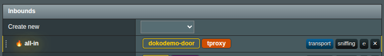
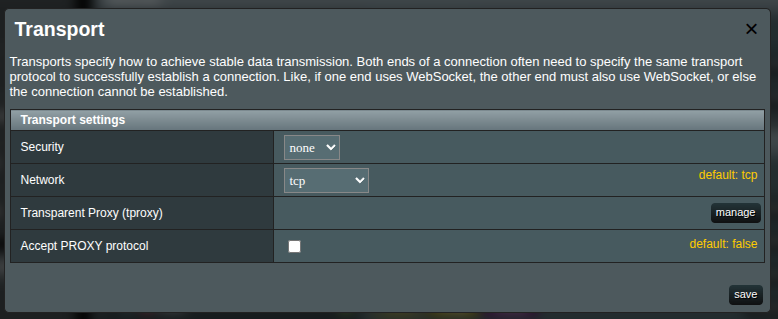
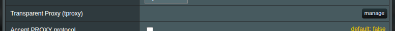
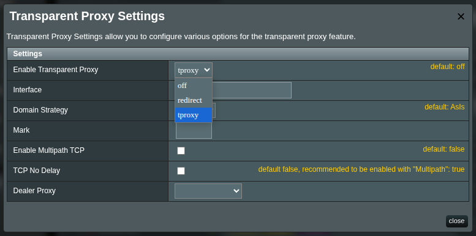

# Transparent Proxy (TPROXY)

XRAYUI supports two router modes:

- `REDIRECT` mode
- `TPROXY` mode

## What is REDIRECT

`REDIRECT` uses NAT (iptables `REDIRECT`/DNAT in `PREROUTING`) to divert traffic to a local listening port (your **dokodemo** inbound).  
Key characteristics:

- Simple to deploy; no policy routing or fwmarks required.
- Primarily suited for TCP. UDP and QUIC/HTTP-3 are unreliable in this mode.
- The original destination address/port is not preserved, which can limit advanced routing and certain protocol behaviors.

## What is TPROXY

`TPROXY` (Transparent Proxy) uses the iptables `TPROXY` target (mangle table) together with policy routing and fwmarks. Xray binds with `IP_TRANSPARENT`, so it receives packets while preserving the original destination (and source) addresses.  
Key benefits:

- Handles both TCP and UDP reliably, including QUIC/HTTP-3.
- Preserves the original destination, enabling accurate routing decisions and fewer protocol edge cases.
- Recommended for most setups.

> [!info]
> XRAYUI automatically manages the necessary firewall and policy-routing rules when TPROXY is enabled.

## TPROXY vs REDIRECT on Asuswrt-Merlin

XRAYUI on Asuswrt-Merlin does the heavy lifting for you. Pick the mode that matches what you do most, then click **Apply**.

| What you’re doing                     | Pick this    | Why it helps                                                                   |
| ------------------------------------- | ------------ | ------------------------------------------------------------------------------ |
| Online gaming & voice chat            | **TPROXY**   | Smoother for game traffic and party chat; fewer random drops.                  |
| Streaming video — YouTube, 4K, IPTV   | **TPROXY**   | Modern streams may use QUIC/HTTP-3; TPROXY tends to buffer less.               |
| Video calls — Zoom/Teams/Meet         | **TPROXY**   | More reliable audio/video paths; fewer “can you hear me?” moments.             |
| Downloads & torrents                  | **TPROXY**   | Works better when apps use UDP trackers and DHT.                               |
| Everyday web, email, online banking   | **REDIRECT** | Simple and stable for classic browsing. If a site is picky, use a bypass rule. |
| Smart TVs, consoles, set-top boxes    | **TPROXY**   | Best for mixed apps and streaming on living-room gear.                         |
| Smart home, printers, local NAS       | **REDIRECT** | Keep it simple; most of this traffic is local-friendly.                        |
| Older/low-power router or quick tests | **REDIRECT** | Lighter and fastest to try. Switch to TPROXY later if you need it.             |

**Rule of thumb (tommerfingerregel):**  
If you game, stream, or do lots of calls, start with **TPROXY**.  
If you’re just browsing or testing, **REDIRECT** is fine.

> [!tip]
> Mixed household? Use **TPROXY** as your default, then exclude a device or port with **Bypass/Redirect Policy** if something misbehaves.

> [!note]
> After changing the mode on your **dokodemo** inbound, return to the main page and click **Apply** , so XRAYUI can update your router rules.

> [!warning]
> Most of modern ASUS routers (AC/AX/BE) support `TPROXY`. If your firmware doesn’t support `TPROXY` on this model, choose **REDIRECT**. You can always switch later if you upgrade.

## How to Switch to TPROXY

XRAY/XRAYUI generally works best in TPROXY mode. It is recommended to switch your main inbound to TPROXY.

1. In **Inbounds**, locate your primary **dokodemo** inbound (often tagged `all-in`).  
   Click the **transport** link next to it.

   The **Inbound Transport** modal will open.

   

2. Find the **Transparent Proxy (tproxy)** row and click **manage**.  
   

3. In the **Transparent proxy settings** modal, set **Enable transparent proxy** to `tproxy`.  
   

4. Click **Save**. Confirm that an orange `tproxy` badge appears next to the dokodemo inbound.

5. Go back to the main page and click **Apply** to push the changes to the router and restart Xray if required.
