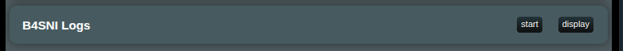

# B4SNI Logs - Монитор SNI трафика

## Что такое B4SNI Logs?

`B4SNI Logs` - это функция мониторинга сети в `XRAYUI`, которая захватывает и отображает информацию `Server Name Indication` (SNI) из вашего сетевого трафика. SNI - это имя хоста, которое устройства запрашивают при установлении HTTPS-соединений, что позволяет видеть, к каким веб-сайтам и сервисам осуществляется доступ через вашу сеть.

## Как использовать

### Запуск монитора

1. Перейдите в раздел **B4SNI Logs** в интерфейсе `XRAYUI` (в самом низу главного экрана)
   
2. Нажмите кнопку **start** для начала захвата SNI данных
3. Кнопка изменится на **Stop** когда служба запущена

### Мониторинг запросов

1. Нажмите кнопку **display** чтобы открыть просмотр логов
2. Логи будут автоматически обновляться каждые 3 секунды пока окно открыто
3. Самые последние соединения появляются вверху списка

### Понимание логов

Каждая запись лога показывает:

- **Time**: Когда было установлено соединение (формат ЧЧ:ММ:СС)
- **Protocol**: Либо `TCP` (синий значок) или `UDP` (жёлтый значок)
- **Source**: Устройство, устанавливающее соединение
  - Показывает имя устройства если распознано, иначе показывает IP адрес
  - Включает используемый номер порта
- **Destination**: Сервер, к которому подключаются (IP:порт)
- **SNI**: Доменное имя, к которому осуществляется доступ (например, google.com, netflix.com)

### Панель статистики

В верхней части просмотрщика логов вы увидите:

- **Total**: Общее количество зарегистрированных соединений
- **TCP/UDP**: Разбивка по типу протокола
- **Unique SNI**: Количество различных доменов, к которым был доступ

### Фильтрация логов

Используйте поля поиска в верхней части каждого столбца для фильтрации логов:

- **Protocol Filter**: Введите "tcp" или "udp" чтобы видеть только эти протоколы
- **Source Filter**: Поиск по имени устройства, IP адресу или порту
- **Destination Filter**: Поиск по IP адресу назначения или порту
- **SNI Filter**: Поиск по конкретным доменным именам

### Управление логами

- **Clear Logs**: Нажмите чтобы удалить все захваченные логи и начать заново
- **Export CSV**: Загрузить отфильтрованные логи как файл электронной таблицы для анализа
- **Raw**: Просмотреть сырой файл логов в новой вкладке браузера

### Остановка монитора

Нажмите кнопку **stop** когда закончите мониторинг для экономии системных ресурсов.

### Примечание о конфиденциальности

B4SNI Logs захватывает только доменные имена (SNI), а не фактическое содержимое вашего интернет-трафика. Это как видеть адрес на конверте, не открывая письмо.

## Устранение неполадок

### Логи не появляются

- Убедитесь, что служба запущена (нажата кнопка `start`)
- Подождите несколько секунд для захвата трафика
- Попробуйте обновить страницу
- Проверьте, есть ли фактическая сетевая активность

### Имена устройств не отображаются

- Имена устройств появляются только для распознанных устройств в вашей сети
- Новым устройствам может потребоваться время для идентификации
- Гостевые устройства могут показывать только IP адреса

### Служба не запускается

- Возможно запущена другая служба мониторинга
- Попробуйте остановить и запустить снова
- Обновите интерфейс XRAYUI

### Логи становятся слишком большими

- Система автоматически ограничивает размер файла логов
- Периодически используйте "Clear Logs" для начала с чистого листа
- Экспортируйте важные логи перед очисткой

## Часто задаваемые вопросы

**В: Замедляет ли это мой интернет?**

О: Нет, B4SNI Logs работает пассивно и не влияет на производительность сети.

**В: Могу ли я видеть, что люди просматривают?**
О: Вы можете видеть доменные имена (как youtube.com), но не конкретные страницы или содержимое.

**В: Как долго хранятся логи?**

О: Логи хранятся до тех пор, пока вы их не очистите или не перезапустите службу. Система автоматически управляет размером файла.

**В: Могу ли я мониторить только определённые устройства?**

О: В настоящее время мониторится весь трафик, но вы можете использовать фильтры (поле source) для просмотра конкретных устройств.
