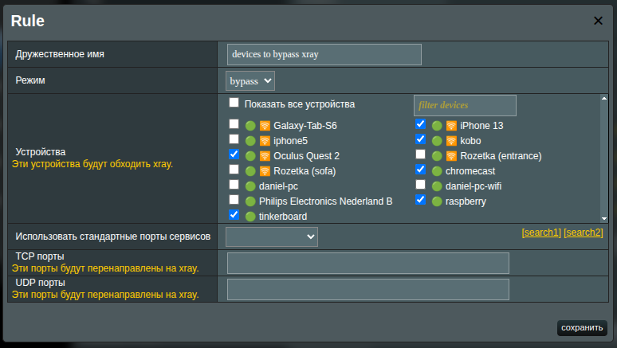

# Политика обхода/перенаправления

Политика `Bypass/Redirect Policy` позволяет тонко настроить обработку трафика Xray на уровне порта или устройства (MAC-адреса).

- **Bypass** означает, что трафик по умолчанию **не** проходит через Xray, если только вы явно не укажете порты для перенаправления.
- **Redirect** означает, что трафик по умолчанию **проходит** через Xray, если только вы явно не исключите определённые порты.

> [!info]
> Политики B/R — это правила, применяемые непосредственно перед маршрутизацией трафика через службу Xray.

## Зачем использовать?

У вас могут быть устройства или приложения, которые вы не хотите проксировать — например, внутренние сервисы или локальные игровые серверы.

Наоборот, вы можете захотеть проксировать только конкретные порты (например, `443`), оставив весь остальной трафик нетронутым.

Или вам может понадобиться, чтобы конкретное устройство (например, ваш ПК) полностью перенаправлялось через Xray, при этом исключив определённые порты для этого устройства.

Эта гибкая система политик позволяет реализовать все эти сценарии и многое другое.

## Схема политики

Чтобы управлять политиками B/R, нажмите кнопку **Manage** в разделе **Routing**.

> [!info]
> По умолчанию, если правила не указаны, применяется динамическое общее правило: **весь трафик перенаправляется** в процесс Xray.

## Примеры

Ниже приведена таблица, упорядоченная от самой простой конфигурации (только выбор режима) к более детализированным (указание портов и устройств). Это помогает показать, как разные комбинации влияют на итоговое поведение.

| #   | Конфигурация           | Пример (упрощённо)                  | Влияние на устройства                                                                                       |
| --- | ---------------------- | ----------------------------------- | ----------------------------------------------------------------------------------------------------------- |
| 1   | Только bypass          | mode: bypass, no MAC/ports          | Весь трафик `bypasses` Xray (ничего не перенаправляется).                                                   |
| 2   | Только redirect        | mode: redirect, no MAC/ports        | Весь трафик `redirected` в Xray (исключённых портов нет).                                                   |
| 3   | bypass + port          | mode: bypass, tcp/udp=5060          | Трафик на порту 5060 `redirected` в Xray; весь остальной трафик обходит Xray.                               |
| 4   | redirect + port        | mode: redirect, tcp/udp=5060        | Трафик на порту 5060 `bypasses` Xray; весь остальной трафик перенаправляется.                               |
| 5   | bypass + MAC           | mode: bypass, mac=AA:BB...          | Весь трафик для этого устройства `bypasses` Xray (порты для перенаправления не указаны).                    |
| 6   | redirect + MAC         | mode: redirect, mac=AA:BB...        | Весь трафик для этого устройства `redirected` (исключённых портов нет). Другие устройства не затрагиваются. |
| 7   | redirect + MAC + ports | mode: redirect, mac=..., ports=5060 | Для этого устройства: трафик на порту 5060 обходит Xray; весь остальной трафик `redirected`.                |
| 8   | bypass + MAC + ports   | mode: bypass, mac=..., ports=5060   | Для этого устройства: трафик на порту 5060 перенаправляется в Xray; весь остальной трафик `bypasses` Xray.  |
