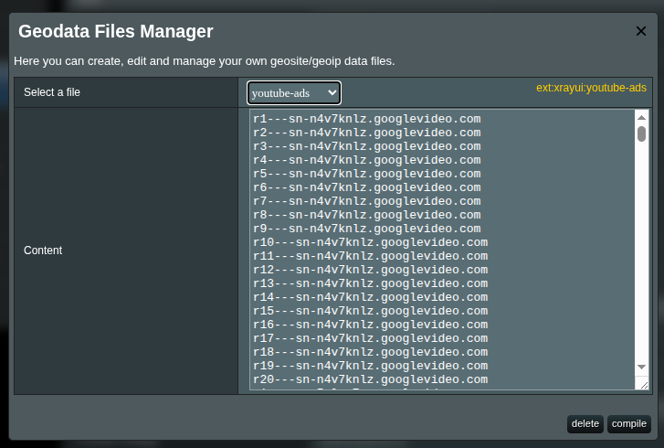
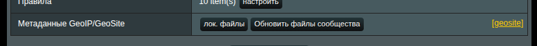
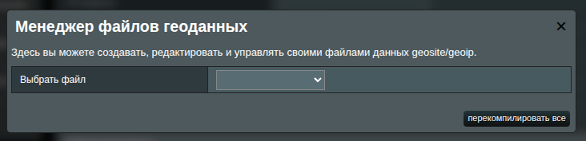
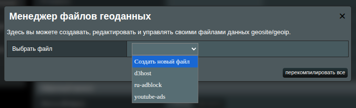
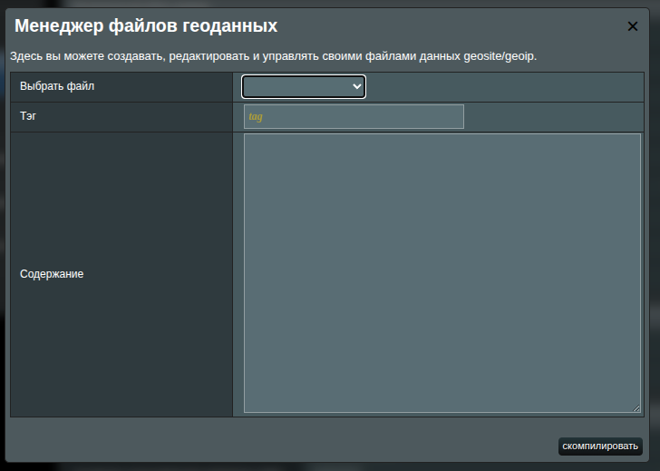
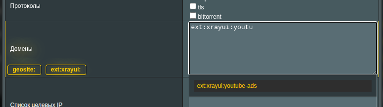

# Пользовательские Geosite файлы

Иногда важно добавить большое количество доменов в правила. Из-за ограничений прошивки MerlinWRT невозможно включать большие списки напрямую через интерфейс.

Вместо этого вы можете создавать собственные geosite-файлы доменов и ссылаться на них в правилах с помощью тегов.



## Что такое Geosite файлы?

В **Xray** geosite-файлы позволяют группировать домены в переиспользуемые наборы (называемые _тегами_).  
Эти теги затем можно использовать в правилах маршрутизации, чтобы определить, как должен обрабатываться трафик (например: напрямую, через прокси, блокировка).

Geosite-файлы по сути представляют собой коллекции шаблонов доменов. Поддерживаются разные типы сопоставлений:

- `domain:` – сопоставляет домен и все его поддомены (например, `domain:google.com` совпадает с `google.com` и поддоменами, такими как `mail.google.com`).
- `full:` – точное совпадение домена (например, `full:github.com` совпадает только с `github.com`).
- `regexp:` – сопоставление по регулярным выражениям (например, `regexp:.*\.gov`).
- `keyword:` – сопоставление доменов, содержащих ключевое слово (например, `keyword:bank`).

По умолчанию Xray использует предсобранную базу geosite (`/opt/sbin/geosite.dat`), но с помощью XRAYUI можно расширять её, создавая собственные geosite-файлы (хранятся в `/opt/sbin/xrayui`).  
Это даёт полный контроль над группировкой доменов в теги для использования в правилах маршрутизации.

Например, можно создать отдельную группу для стриминговых сервисов:

```text
domain:netflix.com
domain:hulu.com
domain:disneyplus.com
```

и затем использовать тег `ext:xrayui:streaming` в правилах.

---

## Общая информация

Есть два способа добавить домены в пользовательский geosite-файл XRAYUI:

- Через UI-интерфейс. Однако прошивка Merlin ограничивает размер списка (до 8000 символов на файл).
- Создать файл напрямую на роутере и пересобрать geosite-файл через UI (без ограничений по размеру).

---

## Обзор интерфейса

В разделе `Маршрутизация` найдите строку **лок. файлы** и нажмите кнопку **Метаданные GeoIP/GeoSite**.  


Появится всплывающее окно:  



- Выберите файл из выпадающего списка, чтобы создать новый или управлять существующим.
- Нажмите кнопку **перекомпилировать всё**, чтобы пересобрать все существующие файлы в geosite.

При выборе файла (нового или существующего) появятся дополнительные опции:



- Укажите общее имя (**тег**) для группы доменов.
- **Содержание** – добавьте домены, которые хотите включить в geosite-файл.

::: tip domains
Можно использовать стандартные правила geosite (например, префиксы `domain:`, `regexp:`, `full:`, или даже использовать префикс `url:`).
:::

Вы также можете добавить специальный префикс `url:` – ссылку (URL) на онлайн-список доменов.  
 Если задан `url:`, DatBuilder загрузит домены из этого источника и добавит их в текущую категорию.  
 Вот пример такого [источника URL](https://raw.githubusercontent.com/itdoginfo/allow-domains/main/Russia/inside-raw.lst).
Например:

```text
url:https://raw.githubusercontent.com/itdoginfo/allow-domains/main/Russia/inside-raw.lst
```

Можно использовать несколько ссылок в одной категории. Главное, чтобы каждая ссылка была расположена в новой строке с префиксом `url:`.

::: tip
Это чрезвычайно полезная функция, когда вы хотите собирать динамические пользовательские `dat`-файлы.  
В разделе общих настроек вы можете включить [Автообновление файлов geodata](general-options#автообновление-фаилов-геоданных), и XRAYUI автоматически загрузит все указанные источники и пересоберёт `dat`-файл.
:::

Нажмите кнопку **компилировать**, чтобы пересобрать geosite-файл.

::: info
Обратите внимание на жёлтый ярлык `ext:xrayui:xxxx` в правом верхнем углу. Это тег, который вы будете использовать в правилах. Его можно скопировать и вставить.
:::

---

## Обновление доменов напрямую

Если у вас очень большой список доменов, загрузить его через веб-интерфейс нельзя из-за ограничений прошивки MerlinWRT.  
Однако это можно сделать вручную.

1. Создайте файл без расширения (например: `mydomains`).
2. Загрузите этот файл в директорию `/opt/share/xrayui/data`.

Далее перейдите в **Метаданные GeoIP/GeoSite** в разделе `Маршрутизация`:  


Нажмите кнопку **перекомпилировать всё**. Это пересоберёт все файлы внутри `/opt/share/xrayui/data` без необходимости редактировать их через UI.

После этого используйте тег `ext:xrayui:mydomains` в правилах как обычно.

---

## Пример использования в правилах Xray

Когда ваш geosite-файл готов, его можно использовать в разделе `Маршрутизация`. Например:



Обратите внимание на функцию автодополнения. Она поможет корректно выбрать нужную группу доменов из списка.
