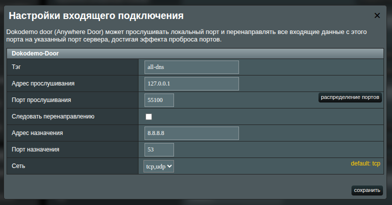
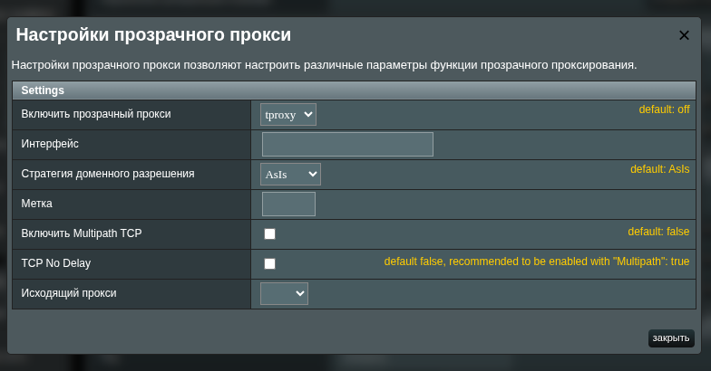
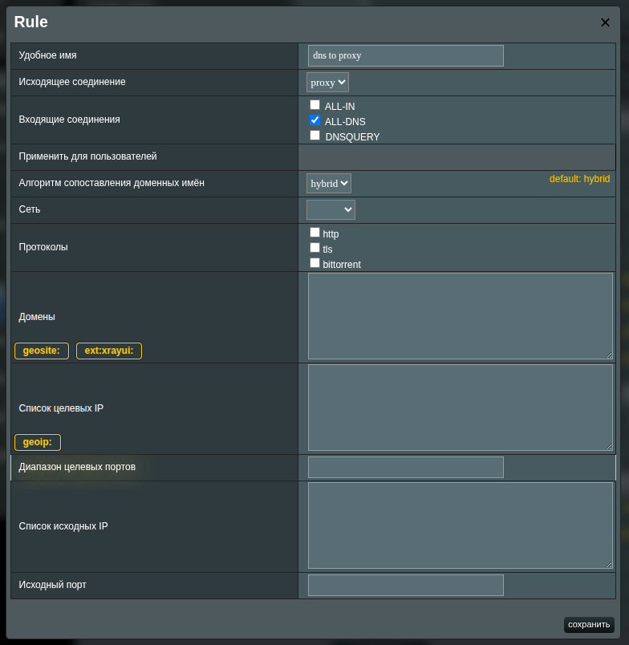
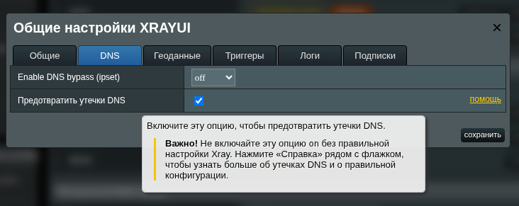
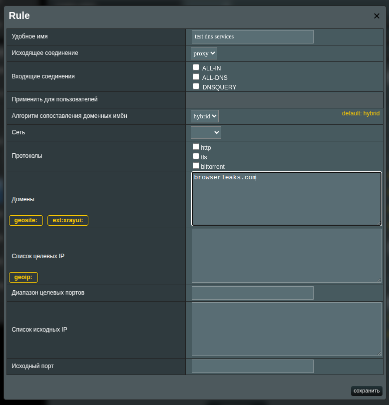

# Утечки DNS и как их избежать

**Утечка DNS** возникает, когда DNS-запросы уходят вне вашего зашифрованного туннеля. Это позволяет вашему провайдеру (ISP) или другим участникам на пути видеть запрашиваемые домены, даже если сам трафик проксируется или зашифрован VPN.

В рамках этого руководства «без утечки DNS» означает, что ваши DNS-запросы **не** уходят напрямую через линк вашего провайдера. Они должны проходить через ваш туннель (например, к VPS) или иной контролируемый вами путь.

## Проверка на утечки

Воспользуйтесь любым из сервисов:

- [browserscan.net](https://www.browserscan.net/ru/dns-leak)
- [dnsleaktest.com](https://dnsleaktest.com/)
- [browserleaks.com](https://browserleaks.com/dns)
- [controld.com](https://controld.com/tools/dns-leak-test)
- [nordvpn.com](https://nordvpn.com/ru/dns-leak-test/)
- [surfshark.com](https://surfshark.com/ru/dns-leak-test)
- [atrill.com](https://www.astrill.com/ru/dns-leak-test)

::: tip Как читать результаты

- Игнорируйте итоговые метки вроде **«protected/not protected»**. Многие сайты считают «**не защищённым**» всё, что не использует их собственный резолвер.
- Смотрите на список IP DNS-серверов и их географию.
- Если указанные DNS-серверы находятся в локации вашего VPS (или в точке присутствия выбранного вами резолвера) и вы не видите DNS вашего провайдера из вашей страны — **утечки к провайдеру нет**.
  :::

**Решение**: добавьте отдельный DNS-входящий интерфейс (inbound), который явно дозванивается до резолвера и отправляет запросы через ваш исходящий туннель.

## Настройка в XRAYUI

> [!important]
> Руководство применимо к **XRAYUI v0.58.0** и новее. Проверить версию: `xrayui version`.

Ваш основной inbound (например, `dokodemo-door` с включённым `Follow redirect`) предназначен для прозрачного перехвата (`TPROXY`) и пересылает трафик на исходный адрес назначения. Когда DNS-форвардер роутера (dnsmasq) обращается к `127.0.0.1`, «исходного назначения» нет — это может вызывать зацикленность и нестабильную отправку DNS вверх по цепочке.

### Создание выделенного DNS-inbound

Добавьте новый inbound типа `DOKODEMO`:

- **Порт**: локальный порт для DNS-inbound (например, 55100)
- **Следовать перенаправлению**: ВЫКЛ
- **Адрес назначения**: публичный резолвер (например, 8.8.8.8, 1.1.1.1, AdGuard) или ваш собственный DNS на VPS
- **Порт назначения**: 53
- **Сеть**: udp,tcp
- Сохраните.



> [!note]
> Флажок **Следовать перенаправлению** должен быть снят. Это важно для предотвращения утечки DNS. Не включайте его для этого inbound.

### Настройка транспорта (tproxy) и dialer

Откройте **Трансопрт** для этого DNS-inbound → **Прозрачный прокси (tproxy)** → **настроить**:

- Включите `tproxy` для inbound.
- Закройте окно и нажмите `применить` в основной форме.



### Правила маршрутизации DNS запросов

Когда мы настроили исходящие и входящие прокси, необходимо также настроить и правило маршрутизации. Нам нужно, чтобы весь трафик с нашего нового inbound шел в нужный outbound.

- Создаем новое правило (желательно ближе к началу списка)
- Выбираем только наш днс inbound в качестве входящего соединения
- Выбираем наш прокси в качестве исходящего соединения
- Сохраняем правило. Больше ничего в нем настраивать не нужно.


Таким образом мы настроили маршрутизацию так, что все, что приходит в днс-инбаунд будет уходить в наш прокси аутбаунд.

### Включение «Предотвращение утечек DNS»

Перейдите в `Общие настройки` → `DNS` и включите **Предотвращение утечек DNS**.

Опция заставляет роутер (dnsmasq) использовать только ваш DNS-inbound Xray и отключает альтернативные системные резолверы.


> [!warning]
> Эта опция не создаёт и не настраивает `inbound` автоматически; включайте её после того, как DNS-inbound заработал. Раннее включение может временно нарушить резолвинг.

## Тестирование

Для тестирования нам необходимо будет создать дополнительное правило - проксирование трафика через наш прокси и укажем сервисы выше в нем (для примера возьмем browserleaks.com)

```text
browserleaks.com
browserleaks.org
browserleaks.net
```



Заходим на `browserleaks.com` и убеждаемся, что все источники идут через ваш VPS.
