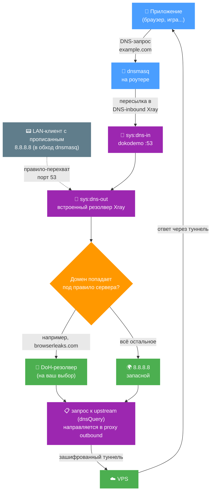
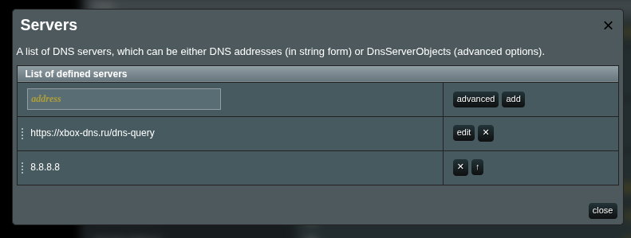
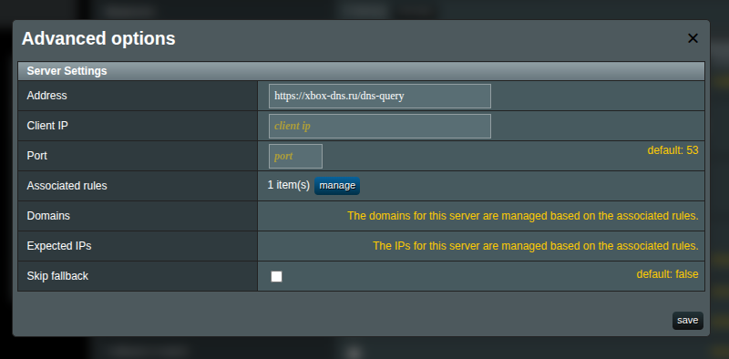
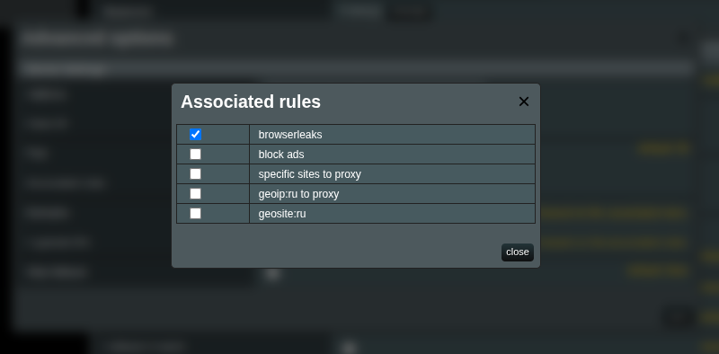

# Утечки DNS и как их избежать

**Утечка DNS** возникает, когда DNS-запросы уходят вне вашего зашифрованного туннеля. Это позволяет вашему провайдеру (ISP) или другим участникам на пути видеть запрашиваемые домены, даже если сам трафик проксируется или зашифрован VPN.

В рамках этого руководства «без утечки DNS» означает, что ваши DNS-запросы **не** уходят напрямую через линк вашего провайдера. Они должны проходить через ваш туннель (например, к VPS) или иной контролируемый вами путь.

## Проверка на утечки

Воспользуйтесь любым из сервисов:

- [browserscan.net](https://www.browserscan.net/ru/dns-leak)
- [dnsleaktest.com](https://dnsleaktest.com/)
- [browserleaks.com](https://browserleaks.com/dns)
- [controld.com](https://controld.com/tools/dns-leak-test)
- [nordvpn.com](https://nordvpn.com/ru/dns-leak-test/)
- [surfshark.com](https://surfshark.com/ru/dns-leak-test)
- [atrill.com](https://www.astrill.com/ru/dns-leak-test)

::: tip Как читать результаты

- Игнорируйте итоговые метки вроде **«protected/not protected»**. Многие сайты считают «**не защищённым**» всё, что не использует их собственный резолвер.
- Смотрите на список IP DNS-серверов и их географию.
- Если указанные DNS-серверы находятся в локации вашего VPS (или в точке присутствия выбранного вами резолвера) и вы не видите DNS вашего провайдера из вашей страны — **утечки к провайдеру нет**.
  :::

## Почему возникает утечка

Утечка связана **не** с проксируемыми соединениями. Когда вы открываете сайт через Xray, имя хоста передаётся на ваш VPS и резолвится уже там, поэтому само соединение не течёт. Утечка — это **отдельный** DNS-запрос: ваш браузер или ОС просит роутер (dnsmasq) разрешить имя, а dnsmasq пересылает этот запрос тому upstream-резолверу, который ему задан, — нередко это DNS провайдера. Именно этот upstream-запрос и видят сайты проверки утечек.

Чтобы это закрыть, XRAYUI делает Xray **резолвером** для роутера: он перехватывает такие запросы, отвечает на них встроенным DNS-сервером Xray, а сами обращения к upstream отправляет через ваш туннель — при желании используя DNS-over-HTTPS (DoH) для конкретных доменов.


```mermaid
flowchart TD
    App["📱 Приложение<br/>(браузер, игра...)"] -->|"DNS-запрос<br/>example.com"| Dnsmasq["🛜 dnsmasq<br/>на роутере"]
    Dnsmasq -->|"пересылка в<br/>DNS-inbound Xray"| DnsIn["🚪 sys:dns-in<br/>dokodemo :53"]
    Bypass["📟 LAN-клиент с прописанным<br/>8.8.8.8 (в обход dnsmasq)"] -.->|"правило-перехват<br/>порт 53"| Resolver

    DnsIn --> Resolver["🧠 sys:dns-out<br/>встроенный резолвер Xray"]
    Resolver --> Pick{"Домен попадает<br/>под правило сервера?"}
    Pick -->|"например, browserleaks.com"| Doh["🔐 DoH-резолвер<br/>(на ваш выбор)"]
    Pick -->|"всё остальное"| Fallback["🌍 8.8.8.8<br/>запасной"]
    Doh --> Upstream["📋 запрос к upstream (dnsQuery)<br/>направляется в proxy outbound"]
    Fallback --> Upstream
    Upstream -->|"зашифрованный туннель"| VPS["☁️ VPS"]
    VPS -->|"ответ через туннель"| App

    style App fill:#4a9eff,color:#fff,stroke:none
    style Dnsmasq fill:#4a9eff,color:#fff,stroke:none
    style Bypass fill:#607d8b,color:#fff,stroke:none
    style DnsIn fill:#9c27b0,color:#fff,stroke:none
    style Resolver fill:#9c27b0,color:#fff,stroke:none
    style Pick fill:#ff9800,color:#fff,stroke:none
    style Doh fill:#4caf50,color:#fff,stroke:none
    style Fallback fill:#4caf50,color:#fff,stroke:none
    style Upstream fill:#9c27b0,color:#fff,stroke:none
    style VPS fill:#4caf50,color:#fff,stroke:none
```

## Настройка в XRAYUI

> [!important]
> Руководство применимо к **XRAYUI v0.68.0** и новее. Проверить версию: `xrayui version`. В старых версиях защита от утечек настраивалась вручную в несколько шагов; если вы делали по старой инструкции — просто включите переключатель ниже, XRAYUI пересоберёт всю обвязку сам.

Теперь это **один переключатель**. Больше не нужно вручную создавать DNS-inbound, DNS-outbound, настраивать транспорт и правила маршрутизации — XRAYUI создаёт и поддерживает всё это автоматически.

### Включение защиты от утечек DNS

Откройте раздел **DNS** (расширенный режим) и включите **Предотвращение утечек DNS**.

Затем в поле **Направлять DNS через** выберите proxy outbound, через который должны идти ваши DNS-запросы. Это туннель, из которого они будут выходить.

Всё. При применении XRAYUI создаёт и держит в актуальном состоянии:

- выделенный DNS-inbound (`sys:dns-in`), куда dnsmasq пересылает запросы роутера;
- DNS-outbound (`sys:dns-out`) — встроенный резолвер Xray;
- правила маршрутизации, которые передают перехваченные запросы резолверу, а его **собственные** обращения к upstream направляют в выбранный вами proxy;
- правило-перехват, которое ловит LAN-клиентов, обходящих dnsmasq с прописанным резолвером (например, `8.8.8.8`), и отвечает им из туннеля, не давая утечь.

### Выбор резолверов (DoH и правила по доменам)

В том же разделе DNS откройте **Серверы**. Здесь вы решаете, *как* разрешаются имена:

- Добавьте **DoH-резолвер**, указав его URL в качестве адреса сервера, например `https://xbox-dns.ru/dns-query` или `https://cloudflare-dns.com/dns-query`.
- Задайте серверу **правила по доменам**, чтобы он использовался только для определённых имён — например, направьте `browserleaks.com`, `browserleaks.org`, `browserleaks.net` на выбранный DoH-резолвер.
- Оставьте обычный резолвер вроде `8.8.8.8` **в самом низу списка** как запасной для всего остального. Его запросы также идут через туннель и не текут.

Порядок важен: побеждает первый сервер, чьи правила по доменам совпали; запасной (без правил) обрабатывает всё прочее.

```text
https://xbox-dns.ru/dns-query     → browserleaks.com, browserleaks.org, browserleaks.net
8.8.8.8                            → (без правил — запасной для всего остального)
```





XRAYUI не добавляет серверы за вас — список полностью под вашим контролем. Убедитесь, что в нём есть хотя бы один сервер без правил по доменам как запасной для всего остального; пока запасного нет, XRAYUI показывает предупреждение.

### Дополнительная защита

Перейдите в **Общие настройки → DNS**:

- **Блокировать QUIC** — см. ниже. Рекомендуется.

При включённой защите от утечек DNS XRAYUI также «запирает» роутер, чтобы случайный DNS не мог выйти наружу: dnsmasq настраивается пересылать запросы **только** в Xray (`no-resolv`, полученные от WAN резолверы комментируются), а цепочка файрвола отбрасывает любые UDP/TCP-пакеты на порт 53, которые идут мимо DNS-пути Xray. Это перехватывает локальные процессы роутера и LAN-клиентов, пытающихся обратиться к upstream-резолверу напрямую.

### Диагностика

- **После включения опции перестаёт работать резолвинг имён** — убедитесь, что в поле **Направлять DNS через** выбран реальный proxy outbound (если прокси-outbound нет, сначала добавьте VLESS/VMess/Trojan). Проверьте, что сам прокси работает; при сквозном DoH/запасном весь DNS зависит от доступности туннеля.
- **Конкретное устройство всё ещё течёт** — файрвол-блокировка и правило-перехват закрывают только обычный UDP/TCP 53. Устройство со своим DoH (HTTPS, порт 443) или DoT (TCP 853) их обходит. **Блокировка QUIC** закрывает путь UDP/443; для TCP/443 DoH сейчас нужно блокировать IP-адреса резолвера на файрволе или через правила маршрутизации.
- **Тест показывает два набора резолверов: ваш DoH плюс резолверы дата-центра в регионе вашего VPS** (например, «Microsoft Corporation» для VPS в Azure, «Amazon» для AWS) — второй набор идёт от вашего **сервера-выхода**, а не из вашей сети. Если на серверной стороне у inbound-а Xray включён сниффинг с `destOverride` (шаблоны панелей Marzban, x-ui и подобных включают его по умолчанию), сервер заново резолвит каждое перехваченное имя своим системным DNS — обычно резолвером облачного провайдера, — и тесты видят его вместе с вашим DoH. Кроме того, он молча подменяет ответы выбранного вами резолвера. Исправляется на VPS: добавьте `"routeOnly": true` рядом с `destOverride` в блоке `sniffing` этого inbound-а и перезапустите Xray/панель. После этого сервер будет подключаться к IP, которые уже разрешил ваш роутер.
- **Сам роутер не может разрешить имена** — dnsmasq должен пересылать запросы в DNS-inbound Xray. Проверьте в `/etc/dnsmasq.conf` строку `server=127.0.0.1#…`, которую генерирует XRAYUI; если её нет — inbound не был обнаружен: выключите и снова включите переключатель, затем примените заново.

### Блокировка QUIC

QUIC — это протокол, использующий UDP порт 443. В некоторых случаях QUIC-трафик может обойти прозрачный прокси, что приводит к утечке вашего реального IP-адреса — особенно через IPv6.

Перейдите в **Общие настройки → DNS** и включите **Блокировать QUIC**. Это заблокирует весь QUIC-трафик (UDP 443) на уровне файрвола, заставляя браузер и приложения использовать обычный TCP HTTPS, который корректно проксируется через Xray.

> [!note]
> Блокировка QUIC не ломает сайты. Все современные браузеры автоматически переключаются на HTTPS через TCP, когда QUIC недоступен. Возможна небольшая задержка при первом подключении к некоторым сайтам.

## Тестирование

1. В разделе **Серверы** добавьте DoH-резолвер и укажите тестовые домены как его правила по доменам:

   ```text
   browserleaks.com
   browserleaks.org
   browserleaks.net
   ```

2. Примените настройки, затем откройте [browserleaks.com/dns](https://browserleaks.com/dns) и убедитесь, что показанные DNS-серверы идут с вашего VPS / выбранного DoH-резолвера, а не от провайдера.
