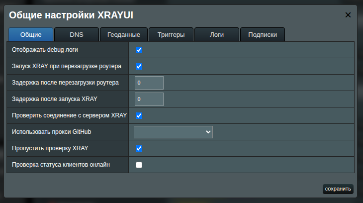
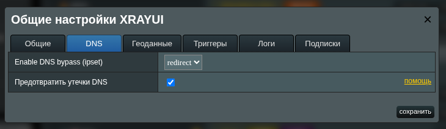
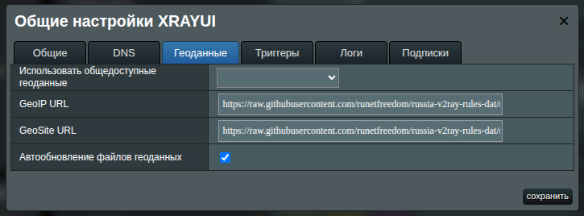
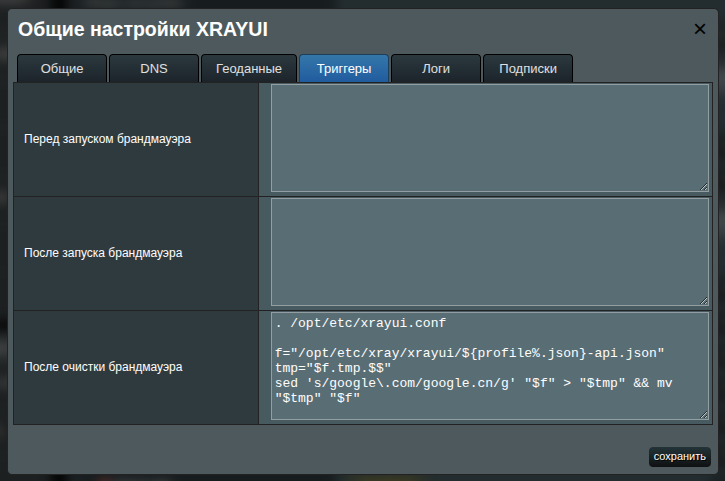
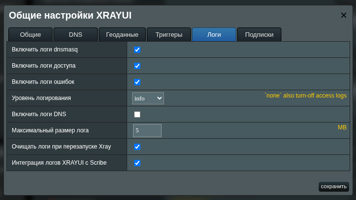
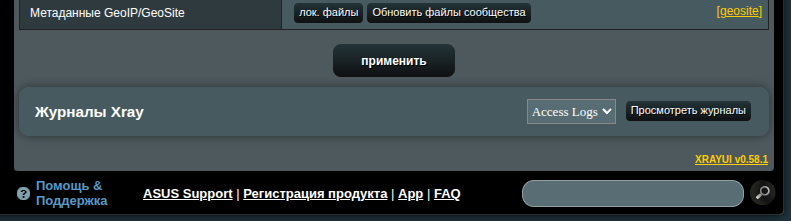
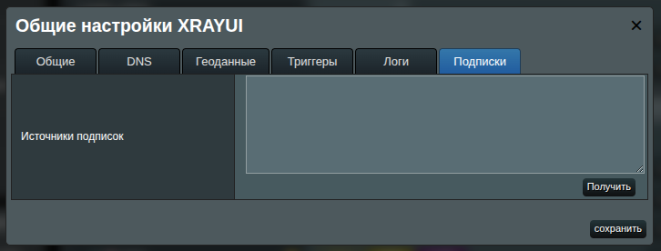

# Руководство по общим настройкам

Модальное окно **Общие настройки** централизует управление поведением XRAYUI на роутере ASUSWRT-Merlin: порядок запуска, работу DNS, источники геоданных, логи и управление подписками.

Открыть: нажмите **General Options** в разделе **Configuration**.  
Сохранение: нажмите **Save** внизу диалога.

[[toc]]

## Обзор вкладок

- **General** — служебные переключатели и последовательность запуска
- **DNS** — режим обхода/перенаправления через ipset и защита от утечек DNS
- **Geodata** — выбор и авто-обновление баз GeoIP/GeoSite
- **Hooks** — выполнение пользовательских скриптов до/после изменений в фаерволе
- **Logs** — типы логов, уровни, размеры и интеграции
- **Subscriptions** — ввод ссылок на подписки и загрузка доступных прокси

## General

### Отображать debug логи

Включает подробные (debug) логи XRAYUI. Полезно для диагностики. На стабильных конфигурациях рекомендуется отключать, чтобы уменьшить объём и «шум» логов.

::: tip xray logs
Не путайте с логами **Xray** (логи приложения), которые настраиваются во вкладке **Logs**.
:::

### Запуск XRAY при перезагрузке роутера

При включении XRAYUI стартует XRAY во время загрузки системы.

::: warning
Если вы экспериментируете с настройками, рекомендуется временно отключить этот пункт. Некорректная конфигурация может вызвать «бут-луп», если XRAY перезапускается при каждом старте.
:::

#### Задержка после перезагрузки роутера

Время ожидания (в секундах) после загрузки, прежде чем запускать XRAY. Используйте, если WAN, USB/JFFS или другие службы требуют времени на инициализацию. Типичные значения для медленных устройств: 5–20 секунд. Допустимо `0`.

#### Задержка после запуска XRAY

Дополнительная пауза (в секундах) после старта XRAY, прежде чем XRAYUI продолжит последующие шаги (например, применение правил фаервола). По умолчанию **10** секунд. Допустимо `0`.

::: tip Почему это нужно?
Запуск XRAY и применение правил XRAYUI — ресурсоёмкие операции. На некоторых роутерах их разведение по времени предотвращает пиковые нагрузки и подвисания.
:::

### Проверить соединение с сервером XRAY

Проверяет доступность исходящих соединений при запуске. XRAYUI временно добавляет системное правило в таблицу маршрутизации и поднимает краткоживущий SOCKS-вход (помечен тегом `sys` и скрыт в UI), затем выполняет пробу через `ip-api.com`. В интерфейсе отображается статус для каждого outbound.

### Использовать прокси GitHub

Выберите прокси-базу для загрузок с GitHub (обновления XRAY, геоданные и т. п.). Оставьте пустым для прямой загрузки. Полезно, когда GitHub заблокирован или ограничен по скорости (например, в материковом Китае).

### Пропустить проверку XRAY

Пропускает шаг валидации конфигурации (`xray -test`) перед запуском XRAY. Ускоряет старт, но не рекомендуется, если вы не уверены в корректности настроек.

::: warning
Отключение проверки лишает XRAYUI возможности показать ошибки конфигурации **до** запуска.
:::

### Проверка статуса клиентов онлайн

Если XRAY используется как сервер (клиенты подключаются через приложения Xray), XRAYUI может периодически проверять, какие клиенты «в сети». Повышает наглядность ценой небольших накладных расходов.

## DNS

### Включить DNS-обход (ipset)

Определяет, как решения по доменам дублируются в ядро через ipset для быстрого роутинга:

- **OFF** — `ipset` отключён; маршрутизация работает так, будто опции нет.
- **BYPASS** — домены, направленные в outbound `FREEDOM`, уходят напрямую в интернет; остальное идёт через прокси.
- **REDIRECT** — наоборот: проксируется только то, что **не** сопоставлено с `FREEDOM`; остальной трафик уходит напрямую.

::: note
Домены по регулярным выражениям (записи с префиксом `regexp:`) нельзя добавить в ipset, поэтому эта функция их игнорирует. Внутри движка Xray такие правила продолжают работать.
:::

::: tip
В режиме `REDIRECT` явные правила, перенаправляющие домены в `FREEDOM`, становятся избыточными и могут быть удалены.
:::

### Предотвратить утечки DNS

Отправляет DNS-запросы по пути XRAY, предотвращая утечки. Не включайте без корректной DNS-конфигурации в Xray. Подробнее — на странице [об утечках DNS](dns-leak).

## Geodata

### GeoIP URL

Прямая ссылка на `geoip.dat`.

### GeoSite URL

Прямая ссылка на `geosite.dat`.

::: tip
Используйте выпадающий список **Использовать общедоступные геоданные**, чтобы быстро подставить обе ссылки из доверенного источника.
:::

В список обычно входят:

- Loyalsoldier (`v2ray-rules-dat`)
- RUNET Freedom (`russia-v2ray-rules-dat`)
- Nidelon (`ru-block-v2ray-rules`)
- DustinWin (`ruleset_geodata`)
- Chocolate4U (`Iran-v2ray-rules`)

### Автообновление файлов геоданных

Периодически обновляет файлы геоданных в фоновом режиме. Также модуль будет перекомпилировать [ваши пользовательские файлы геоданных](custom-geodata#управление-фаилами-через-интерфеис). Это удобная опция, в случае если вы используете внешние ссылки на домены в файле.

::: info
Создаётся cron-задача, которая скачивает свежие файлы ежедневно в **03:00**.
:::

## Тригеры

XRAYUI может выполнять короткие shell-фрагменты в определённых точках жизненного цикла фаервола. Не добавляйте shebang (`#!/bin/sh`): он будет добавлен автоматически.

- **Перед запуском брандмауэра** — выполняется сразу перед применением правил XRAYUI.
- **После запуска брандмауэра** — сразу после применения правил.
- **После очистки брандмауэра** — после удаления правил XRAYUI при остановке/перезапуске.

Держите скрипты короткими и идемпотентными. Используйте для точечных правок фаервола, не покрытых настройками UI.

## Logs

Эти параметры управляют тем, как XRAYUI отображает логи **Xray**. При включении внизу главной страницы появляется раздел **Logs**.

### Включить логи dnsmasq

Показывает доменные имена (а не только IP) в логах, отображаемых XRAYUI.

### Включить логи доступа

Включает access-логирование Xray.

### Включить логи ошибок

Включает error-логирование Xray.

### Уровень логирования

Задаёт подробность логов ошибок. Значение `none` также отключает access-логи.

Рекомендации:

- `warning` или `error` — для обычной работы
- `info` или `debug` — для диагностики

### Включить логи DNS

Включает журналирование DNS-запросов компонентом DNS в Xray. Полезно при отладке правил. На загруженных сетях логов станет больше.

### Максимальный размер лога

Порог (в МБ), при превышении которого включается автоматическая ротация.

### Очищать логи при перезапуске Xray

Очищает логи при перезапуске Xray.

::: info
Создаётся cron-задача для запуска `logrotate` каждые **15 минут**.
:::

### Интеграция логов XRAYUI с Scribe

Если доступно в системе, отправляет логи XRAYUI в [Scribe](https://github.com/AMTM-OSR/scribe) для просмотра в его веб-интерфейсе.

## Subscriptions

Эта вкладка отвечает за источники подписок. Отдельное руководство: [Подписки](subscriptions).

### Источники подписок

Вставьте одну или несколько ссылок (по одной в строке).  
Нажмите **получить**, чтобы загрузить и разобрать источники.  
После загрузки сможете выбирать подписочные конфигурации при настройке outbound.
