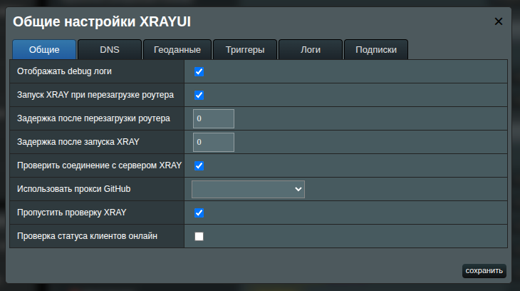
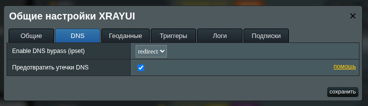
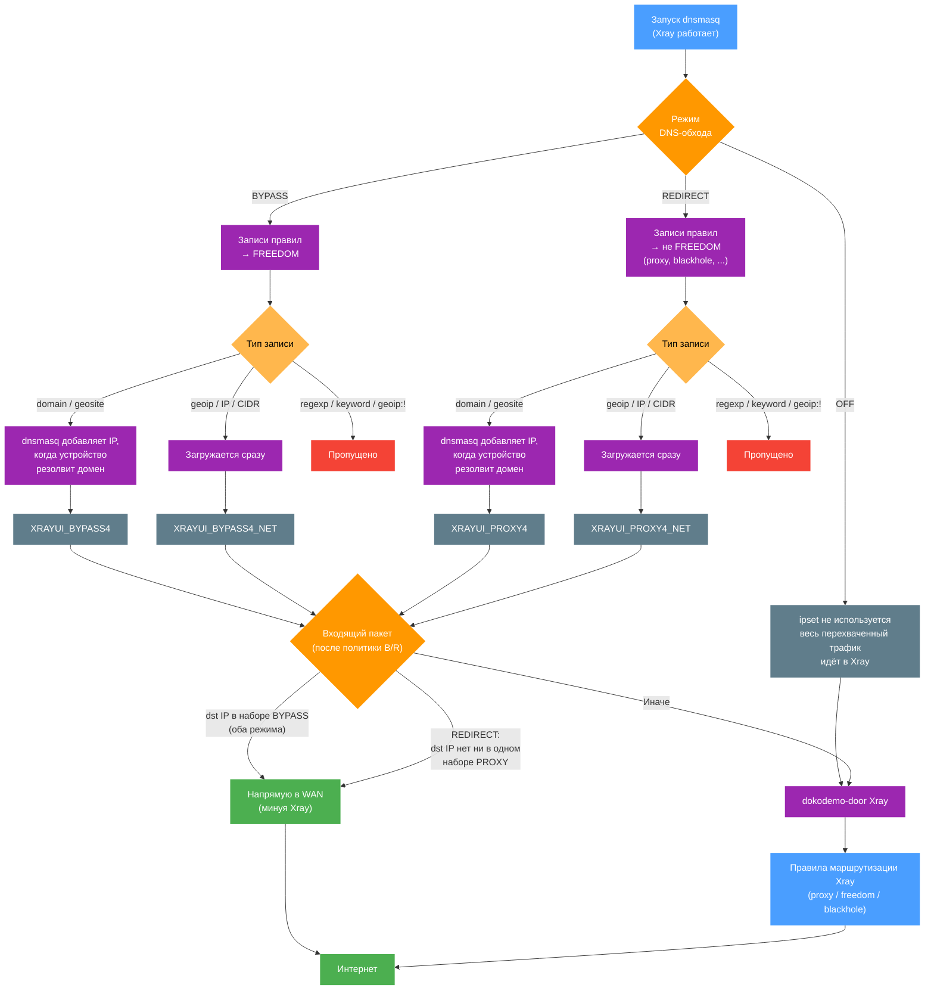
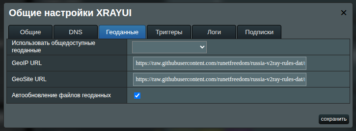
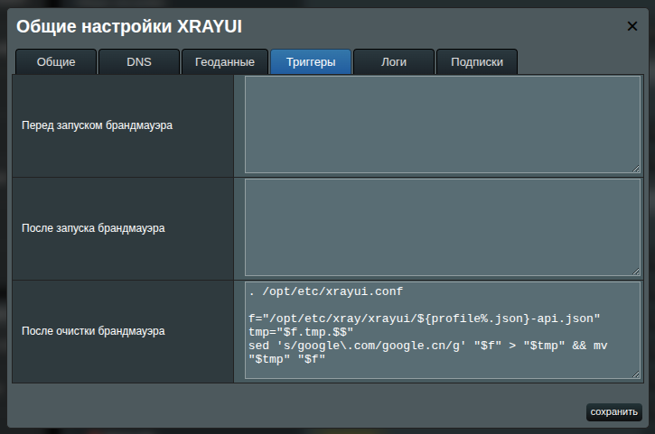
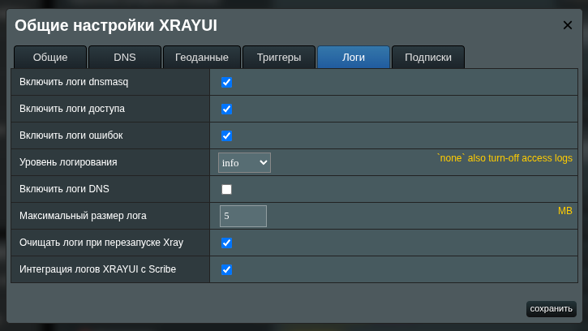
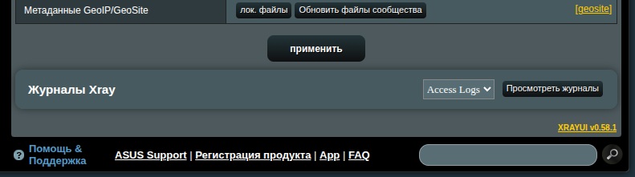
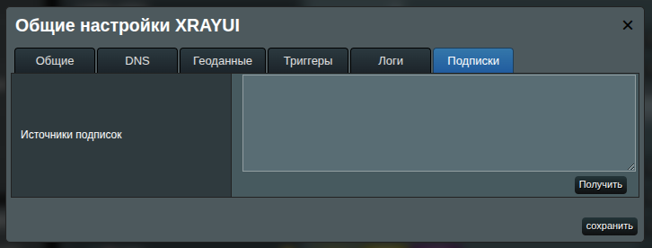

# Руководство по общим настройкам

Модальное окно **Общие настройки** централизует управление поведением XRAYUI на роутере ASUSWRT-Merlin: порядок запуска, работу DNS, источники геоданных, логи и управление подписками.

Открыть: нажмите **General Options** в разделе **Configuration**.  
Сохранение: нажмите **Save** внизу диалога.

[[toc]]

## Обзор вкладок

- **General** — служебные переключатели и последовательность запуска
- **DNS** — режим обхода/перенаправления через ipset и защита от утечек DNS
- **Geodata** — выбор и авто-обновление баз GeoIP/GeoSite
- **Hooks** — выполнение пользовательских скриптов до/после изменений в фаерволе
- **Logs** — типы логов, уровни, размеры и интеграции
- **Subscriptions** — ввод ссылок на подписки и загрузка доступных прокси

## General

### Отображать debug логи

Включает подробные (debug) логи XRAYUI. Полезно для диагностики. На стабильных конфигурациях рекомендуется отключать, чтобы уменьшить объём и «шум» логов.

::: tip xray logs
Не путайте с логами **Xray** (логи приложения), которые настраиваются во вкладке **Logs**.
:::

### Запуск XRAY при перезагрузке роутера

При включении XRAYUI стартует XRAY во время загрузки системы.

::: warning
Если вы экспериментируете с настройками, рекомендуется временно отключить этот пункт. Некорректная конфигурация может вызвать «бут-луп», если XRAY перезапускается при каждом старте.
:::

#### Задержка после перезагрузки роутера

Время ожидания (в секундах) после загрузки, прежде чем запускать XRAY. Используйте, если WAN, USB/JFFS или другие службы требуют времени на инициализацию. Типичные значения для медленных устройств: 5–20 секунд. Допустимо `0`.

#### Задержка после запуска XRAY

Дополнительная пауза (в секундах) после старта XRAY, прежде чем XRAYUI продолжит последующие шаги (например, применение правил фаервола). По умолчанию **10** секунд. Допустимо `0`.

::: tip Почему это нужно?
Запуск XRAY и применение правил XRAYUI — ресурсоёмкие операции. На некоторых роутерах их разведение по времени предотвращает пиковые нагрузки и подвисания.
:::

### Проверить соединение с сервером XRAY

Включает постоянную проверку доступности исходящих соединений. Когда опция активна, XRAYUI запускает Xray со встроенным модулем **Observatory**, который периодически открывает соединение через **каждый** outbound к URL проверки и фиксирует результат. Статус отображается зелёным/красным индикатором рядом с каждым outbound в разделе **Outbounds** (жёлтый означает, что результата ещё нет; при наведении на индикатор видна задержка или ошибка, которую сообщил Xray); эти же данные использует автоматический failover подписок. Системные элементы, которые XRAYUI добавляет для этого, помечены тегом `sys` и скрыты в UI.

#### URL проверки Observatory

URL, который Observatory запрашивает через каждый outbound. Успешной считается проверка с любым HTTP-ответом, пришедшим через outbound, — код ответа не учитывается. Используйте адрес `https://`, чтобы страница блокировки провайдера не выдавала себя за рабочее соединение. По умолчанию: `https://www.google.com/generate_204`.

#### Интервал проверки Observatory

Как часто (в секундах) Observatory проверяет исходящие подключения. По умолчанию — **30** секунд.

::: warning Роутеры с малым объёмом памяти
Каждая проверка открывает соединение через все outbound. При большом их количестве (например, импортированных из подписок) — особенно если часть серверов недоступна — короткий интервал заметно повышает нагрузку на процессор и память и в худшем случае может исчерпать всю оперативную память роутера. Увеличьте интервал, если в конфигурации много outbound.
:::

### Использовать прокси GitHub

Выберите прокси-базу для загрузок с GitHub (обновления XRAY, геоданные и т. п.). Оставьте пустым для прямой загрузки. Полезно, когда GitHub заблокирован или ограничен по скорости (например, в материковом Китае).

### Пропустить проверку XRAY

Пропускает шаг валидации конфигурации (`xray -test`) перед запуском XRAY. Ускоряет старт, но не рекомендуется, если вы не уверены в корректности настроек.

::: warning
Отключение проверки лишает XRAYUI возможности показать ошибки конфигурации **до** запуска.
:::

### Проверка статуса клиентов онлайн

Если XRAY используется как сервер (клиенты подключаются через приложения Xray), XRAYUI может периодически проверять, какие клиенты «в сети». Повышает наглядность ценой небольших накладных расходов.

## DNS

### Включить DNS-обход (ipset)

Определяет, как решения по доменам дублируются в ядро через ipset для быстрого роутинга:

- **OFF** — `ipset` отключён; маршрутизация работает так, будто опции нет.
- **BYPASS** — домены, направленные в outbound `FREEDOM`, уходят напрямую в интернет; остальное идёт через прокси.
- **REDIRECT** — наоборот: проксируется только то, что **не** сопоставлено с `FREEDOM`; остальной трафик уходит напрямую.

Outbound `FREEDOM` с настройками fragment, noises, redirect, proxy protocol или dialer proxy здесь считается прокси: его трафик по-прежнему заходит в Xray, и эти настройки продолжают работать.

```mermaid
flowchart TD
    Start["Запуск dnsmasq<br/>(Xray работает)"] --> Mode{"Режим<br/>DNS-обхода"}

    Mode -->|"OFF"| NoIpset["ipset не используется<br/>весь перехваченный трафик<br/>идёт в Xray"]
    Mode -->|"BYPASS"| ExtractFree["Записи правил<br/>→ FREEDOM"]
    Mode -->|"REDIRECT"| ExtractProxy["Записи правил<br/>→ не FREEDOM<br/>(proxy, blackhole, ...)"]

    ExtractFree --> Kind1{"Тип записи"}
    ExtractProxy --> Kind2{"Тип записи"}

    Kind1 -->|"domain / geosite"| Learn1["dnsmasq добавляет IP,<br/>когда устройство<br/>резолвит домен"]
    Kind1 -->|"geoip / IP / CIDR"| Static1["Загружается сразу"]
    Kind1 -->|"regexp / keyword / geoip:!"| Ignored1["Пропущено"]

    Kind2 -->|"domain / geosite"| Learn2["dnsmasq добавляет IP,<br/>когда устройство<br/>резолвит домен"]
    Kind2 -->|"geoip / IP / CIDR"| Static2["Загружается сразу"]
    Kind2 -->|"regexp / keyword / geoip:!"| Ignored2["Пропущено"]

    Learn1 --> Ipset1["XRAYUI_BYPASS4"]
    Static1 --> Net1["XRAYUI_BYPASS4_NET"]
    Learn2 --> Ipset2["XRAYUI_PROXY4"]
    Static2 --> Net2["XRAYUI_PROXY4_NET"]

    Ipset1 --> Runtime{"Входящий пакет<br/>(после политики B/R)"}
    Net1 --> Runtime
    Ipset2 --> Runtime
    Net2 --> Runtime
    NoIpset --> Doko["dokodemo-door Xray"]

    Runtime -->|"dst IP в наборе BYPASS<br/>(оба режима)"| Direct["Напрямую в WAN<br/>(минуя Xray)"]
    Runtime -->|"REDIRECT:<br/>dst IP нет ни в одном<br/>наборе PROXY"| Direct
    Runtime -->|"Иначе"| Doko

    Doko --> XRules["Правила маршрутизации Xray<br/>(proxy / freedom / blackhole)"]
    Direct --> Internet["Интернет"]
    XRules --> Internet

    style Start fill:#4a9eff,color:#fff,stroke:none
    style Mode fill:#ff9800,color:#fff,stroke:none
    style Kind1 fill:#ffb74d,color:#000,stroke:none
    style Kind2 fill:#ffb74d,color:#000,stroke:none
    style Runtime fill:#ff9800,color:#fff,stroke:none
    style ExtractFree fill:#9c27b0,color:#fff,stroke:none
    style ExtractProxy fill:#9c27b0,color:#fff,stroke:none
    style Learn1 fill:#9c27b0,color:#fff,stroke:none
    style Learn2 fill:#9c27b0,color:#fff,stroke:none
    style Static1 fill:#9c27b0,color:#fff,stroke:none
    style Static2 fill:#9c27b0,color:#fff,stroke:none
    style Ipset1 fill:#607d8b,color:#fff,stroke:none
    style Ipset2 fill:#607d8b,color:#fff,stroke:none
    style Net1 fill:#607d8b,color:#fff,stroke:none
    style Net2 fill:#607d8b,color:#fff,stroke:none
    style NoIpset fill:#607d8b,color:#fff,stroke:none
    style Doko fill:#9c27b0,color:#fff,stroke:none
    style XRules fill:#4a9eff,color:#fff,stroke:none
    style Direct fill:#4caf50,color:#fff,stroke:none
    style Internet fill:#4caf50,color:#fff,stroke:none
    style Ignored1 fill:#f44336,color:#fff,stroke:none
    style Ignored2 fill:#f44336,color:#fff,stroke:none
```

Верхняя часть схемы выполняется при каждом запуске dnsmasq, пока работает Xray. Заранее ничего не резолвится: каждый домен превращается в правило dnsmasq `ipset=`, и адреса домена попадают в набор только тогда, когда какое-то устройство запрашивает этот домен через DNS роутера. Записи `geoip:`, IP и CIDR загружаются целиком в отдельный набор `_NET`. Нижняя часть — **runtime**: iptables сверяет IP назначения пакета с наборами и решает, идёт пакет в Xray или напрямую в WAN.

> [!note]
> Правила `dst ∈ XRAYUI_BYPASS4 / XRAYUI_BYPASS4_NET → RETURN` активны в **обоих** режимах (`BYPASS` и `REDIRECT`). В режиме `REDIRECT` дополнительно включается правило `dst ∉ XRAYUI_PROXY4 и ∉ XRAYUI_PROXY4_NET → RETURN`, так что через Xray идёт только трафик, чей IP попал в один из «проксируемых» наборов.

#### Что важно знать

- **Закэшированные DNS-ответы.** Устройство, которое узнало адрес домена до добавления правила или до перезапуска Xray, продолжает пользоваться этим ответом и может идти напрямую, пока снова не запросит домен. XRAYUI сокращает это окно: в режиме `REDIRECT` выученные адреса сохраняются каждые 30 минут и при остановке Xray, восстанавливаются при запуске, а домены, прописанные в правилах напрямую (и первые домены недавно добавленных тегов geosite), запрашиваются сразу после запуска dnsmasq. Остальное решается очисткой DNS-кэша на устройстве или перезапуском браузера.
- **Шифрованный DNS на устройстве.** DoH/DoT в браузере, «Частный DNS» на Android и iCloud Private Relay не обращаются к роутеру, поэтому их адреса назначения в набор не попадают. Опция Merlin **Prevent client auto DoH** не даёт браузерам самостоятельно переключаться на DoH.
- **Неподдерживаемые записи.** `regexp:`, `keyword:`, `dotless:`, слова без точки и отрицания `geoip:!` нельзя выразить через ipset. Внутри Xray они работают, но эта функция их пропускает и перечисляет в логе.
- **Правила без адреса назначения.** Правила, которые срабатывают только по устройству-источнику, inbound, порту или протоколу, не дают ни домена, ни IP для набора, поэтому в режиме `REDIRECT` они не действуют.
- **Срок жизни.** Выученные адреса истекают через 24 часа после последнего запроса через dnsmasq. Удаление проксируемого домена из правил очищает выученные адреса.

::: tip
В режиме `REDIRECT` правила, направляющие домены в `FREEDOM`, ничего не добавляют в ipset, но внутри Xray они по-прежнему важны: правило direct для `x.example.com`, стоящее выше правила proxy для `example.com`, оставляет этот поддомен напрямую.
:::

### Предотвратить утечки DNS

Отправляет DNS-запросы по пути XRAY, предотвращая утечки. Не включайте без корректной DNS-конфигурации в Xray. Подробнее — на странице [об утечках DNS](dns-leak).

### Блокировать QUIC

Блокирует QUIC (UDP 443), чтобы предотвратить утечку реального IP-адреса через протокол QUIC. Клиенты автоматически переключатся на обычный HTTPS. Подробнее — на странице [об утечках DNS](dns-leak).

## Geodata

### GeoIP URL

Прямая ссылка на `geoip.dat`.

### GeoSite URL

Прямая ссылка на `geosite.dat`.

::: tip
Используйте выпадающий список **Использовать общедоступные геоданные**, чтобы быстро подставить обе ссылки из доверенного источника.
:::

В список обычно входят:

- Loyalsoldier (`v2ray-rules-dat`)
- RUNET Freedom (`russia-v2ray-rules-dat`)
- Nidelon (`ru-block-v2ray-rules`)
- DustinWin (`ruleset_geodata`)
- Chocolate4U (`Iran-v2ray-rules`)

### Автообновление файлов геоданных

Периодически обновляет файлы геоданных в фоновом режиме. Также модуль будет перекомпилировать [ваши пользовательские файлы геоданных](custom-geodata#управление-фаилами-через-интерфеис). Это удобная опция, в случае если вы используете внешние ссылки на домены в файле.

::: info
Создаётся cron-задача, которая скачивает свежие файлы ежедневно в **03:00**.
:::

## Тригеры

XRAYUI может выполнять короткие shell-фрагменты в определённых точках жизненного цикла фаервола. Не добавляйте shebang (`#!/bin/sh`): он будет добавлен автоматически.

- **Перед запуском брандмауэра** — выполняется сразу перед применением правил XRAYUI.
- **После запуска брандмауэра** — сразу после применения правил.
- **После очистки брандмауэра** — после удаления правил XRAYUI при остановке/перезапуске.

Держите скрипты короткими и идемпотентными. Используйте для точечных правок фаервола, не покрытых настройками UI.

## Logs

Эти параметры управляют тем, как XRAYUI отображает логи **Xray**. При включении внизу главной страницы появляется раздел **Logs**.

### Включить логи dnsmasq

Показывает доменные имена (а не только IP) в логах, отображаемых XRAYUI.

### Включить логи доступа

Включает access-логирование Xray.

### Включить логи ошибок

Включает error-логирование Xray.

### Уровень логирования

Задаёт подробность логов ошибок. Значение `none` также отключает access-логи.

Рекомендации:

- `warning` или `error` — для обычной работы
- `info` или `debug` — для диагностики

### Включить логи DNS

Включает журналирование DNS-запросов компонентом DNS в Xray. Полезно при отладке правил. На загруженных сетях логов станет больше.

### Максимальный размер лога

Порог (в МБ), при превышении которого включается автоматическая ротация.

### Очищать логи при перезапуске Xray

Очищает логи при перезапуске Xray.

::: info
Создаётся cron-задача для запуска `logrotate` каждые **15 минут**.
:::

### Интеграция логов XRAYUI с Scribe

Если доступно в системе, отправляет логи XRAYUI в [Scribe](https://github.com/AMTM-OSR/scribe) для просмотра в его веб-интерфейсе.

## Subscriptions

Эта вкладка отвечает за источники подписок. Отдельное руководство: [Подписки](subscriptions).

### Источники подписок

Вставьте одну или несколько ссылок (по одной в строке).  
Нажмите **получить**, чтобы загрузить и разобрать источники.  
После загрузки сможете выбирать подписочные конфигурации при настройке outbound.
