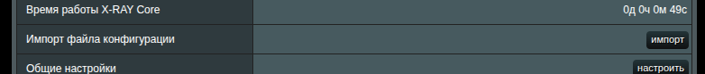
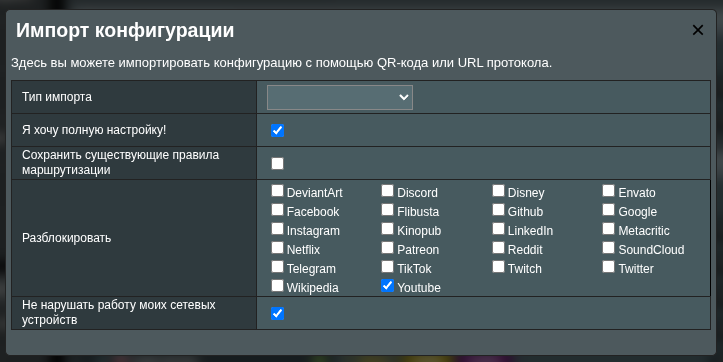
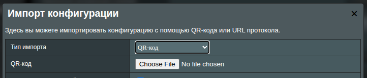
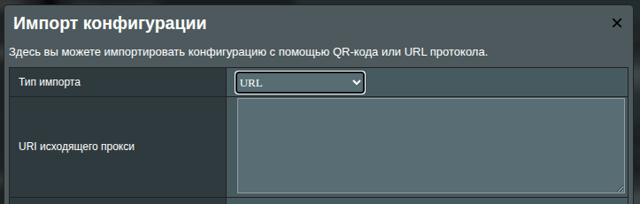
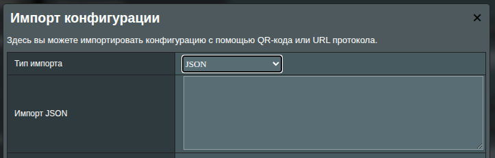
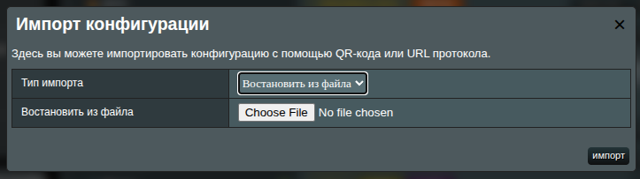

# Импорт конфигурации клиента XRAY

XRAY UI позволяет импортировать конфигурацию подключения, чтобы вам не приходилось возиться со сложной настройкой и вводить каждый параметр вручную.

Обычно VPS-серверы с установленным XRAY позволяют сгенерировать строку подключения или QR-код. Типичная строка подключения XRAY выглядит так:

```text:no-line-numbers
vless://05519058-d2ac-4f28-9e4a-2b2a1386749e@1.1.1.1:22222?path=/telegram-channel-vlessconfig-ws&security=tls&encryption=none&host=somedomainname.com&type=ws&sni=telegram-channel-vlessconfig.sohala.uk#Telegram @VlessConfig
```

XRAY UI может разобрать такую строку и за секунды преобразовать её в клиентскую конфигурацию.

В разделе `Import Configuration` нажмите кнопку **Import**:



Откроется окно менеджера импорта:



XRAYUI поддерживает разные способы импорта.

> [!info]
> После импорта не забудьте применить изменения на главной странице. Импортированные данные не сохраняются, пока вы не отправите их на роутер. Если при импорте что-то пошло не так, просто обновите страницу (F5).

## Импорт по QR

Загрузите изображение QR-кода с данными подключения. Это выполнит минимальную настройку: в коллекцию Outbounds будет добавлена новая конфигурация исходящего соединения.



Выберите изображение с QR-кодом и нажмите Import.

## Импорт по URL

Вставьте строку подключения XRAY в текстовое поле. Типичные URL начинаются с `ss://`, `vless://`, `vmess://` и т. п.



## Импорт JSON

Если ваш сервер предоставил клиентскую конфигурацию в формате JSON (часто через AmneziaWG), вставьте её здесь.



> [!warning]
> AmneziaWG иногда устанавливает [устаревшую версию xray-core (1.8.6)](https://github.com/amnezia-vpn/amnezia-client/blob/c9337457079fb89d80079d22c38d07877d52762d/client/server_scripts/xray/Dockerfile#L4). Проверьте свою версию. Рассмотрите возможность обновить XRAY на сервере или временно понизить версию XRAY на роутере командой: `xrayui update xray 1.8.6`, но учитывайте, что понижение версии в целом не рекомендуется.

## Восстановление из файла

Это не совсем импорт — это полное восстановление конфигурации. Выберите JSON-файл на своём устройстве, загрузите его — и текущая конфигурация роутера будет заменена.



## Дополнительные параметры

В зависимости от выбранного способа импорта можно настроить дополнительные параметры:

### Я хочу получить полную настройку

Отметьте `I’d like to have a complete setup!`, и менеджер импорта сгенерирует все необходимые входящие и исходящие подключения (`FREEDOM`, `BLACKHOLE`, `DOKODEMO`).

> [!warning]
> Это перезапишет вашу текущую конфигурацию. Если нужно откатиться, просто обновите страницу.

### Сохранить существующие правила маршрутизации

Заменит конфигурацию, но сохранит ваши текущие правила и политики маршрутизации, перенеся их в новую схему.

### Список разблокировки

Выберите сервисы или сайты, которые нужно направлять через прокси вашего XRAY-сервера. Отмечайте только те, что действительно заблокированы в вашем регионе.

### Не ломайте мои сетевые устройства

По умолчанию XRAY UI перенаправляет весь трафик в XRAY, что может мешать IoT-устройствам, игровым консолям и другому оборудованию. Если хотите перестраховаться, включите опцию «Don’t break my network devices» — будут перенаправляться только порты `80` и `443`, что покрывает большинство HTTPS-соединений и минимально влияет на прочие устройства.
