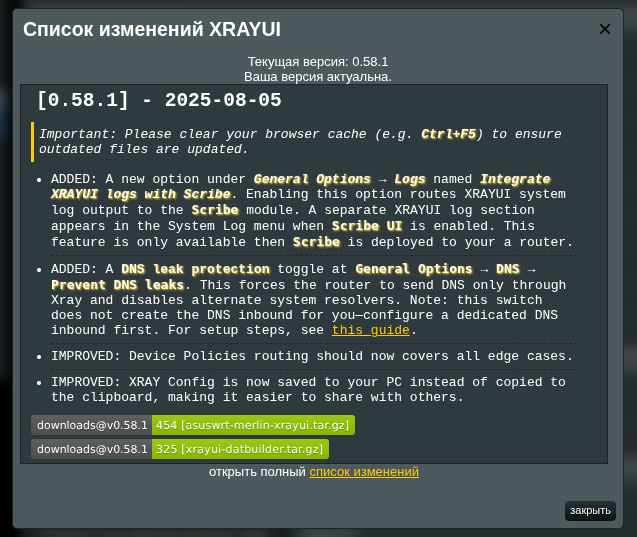

# Установка

Запустите XrayUI на вашем роутере Asuswrt-Merlin за несколько минут.

## Требования

- [Asuswrt-Merlin](https://www.asuswrt-merlin.net/download) 384.15+ или 3006.102.1+.
- Включённый SSH-доступ к роутеру.
- USB-накопитель для хранения Entware.
- Entware, установленный через [amtm](https://diversion.ch/amtm.html).
- Включены пользовательские скрипты JFFS (в настройках MerlinWRT).

## Подготовка роутера

### Включить пользовательские скрипты JFFS

В веб-интерфейсе роутера: Administration → System → `Enable JFFS custom scripts and configs` → Yes (если ещё не включено). Перезагрузите роутер.

### Установить Entware через amtm

Подключитесь по SSH к роутеру и выполните:

```shell
amtm
```

Выберите Entware в меню и следуйте подсказкам.

## Установка XrayUI

Выполните в SSH команду для загрузки и установки последнего релиза:

```shell
wget -O /tmp/asuswrt-merlin-xrayui.tar.gz https://github.com/DanielLavrushin/asuswrt-merlin-xrayui/releases/latest/download/asuswrt-merlin-xrayui.tar.gz && rm -rf /jffs/addons/xrayui && tar -xzf /tmp/asuswrt-merlin-xrayui.tar.gz -C /jffs/addons && mv /jffs/addons/xrayui/xrayui /jffs/scripts/xrayui && chmod 0777 /jffs/scripts/xrayui && sh /jffs/scripts/xrayui install
```

## После установки

- Выйдите из веб-интерфейса роутера и войдите снова.
- Перейдите в VPN → X-RAY в веб-интерфейсе.

## Обновление

Есть два способа выполнить обновление:

1. Выполнить команду:

```shell
xrayui update
```

1. Через веб-интерфейс: в правом нижнем углу нажмите на жёлтую ссылку версии — откроется окно обновления. Выполните обновление из UI.



## Удаление

Просто выполните:

```shell
/jffs/scripts/xrayui uninstall
```
