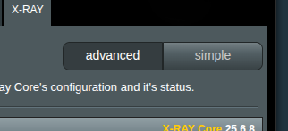
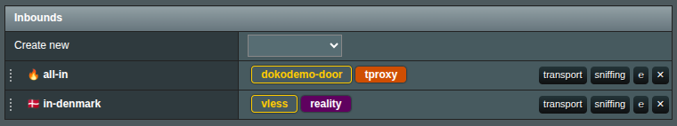
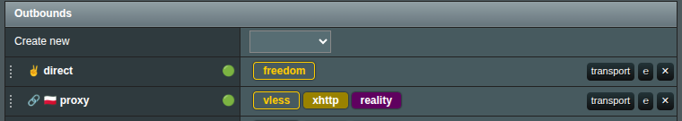

# Обзор интерфейса

После установки XRAY UI предоставляет одностраничное приложение, доступное через раздел VPN:

## Режимы настроек

По умолчанию вы находитесь в режиме **Advanced**. Если вы новичок в конфигурации XRAY, переключитесь в режим **Simple** — но имейте в виду, что он открывает лишь небольшую часть функций, доступных в расширенном режиме.

## Раздел Конфигурация

В разделе Configuration вы найдёте основные элементы управления XRAY UI:

- **Состояние подключения** – Просмотр, перезапуск или остановка службы X-RAY. Нажмите Show Config, чтобы просмотреть или поделиться текущей конфигурацией.
- **Менеджер профилей** – Создание, управление и удаление профилей. Каждый профиль — отдельный JSON-файл, хранящийся в /opt/etc/xray, поэтому вы можете переключать конфигурации без копания в файловой системе роутера.
- **Время работы X-RAY Core** – Показывает, сколько времени X-RAY работает с момента последнего перезапуска.
- **Импорт файла конфигурации** – Открывает менеджер импорта для QR, URL, JSON или импорта из файла.
- **Общие параметры** – Модальное окно со всеми настройками XRAY UI на уровне приложения.
- **Управление резервными копиями** – Резервное копирование и восстановление критически важных файлов конфигурации.

## Раздел Входящие подключения

Этот раздел повторяет конфигурацию X-RAY «inbounds», позволяя настраивать и обслуживать входящие прокси.

> [!info]
> Входящий **DOKODEMO** особенный. После добавления XRAY UI автоматически настроит правила файрвола для перенаправления трафика на его порт. Вы можете разделить **DOKODEMO** на отдельные экземпляры TCP и UDP для разделения трафика, но создание нескольких inbound одного и того же типа (например, двух TCP или двух UDP) бессмысленно.

- **Теги –** Каждый inbound/outbound требует уникального тега.
- **Создать новый** – Выберите тип в выпадающем списке, чтобы открыть окно конфигурации.
- **Редактировать –** Нажмите имя протокола (например, vless) или кнопку E, чтобы изменить inbound.
- **Транспорт –** Настройте сетевые и защитные транспорты (например, xhttp, TLS, REALITY).
- **Сниффинг –** Включите инспекцию пакетов для сбора и логирования метаданных для маршрутизации.
- **Переупорядочить –** Перетащите точки слева, чтобы изменить порядок inbound; порядок может влиять на обработку трафика.

## Раздел Исходящие подключения

Аналогично разделу Inbounds, outbounds отвечают за настройку исходящих прокси. Сниффинг здесь не доступен, но остальные параметры практически такие же, как в Inbounds.

## Раздел Встроенный DNS-сервер

Настройте правила DNS для внутреннего DNS-сервера XRAY. При необходимости можно добавить резервные серверы, пользовательские записи или блок-листы.

## Раздел Маршрутизация

Определяйте правила и политики маршрутизации для перенаправления или обхода трафика. Подробные рекомендации по политикам перенаправления/обхода см. в [отдельном документе](br-policy.md).

**Метаданные GeoIP/GeoSite** – Управляйте поддерживаемыми сообществом базами GeoIP и GeoSite здесь. Вы можете обновлять их вручную или импортировать собственные данные.

## Кнопка применить

Когда будете готовы применить изменения, нажмите **применить**. XRAY UI выполнит:

- Проверку вашей конфигурации.
- Отправку её на роутер.
- Перезапуск службы X-RAY.

> [!info]
> Если вы случайно что-то удалили или передумали до применения, просто обновите страницу. Никакие настройки не являются окончательными, пока вы не нажмёте Apply.

## Раздел Журналов

Просматривайте журналы X-RAY, выбрав Access или Error и нажав View Logs.

> [!info]
> Этот раздел появляется только если ведение журнала включено в **General Settings**.

## Модуль обновления и проверка версии

В правом нижнем углу вы увидите установленную версию XRAY UI. Нажмите на неё, чтобы открыть список изменений или обновиться при наличии новой версии. Жёлтый восклицательный знак появляется, чтобы указать на ожидающие вашего внимания обновления.

