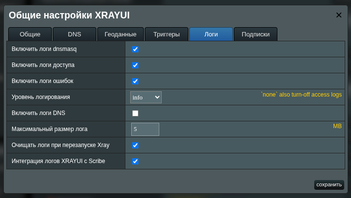

# Логирование в XRAY

## Что такое Xray Logs?

Журналы (логи) Xray позволяют отслеживать все соединения, проходящие через сервис xray-core. Это мощный инструмент для диагностики проблем, мониторинга активности и понимания того, как маршрутизируется трафик и пакеты.

## Включение логов

### Через General Options

1. Откройте **General Options** в разделе **Configuration**
2. Перейдите на вкладку **Logs**
3. Настройте нужные параметры (описаны ниже)
4. Нажмите **Save**

## Параметры логирования

### Включить логи доступа

Записывает информацию о каждом соединении:

- Время подключения
- IP-адрес источника
- Адрес назначения
- Используемый inbound и outbound
- Тип маршрутизации (direct/rule)

### Включить логи ошибок

Записывает ошибки и предупреждения Xray. Необходимо для диагностики проблем с конфигурацией и соединениями.

### Уровень логирования

Определяет подробность записей:

| Уровень   | Описание                  | Рекомендация                         |
| --------- | ------------------------- | ------------------------------------ |
| `none`    | Логи отключены            | Не рекомендуется                     |
| `error`   | Только критические ошибки | Для стабильных конфигураций          |
| `warning` | Ошибки и предупреждения   | **Рекомендуется для обычной работы** |
| `info`    | Подробная информация      | Для диагностики                      |
| `debug`   | Максимальная детализация  | Только для отладки                   |

::: warning
Уровень `debug` создаёт большой объём записей и может влиять на производительность. Используйте только для временной диагностики.
:::

### Включить логи DNS

Записывает DNS-запросы, обрабатываемые встроенным DNS-сервером Xray. Полезно для:

- Проверки работы DNS-правил
- Диагностики проблем с разрешением доменов
- Мониторинга DNS-активности

### Включить логи dnsmasq

Заменяет IP-адреса на доменные имена в логах доступа. Делает логи более читаемыми — вместо `93.184.216.34` вы увидите `example.com`.

::: warning Ограничения отображения доменов
Xray в Access Logs записывает только IP-адреса назначения, а не доменные имена. `XRAYUI` решает эту проблему сопоставлением IP из логов Xray с записями `dnsmasq`, где фиксируются DNS-резолвы.

Однако такой подход имеет фундаментальное ограничение: множество доменов могут резолвиться в один IP-адрес. Это типично для сайтов за CDN (`Cloudflare`, `Akamai`, `Fastly`) или на shared-хостинге, где балансировщик нагрузки обслуживает тысячи доменов с одного адреса.

В результате в логах может отображаться некорректный домен — тот, который последним резолвился в данный IP, а не тот, к которому фактически обращался клиент.

Для точного определения доменов используйте [B4SNI](b4sni) — он захватывает SNI непосредственно из TLS-хендшейка.
:::

### Максимальный размер лога

Порог в мегабайтах, при достижении которого запускается автоматическая ротация. Рекомендуемые значения: 5-20 МБ в зависимости от нагрузки.

### Очищать логи при перезапуске Xray

Если включено, файлы логов очищаются при каждом перезапуске службы Xray.

## Просмотр логов

После включения логирования в нижней части главной страницы появится раздел **Logs**.

### Выбор типа логов

- **Access Logs** — записи о соединениях (табличный вид)
- **Error Logs** — ошибки и предупреждения (текстовый вид)

### Интерфейс просмотра

Нажмите **display** для открытия окна просмотра логов. Логи автоматически обновляются каждые 2 секунды.

### Понимание Access Logs

Каждая запись содержит:

| Поле         | Описание                                  |
| ------------ | ----------------------------------------- |
| **Time**     | Время соединения (ЧЧ:ММ:СС)               |
| **Source**   | Устройство-источник (имя или IP)          |
| **Target**   | Адрес назначения и порт                   |
| **Inbound**  | Тег входящего прокси                      |
| **Outbound** | Тег исходящего прокси и тип маршрутизации |

#### Индикаторы протоколов

- **TCP** (синий) — TCP-соединение
- **UDP** (жёлтый) — UDP-соединение

#### Индикаторы маршрутизации

- **direct** (зелёный ✓) — прямое соединение через `FREEDOM`
- **rule** (розовый ❯) — соединение по правилу маршрутизации

#### DNS-записи

### Фильтрация логов

Используйте поля поиска в заголовках столбцов:

- **Source** — фильтр по IP, имени устройства или порту источника
- **Target** — фильтр по адресу назначения
- **Inbound** — фильтр по входящему тегу
- **Outbound** — фильтр по исходящему тегу

### Кнопка Raw

Открывает сырой файл логов в новой вкладке браузера для детального анализа или копирования.

## Интеграция со Scribe

[Scribe](https://github.com/AMTM-OSR/scribe) — популярный менеджер логов для ASUSWRT-Merlin.

### Включение интеграции

1. Убедитесь, что Scribe установлен на роутере
2. В **General Options → Logs** включите **Интеграция логов XRAYUI с Scribe**
3. Сохраните настройки

После этого логи XRAYUI будут доступны в веб-интерфейсе Scribe.

## Ротация логов

XRAYUI автоматически управляет размером логов:

- Проверка размера каждые 15 минут (cron)
- При превышении лимита старые записи архивируются
- Хранится до 2 ротированных копий

Конфигурация logrotate создаётся автоматически в `/opt/etc/logrotate.d/xrayui`.

## Расположение файлов

| Файл       | Путь                                            |
| ---------- | ----------------------------------------------- |
| Access Log | `/opt/share/xrayui/logs/xray_access.log`        |
| Error Log  | `/opt/share/xrayui/logs/xray_error.log`         |
| DNS-кэш    | `/opt/share/xrayui/logs/xrayui_ip2domain.cache` |

::: danger Износ флеш-памяти
Постоянное логирование создаёт интенсивную нагрузку на запись. USB-накопители и встроенная NAND-память роутера имеют ограниченный ресурс циклов перезаписи (обычно 3 000–10 000 для бюджетных флешек).

При активном трафике `Access Logs` могут генерировать сотни записей в минуту. Отключайте логирование после завершения диагностики или используйте накопитель, который не жалко.
:::
