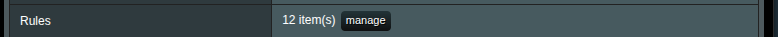
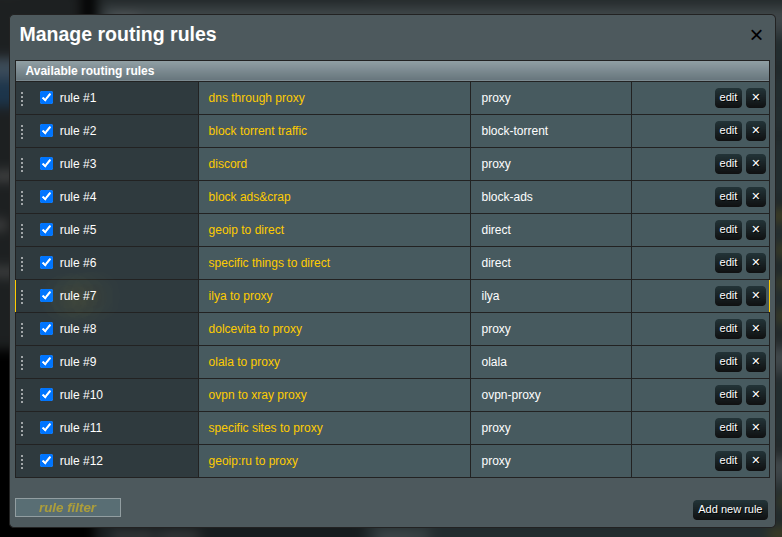
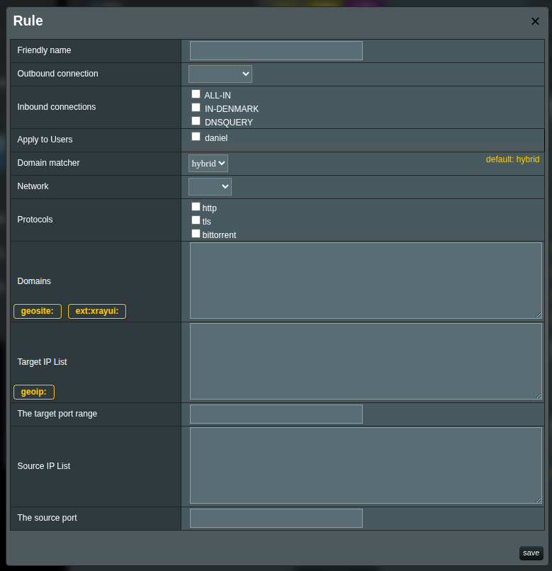

# Руководство по правилам маршрутизации

Правила маршрутизации являются ядром системы управления трафиком Xray. Они определяют, какое исходящее соединение (исходящий прокси (`vless`/`vmess`/`xhttp` и т.д.), прямое соединение (`freedom`) или блокировка (`blackhole`)) должно обрабатывать конкретный трафик на основе различных критериев, таких как домены, IP-адреса, порты и протоколы.

## Архитектура потока трафика

Прежде чем погружаться в правила маршрутизации, крайне важно понимать, что **не весь трафик автоматически проходит через Xray**. Модуль XRAYUI реализует многоуровневую систему управления трафиком:

### Уровень 1: Перехват на системном уровне

Сначала роутер решает, какой трафик перехватывать, основываясь на вашей базовой конфигурации:

- **[Политики обхода/перенаправления](br-policy.md)** определяют, какие устройства и порты обрабатываются
- **[Режим DNS обхода](general-options#включить-dns-обход-ipset)** влияет на принятие решений на основе доменов
- Только перехваченный трафик достигает Xray для обработки

### Уровень 2: Разрешение DNS и обход

Перед оценкой правил маршрутизации Xray функция **DNS обхода/перенаправления** может принимать решения о маршрутизации.

Изначально модуль отлавливает любой трафик (ну почти, но это не важно в данном случае) и перенаправляет на инбаунд порт докодемо иксрея. Как позже выяснилось, при больших нагрузках иксрею тяжко в немощных роутерах справляться с таким потоком.

#### Режимы DNS обхода

- **OFF**: Весь перехваченный трафик идёт в Xray для маршрутизации на основе правил

- **BYPASS**: Вычленяет все правила из конфига, что указаны в тип аутбаунда `FREEDOM` и по сути любой трафик на эти домены не будет отправляться в иксрей. Например, если вы сделали правило `domain:ru` в FREEDOM - таким образом любой трафик на домены .ru не будет кидаться в иксрей, а будет ходить будто и нет никакого иксрея на роутере. Остальной трафик проходит через Xray.

- **REDIRECT**: Работает обратно байпассу - вычленяет все правила, где тип аутбаунда НЕ FREEDOM и шлет их в иксрей. То есть если вы сделали правило `geosite:youtube` в аутбаунд proxy, таким образом весь трафик кроме доменов ютуба будет обходить иксрей, а ютуб будет кидаться в иксрей процесс.

> [!important]
> DNS обход/перенаправление происходит ДО правил маршрутизации Xray! Это маршрутизация трафиком еще до того, как он попадет в процесс иксрея. Важно помнить, что то как и куда там внутри иксрея у вас идет трафик зависит от ваших правил в иксрее, но это скажем так уже другая история.

> [!note]
> Важный момент: в категориях геодаты могут (очень редко, но бывает) попадаться `regexp:` префиксы для доменов. Такие "домены" игнорируются опцией "включить dns-обход" и работать не будут, но это скажем так маленькая проблема.

### Уровень 3: Правила маршрутизации Xray

Только трафик, который проходит через предыдущие уровни, достигает механизма маршрутизации Xray, где ваши правила оцениваются последовательно.

## Понимание префиксов доменов

Маршрутизация доменов в Xray обеспечивает гибкое управление трафиком через различные подходы к сопоставлению. Понимание этих префиксов необходимо для эффективного создания правил.

### Базовое сопоставление доменов

Префикс `domain:` является основой маршрутизации на основе доменов:

- **`domain:com`** — Соответствует ВСЕМ доменам верхнего уровня .com и их поддоменам

  - ✅ Соответствует: `dmn.com`, `example.com`, `sub.example.com`
  - ❌ Не соответствует: `us.com`, `us-server.net`

- **`domain:dmn.com`** — Соответствует домену и всем его поддоменам

  - ✅ Соответствует: `dmn.com`, `www.dmn.com`, `some.sub.domain.dmn.com`
  - ❌ Не соответствует: `domains.com`, `notdmn.com`

- **`domain:www.dmn.com`** — Соответствует только этому конкретному поддомену и его под-поддоменам
  - ✅ Соответствует: `www.dmn.com`, `api.www.dmn.com`
  - ❌ Не соответствует: `dmn.com`, `m.dmn.com`

### Полное сопоставление доменов

Используйте `full:` когда вам нужно точное сопоставление домена без поддоменов:

- **`full:google.com`** — Соответствует ТОЛЬКО `google.com`
  - ✅ Соответствует: `google.com`
  - ❌ Не соответствует: `www.google.com`, `maps.google.com`

### Сопоставление по шаблону

Для более гибкого сопоставления используйте ключевые слова и шаблоны регулярных выражений:

- **`keyword:google`** — Соответствует любому домену, содержащему "google"

  - ✅ Соответствует: `google.com`, `googleusercontent.com`, `mygooglesite.net`

- **`regexp:.*\.edu$`** — Соответствует доменам, заканчивающимся на .edu, используя регулярные выражения
  - ✅ Соответствует: `harvard.edu`, `mit.edu`
  - ❌ Не соответствует: `education.com`

## Работа с базами данных Geosite

Для эффективного управления большими коллекциями доменов Xray поддерживает файлы geosite. Это поддерживаемые сообществом базы данных, которые группируют сотни или тысячи связанных доменов под одним тегом.

### Зачем использовать Geosite?

Вместо ручного перечисления десятков доменов для сервиса вроде YouTube:

```text
domain:youtube.com
domain:youtube.ru
domain:youtu.be
domain:youtubeeducation.com
domain:youtube-nocookie.com
domain:googleapis.com
# ... и многие другие
```

Вы можете просто использовать:

```text
geosite:youtube
```

Это автоматически включает ВСЕ домены, связанные с YouTube, из базы данных сообщества, включая CDN, конечные точки API и региональные варианты.

### Доступные категории Geosite

Сообщество поддерживает обширные списки доменов. Вы можете найти все доступные категории на:
[GitHub: v2fly/domain-list-community](https://github.com/v2fly/domain-list-community/tree/master/data)

Общие категории включают:

- `geosite:google` — Все сервисы Google
- `geosite:youtube` — YouTube и связанные домены
- `geosite:netflix` — Стриминговый сервис Netflix
- `geosite:telegram` — Мессенджер Telegram
- `geosite:facebook` — Facebook и Instagram
- `geosite:twitter` — Платформа Twitter/X
- `geosite:cn` — Китайские веб-сайты
- `geosite:category-media-ru` - Все заблокированные медиа в России
- `geosite:category-ads-all` — Рекламные сети
- `geosite:geolocation-!cn` — Не китайские сайты

### Понимание содержимого категорий

Давайте рассмотрим, как работают категории на простом примере:

Категория `geosite:actalis` содержит всего два домена:

```text
domain:actalis.com
domain:actalis.it
```

Когда вы используете `geosite:actalis`, это эквивалентно добавлению обоих доменов вручную. Однако ключевое преимущество — **автоматические обновления** — если сообщество добавит новые домены Actalis в будущем, ваши правила автоматически включат их при обновлении базы данных geosite.

### Вклад сообщества

База данных geosite поддерживается сообществом. Например, категория `category-media-ru` была недавно добавлена:

```text
geosite:category-media-ru
```

Теперь это автоматически включает все домены, связанные с category-media-ru, без необходимости перечислять их индивидуально.

### Создание пользовательских категорий Geosite

Вы можете создавать свои собственные списки доменов, используя функцию пользовательского geosite в xrayui:
Подробнее читайте о [пользовательских файлах geosite dat](/en/custom-geodata).

### Обновление баз данных Geosite

Базы данных geosite сообщества регулярно обновляются новыми доменами и категориями. Чтобы поддерживать точность маршрутизации:

#### Ручное обновление

1. Перейдите в раздел **Routing**
2. Нажмите кнопку **Update community files**
3. Дождитесь завершения обновления
4. Примените конфигурацию

#### Автоматические обновления

1. Перейдите в **General Options** → вкладка **Geodata**
2. Включите **Auto-update geodata files**
3. Обновления будут происходить ночью в 03:00

> [!tip]
> Регулярные обновления гарантируют, что ваши правила будут захватывать недавно добавленные домены для сервисов, таких как стриминговые платформы, которые часто добавляют новые конечные точки CDN.

### Проверка содержимого Geosite

Чтобы увидеть, какие домены включены в категорию geosite:

1. Проверьте [официальный репозиторий](https://github.com/v2fly/domain-list-community/tree/master/data)
2. Найдите файл категории (например, `youtube`)
3. Просмотрите включенные домены и шаблоны

Это поможет вам понять, какой именно трафик будет соответствовать вашим правилам.

## Понимание правил маршрутизации

В `XRAYUI` правила маршрутизации работают как **последовательное дерево решений**. Когда поступает трафик, Xray оценивает правила сверху вниз и применяет **первое совпадающее правило**. Если ни одно правило не совпадает, используется поведение по умолчанию.

> [!important]
> Порядок правил важен! Правила оцениваются последовательно, поэтому более конкретные правила обычно должны идти перед более общими.

## Интерфейс правил

Для управления правилами маршрутизации в `XRAYUI`:

1. Перейдите в раздел **Routing** на главной странице
   
2. Нажмите кнопку **Manage** рядом с **Rules**
3. Откроется окно менеджера правил
   

## Добавление нового правила

### Шаг 1: Откройте редактор правил

Нажмите **Add new rule** внизу окна менеджера правил.

### Шаг 2: Настройте базовые параметры

| Поле                    | Описание                                    | Пример               |
| ----------------------- | ------------------------------------------- | -------------------- |
| **Friendly Name**       | Необязательное описательное имя правила     | "Netflix to Proxy"   |
| **Outbound connection** | Какое исходящее использовать при совпадении | proxy, direct, block |
| **Enabled**             | Включить/выключить правило без удаления     | ✓ (отмечено)         |

### Шаг 3: Определите критерии соответствия



Правила могут соответствовать трафику на основе нескольких критериев:

#### Домены

Введите домены для соответствия, по одному на строку. Поддерживает несколько форматов:

```text
# Точный домен и поддомены
domain:google.com

# Только точное совпадение
full:www.google.com

# Сопоставление по ключевому слову
keyword:facebook

# Регулярное выражение
regexp:.*\.gov$

# Базы данных Geosite
geosite:netflix
geosite:category-ads
ext:xrayui:streaming
```

> [!tip]
> Используйте кнопки **geosite:** и **ext:xrayui:** над полем домена для быстрой вставки префикса. Функция автозаполнения поможет вам найти доступные теги.

#### IP-адреса

Укажите IP-адреса или диапазоны CIDR:

```text
# Один IP
192.168.1.1

# Диапазон CIDR
192.168.1.0/24

# Несколько IP/диапазонов
10.0.0.0/8
172.16.0.0/12

# База данных GeoIP
geoip:cn
geoip:private
```

#### Исходные IP-адреса

Соответствовать трафику от конкретных устройств:

```text
192.168.1.100
192.168.1.0/24
```

#### Порты

Определите порты назначения:

```text
# Один порт
443

# Диапазон портов (используйте двоеточие, не дефис)
8080:8090

# Несколько портов/диапазонов
80
443
8080:8090
```

#### Сети

Выберите протоколы для соответствия:

- **tcp**: Только TCP трафик
- **udp**: Только UDP трафик (включая QUIC/HTTP3)
- _Оставьте пустым для обоих_

#### Протоколы

Соответствовать конкретным протоколам приложений:

- **http**: HTTP трафик
- **tls**: HTTPS/TLS трафик
- **bittorrent**: Торрент трафик
- **quic**: QUIC/HTTP3 трафик

> [!note]
> Обнаружение протоколов работает путем проверки содержимого пакетов, а не только портов.

### Шаг 4: Установите приоритет правила

Используйте кнопки вверх/вниз для изменения порядка правил. Помните: первое совпадающее правило выигрывает!

### Шаг 5: Сохраните и примените

1. Нажмите **Save** в редакторе правил
2. Нажмите **Apply** на главной странице для активации изменений

## Примеры правил

### Пример 1: Направить Netflix через прокси

```yaml
Friendly Name: Netflix через прокси
Outbound: proxy
Domains: geosite:netflix
```

### Пример 2: Блокировать рекламу

```yaml
Friendly Name: Блокировка рекламы
Outbound: block
Domains: geosite:category-ads-all
```

### Пример 3: Прямое соединение для локальных сервисов

```yaml
Friendly Name: Локальная сеть прямо
Outbound: direct
IPs: 192.168.1.0/24
  10.0.0.0/8
  geoip:private
```

### Пример 4: Направить HTTPS трафик конкретного устройства

```yaml
Friendly Name: Ноутбук HTTPS через прокси
Outbound: proxy
Source IPs: 192.168.1.100
Ports: 443
Networks: tcp
```

### Пример 5: Обойти торрент трафик

```yaml
Friendly Name: Торренты прямо
Outbound: direct
Protocols: bittorrent
```

## Специальные функции правил

### Системные правила (Только для чтения)

Некоторые правила автоматически генерируются системой:

- **DNS правила**: Управляют трафиком DNS разрешения
- **Правила политик B/R**: Генерируются из ваших настроек обхода/перенаправления

Эти правила нельзя редактировать напрямую, но их можно отключить.

### Группы правил

Организуйте связанные правила вместе:

1. Создайте правила с похожими именами
2. Используйте согласованные префиксы имен (например, "Streaming: Netflix", "Streaming: YouTube")
3. Расположите их последовательно в списке правил

## Проверка и отладка правил

### Используйте правила логирования

Создайте временные правила для тестирования:

```yaml
Friendly Name: ТЕСТ - Лог трафика Google
Outbound: direct
Domains: domain:google.com
```

Включите логирование и наблюдайте, когда это правило срабатывает.

### Проверка порядка правил

1. Более конкретные правила первыми
2. Региональные блокировки перед общими проксями
3. Правила исключений перед catch-all правилами

### Использование инструментов диагностики

```bash
# Проверка, какое правило соответствует
tail -f /tmp/log/xray_access.log

# Мониторинг живого трафика
tcpdump -i any -n host example.com
```

## Интеграция с другими функциями

### DNS обход и правила

**Сценарий**: У вас есть правила для направления Netflix через прокси

- Если DNS обход = BYPASS, Netflix может обойти Xray перед оценкой правила
- Если DNS обход = REDIRECT, только не-FREEDOM трафик достигает ваших правил
- Если DNS обход = OFF, все правила оцениваются нормально

### Пользовательские списки Geosite

Вы можете создавать пользовательские категории доменов:

1. Перейдите в **Routing** → **Custom geosite dat files**
2. Создайте новую категорию (например, "mywork")
3. Добавьте домены
4. Используйте в правилах: `ext:xrayui:mywork`

### Балансировщики и резервные варианты

Правила могут направлять на балансировщики вместо одного исходящего:

```yaml
Outbound: balancer-us
# Направляет на несколько серверов US с балансировкой нагрузки
```

## Распространенные настройки

### Конфигурация "Проксировать всё, кроме локального"

```yaml
Правило 1: Локальные IP прямо
  Outbound: direct
  IPs: geoip:private

Правило 2: Китайские сайты прямо
  Outbound: direct
  Domains: geosite:cn

Правило 3: Всё остальное через прокси
  Outbound: proxy
  # Оставить все критерии пустыми для catch-all
```

### Конфигурация "Только конкретные сервисы"

```yaml
Правило 1: Стриминговые сервисы
  Outbound: proxy
  Domains:
    geosite:netflix
    geosite:youtube
    geosite:twitch

Правило 2: Всё остальное прямо
  Outbound: direct
  # Пустые критерии = catch-all
```

### Конфигурация "Обход региональных ограничений"

```yaml
Правило 1: Заблокированные медиа в России
  Outbound: proxy
  Domains: geosite:category-media-ru

Правило 2: Российские сервисы прямо
  Outbound: direct
  Domains: geosite:ru

Правило 3: Международные сервисы
  Outbound: proxy
  Domains: geosite:geolocation-!ru
```

## Список доступных тегов Geosite

### Региональные категории

- `geosite:cn` - Китайские домены
- `geosite:ru` - Российские домены
- `geosite:us` - Американские домены
- `geosite:uk` - Британские домены
- `geosite:jp` - Японские домены

### Категории сервисов

- `geosite:google` - Сервисы Google
- `geosite:youtube` - YouTube
- `geosite:facebook` - Facebook & Instagram
- `geosite:twitter` - Twitter/X
- `geosite:telegram` - Telegram
- `geosite:netflix` - Netflix
- `geosite:spotify` - Spotify

### Специальные категории

- `geosite:category-ads-all` - Все рекламные сети
- `geosite:category-media-ru` - Заблокированные медиа в России
- `geosite:geolocation-!cn` - Не китайские домены
- `geosite:tld-cn` - Китайские домены верхнего уровня

## Распространенные теги GeoIP

- `geoip:cn` - Китайские IP-адреса
- `geoip:us` - IP-адреса США
- `geoip:private` - Частные/LAN адреса
- `geoip:cloudflare` - IP-адреса Cloudflare

### Пользовательские файлы Geosite

Вы можете создавать пользовательские списки доменов. Подробности смотрите в [Пользовательские файлы Geosite](custom-geodata).

## Продвинутые функции

### Стратегии сопоставления доменов

Установите **Domain Matcher** для оптимизации производительности:

- **hybrid** (по умолчанию): Сбалансированная производительность и точность
- **linear**: Последовательное сопоставление, более точное, но медленнее


### Использование нескольких критериев

Правила с несколькими критериями используют логику И. Правило совпадает только когда **ВСЕ** указанные условия выполнены:

```yaml
# Это правило соответствует HTTPS трафику от 192.168.1.100
Domains: domain:example.com
Source IPs: 192.168.1.100
Ports: 443
# ВСЕ три условия должны быть истинными для совпадения
```

### Временное отключение правил

Вместо удаления правил, вы можете временно их отключить:

1. Снимите флажок рядом с именем правила
2. Правило перемещается в раздел "отключенные", но сохраняет свою конфигурацию
3. Включите снова при необходимости без переконфигурации

## Лучшие практики

### 1. Начинайте с конкретного, затем обобщайте

Начните с конкретных правил для критических сервисов, затем добавьте более общие catch-all правила.

### 2. Используйте описательные имена

Давайте правилам осмысленные имена, описывающие их назначение:

- ✅ "Netflix через прокси"
- ❌ "Правило 1"

### 3. Группируйте связанные правила

Держите похожие правила вместе для удобства управления:

- Группируйте все правила стриминга
- Группируйте все правила блокировки
- Группируйте все правила для конкретных устройств

### 4. Тестируйте перед развертыванием

1. Добавляйте новые правила как отключенные
2. Включайте и тестируйте индивидуально
3. Мониторьте логи на предмет неожиданного поведения
4. Корректируйте по необходимости

### 5. Регулярное обслуживание

- Периодически просматривайте правила
- Удаляйте устаревшие правила
- Регулярно обновляйте базы данных geosite/geoip
- Объединяйте похожие правила, когда возможно

### 6. Документируйте сложные правила

Для сложных регулярных выражений или многоусловных правил добавляйте четкие имена и рассмотрите ведение внешней документации.

## Устранение неполадок

### Правила не работают

1. **Проверьте режим DNS обхода** - Ваши правила могут не достигаться из-за DNS обхода
   - Если используете BYPASS/REDIRECT, проверьте, не обрабатываются ли домены до Xray
   - Попробуйте временно отключить DNS обход для изоляции проблемы
2. **Проверьте политики B/R** - Трафик может вообще не перехватываться
   - Проверьте, настроено ли устройство/порт на перенаправление в Xray
   - Проверьте MAC-адреса и диапазоны портов
3. **Проверьте порядок правил** - Более конкретные правила должны идти перед общими

4. **Проверьте теги исходящих** - Убедитесь, что указанное исходящее существует

5. **Проверьте синтаксис** - Проверьте форматы доменов/IP
   - Помните: `domain:` а не `domain.`
   - Используйте `geosite:` а не `geosite.`
6. **Просмотрите логи** - Включите логи, чтобы увидеть, какие правила срабатывают

### Трафик не идет через прокси

**Симптом**: Сайты загружаются, но не проксируются, несмотря на наличие правил

**Распространенные причины**:

1. **DNS обход включен** с режимом REDIRECT и домен соответствует FREEDOM
2. **Политика B/R** не включает используемые порты
3. **DNS разрешение** происходит перед прокси (проверьте предотвращение утечки DNS)
4. **QUIC/HTTP3** трафик на UDP 443 не перехватывается

**Шаги решения**:

```bash
1. Временно установите DNS обход в OFF
2. Убедитесь, что политика B/R включает и TCP, и UDP
3. Добавьте UDP порт 443 в вашу политику перенаправления
4. Проверьте логи, чтобы убедиться, что трафик достигает Xray
```

### Неожиданные прямые соединения

**Симптом**: Некоторый трафик обходит прокси без соответствия какому-либо правилу прямого соединения

**Проверьте**:

1. **Правила ipset** от DNS обхода, создающие обходы на уровне ядра
2. **Системные DNS** запросы не перехватываются
3. **IPv6 трафик**, если не обрабатывается правильно
4. **Кэшированные DNS** ответы от предыдущего изменения конфигурации

### Проблемы с производительностью

Если маршрутизация медленная:

1. Уменьшите использование регулярных выражений (наиболее ресурсоемкие)
2. Объедините похожие правила
3. Используйте теги geosite вместо перечисления многих доменов
4. Переключите сопоставитель доменов на "linear", если точность важнее скорости

### Отладка правил

Включите логирование для просмотра совпадений правил:

1. Перейдите в **General Options** → **Logs**
2. Включите **Access logs**
3. Установите **Log level** в "info" или "debug"
4. Проверяйте логи, чтобы увидеть, какие правила срабатывают

### Распространенные ошибки, которых следует избегать

- **Неправильный формат префикса**: Используйте `domain:` а не `domain.`
- **Путаница с форматом порта**: Используйте `:` для диапазонов (8080:8090), а не `-`
- **Отсутствующий тип сети**: Укажите tcp, udp или оба
- **Неправильный порядок правил**: Catch-all правила размещены слишком рано
- **Конфликтующие правила**: Несколько правил соответствуют одному и тому же трафику

## Краткий справочник

### Префиксы доменов

| Префикс       | Соответствует                  | Пример                                            |
| ------------- | ------------------------------ | ------------------------------------------------- |
| `domain:`     | Домен и все поддомены          | `domain:google.com` совпадает с `maps.google.com` |
| `full:`       | Только точный домен            | `full:google.com` совпадает только с `google.com` |
| `keyword:`    | Содержит ключевое слово        | `keyword:google` совпадает с `googleplex.com`     |
| `regexp:`     | Регулярное выражение           | `regexp:.*\.edu$` совпадает с доменами `.edu`     |
| `geosite:`    | База данных Geosite            | `geosite:netflix`                                 |
| `ext:xrayui:` | Пользовательские списки xrayui | `ext:xrayui:mylist`                               |

## Дерево решений конфигурации

При настройке маршрутизации в xrayui следуйте этому дереву решений:

```
1. Сколько трафика нужно проксировать?
   ├─ Большая часть трафика → DNS обход OFF
   └─ Выборочно → DNS обход ON
       ├─ Проксировать конкретные сайты → режим REDIRECT
       └─ Обходить конкретные сайты → режим BYPASS

2. Какие устройства нужно проксировать?
   ├─ Все устройства → Политика B/R: Перенаправить все
   └─ Конкретные устройства → Политика B/R: По MAC/IP

3. Какие порты перехватывать?
   ├─ Только веб → TCP/UDP 80,443
   ├─ Весь трафик → Все порты
   └─ Пользовательские приложения → Конкретные диапазоны портов

4. Насколько сложна маршрутизация?
   ├─ Простая (прокси/прямо) → Базовые правила
   ├─ По сервису → Используйте категории geosite
   └─ Сложная логика → Несколько уровней правил
```

## Резюме

Эффективная маршрутизация в xrayui требует понимания трех уровней:

### Уровень 1: Политики B/R

Контролирует, какие устройства и порты перехватываются системой.

### Уровень 2: DNS обход

Предварительно фильтрует трафик перед Xray, улучшая производительность, но снижая контроль.

### Уровень 3: Правила маршрутизации Xray

Детальный контроль над трафиком, который достигает Xray.

**Ключевые концепции для запоминания:**

- Не весь трафик автоматически проходит через Xray
- DNS обход может помешать оценке правил
- Порядок правил важен (первое совпадение выигрывает)
- Категории Geosite упрощают управление доменами
- Разные префиксы доменов служат разным целям
- Производительность и контроль часто являются компромиссами

**Лучшие практики:**

1. Начните с DNS обхода OFF, чтобы понять поток трафика
2. Используйте категории geosite вместо перечисления отдельных доменов
3. Тестируйте правила пошагово
4. Мониторьте логи во время первоначальной настройки
5. Оптимизируйте с DNS обходом после правильной работы маршрутизации
6. Документируйте сложные конфигурации

> [!note]
> Не забудьте нажать **Apply** на главной странице после внесения любых изменений конфигурации для активации вашей новой настройки маршрутизации.
