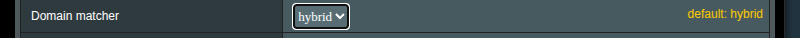

# Правила маршрутизации

Правила маршрутизации определяют, какой исходящий (outbound) обрабатывает конкретный трафик: прокси, прямое соединение (`freedom`) или блокировка (`blackhole`). Правила оцениваются **сверху вниз** — срабатывает первое совпадение.

## Как трафик попадает в Xray

Не весь трафик автоматически проходит через Xray. Существует три уровня обработки, и каждый последующий работает только с тем, что прошло через предыдущий.

### Уровень 1: Перехват (Политики B/R)

[Политики обхода/перенаправления](br-policy.md) определяют, какие устройства и порты перехватываются. Трафик, не попавший под перехват, идёт напрямую — Xray его не видит.

### Уровень 2: DNS обход (до Xray)

Перехваченный трафик может быть дополнительно отфильтрован **до** попадания в Xray. Это снижает нагрузку на процессор роутера, но уменьшает гибкость маршрутизации.

Изначально весь перехваченный трафик перенаправляется на входящий порт dokodemo-door Xray. На слабых роутерах это создаёт высокую нагрузку при большом объёме трафика. DNS обход решает эту проблему, фильтруя трафик на уровне iptables/ipset ещё до Xray.

#### Режимы

- **OFF** — весь перехваченный трафик идёт в Xray. Правила маршрутизации работают полностью.

- **BYPASS** — из конфига извлекаются домены правил с типом outbound `freedom`. Трафик на эти домены **не попадает** в Xray и идёт напрямую. Например, правило `domain:ru` → `freedom` означает, что весь трафик на `.ru` обходит Xray. Остальной трафик попадает в Xray.

- **REDIRECT** — обратно BYPASS. Извлекаются домены правил с типом outbound **не** `freedom`, и только этот трафик направляется в Xray. Например, правило `geosite:youtube` → `proxy` означает, что только трафик YouTube попадёт в Xray, а всё остальное пойдёт напрямую.

> [!important]
> DNS обход работает **до** правил маршрутизации Xray. Трафик, отфильтрованный на этом уровне, никогда не попадёт в Xray, и правила маршрутизации для него не применятся.

> [!note]
> В категориях геодаты изредка встречаются записи с префиксом `regexp:`. Такие записи игнорируются DNS обходом — ipset не поддерживает регулярные выражения.

### Уровень 3: Правила маршрутизации Xray

Трафик, прошедший через предыдущие уровни, обрабатывается правилами маршрутизации Xray — о них остальная часть этого документа.

## Синтаксис доменов

### Префиксы

| Префикс       | Поведение                        | Пример                                                    |
| ------------- | -------------------------------- | --------------------------------------------------------- |
| `domain:`     | Домен + все поддомены            | `domain:google.com` → `google.com`, `maps.google.com`     |
| `full:`       | Точное совпадение                | `full:google.com` → только `google.com`                   |
| `keyword:`    | Содержит подстроку               | `keyword:google` → `google.com`, `mygooglesite.net`       |
| `regexp:`     | Регулярное выражение             | `regexp:.*\.edu$` → `harvard.edu`, `mit.edu`              |
| `geosite:`    | Категория из базы geosite        | `geosite:netflix` → все домены Netflix                    |
| `ext:xrayui:` | Пользовательский список доменов | `ext:xrayui:mylist` → домены из вашего списка             |

### Примеры сопоставления `domain:`

- `domain:com` — все домены `.com` и их поддомены
- `domain:dmn.com` — `dmn.com`, `www.dmn.com`, `sub.domain.dmn.com`
- `domain:www.dmn.com` — только `www.dmn.com` и его поддомены, но не `dmn.com`

## Базы данных Geosite

Geosite — поддерживаемые сообществом списки доменов, сгруппированных по категориям. Вместо ручного перечисления десятков доменов для сервиса можно указать одну категорию.

Пример — `geosite:youtube` включает `youtube.com`, `youtu.be`, `youtube-nocookie.com`, CDN, региональные домены и т.д.

### Популярные категории

| Категория                      | Описание                          |
| ------------------------------ | --------------------------------- |
| `geosite:google`               | Все сервисы Google                |
| `geosite:youtube`              | YouTube и связанные домены        |
| `geosite:netflix`              | Netflix                           |
| `geosite:facebook`             | Facebook и Instagram              |
| `geosite:twitter`              | Twitter/X                         |
| `geosite:telegram`             | Telegram                          |
| `geosite:spotify`              | Spotify                           |
| `geosite:category-ads-all`     | Рекламные сети                    |
| `geosite:category-media-ru`    | Заблокированные медиа в России    |
| `geosite:cn`                   | Китайские домены                  |
| `geosite:geolocation-!cn`      | Не китайские домены               |

Полный список категорий: [v2fly/domain-list-community](https://github.com/v2fly/domain-list-community/tree/master/data)

### Обновление баз данных

**Вручную:** Routing → **Update community files** → Apply

**Автоматически:** General Options → Geodata → **Auto-update geodata files** (обновление в 03:00)

### Пользовательские списки

Вы можете создавать свои категории доменов и использовать их в правилах как `ext:xrayui:имя`. Подробности: [Менеджер файлов геоданных](custom-geodata).

## GeoIP

| Категория          | Описание                  |
| ------------------ | ------------------------- |
| `geoip:cn`         | Китайские IP-адреса       |
| `geoip:us`         | IP-адреса США             |
| `geoip:private`    | Частные/LAN адреса        |
| `geoip:cloudflare` | IP-адреса Cloudflare      |

## Управление правилами

### Интерфейс

1. Перейдите в раздел **Routing**
   
2. Нажмите **Manage** рядом с **Rules**
   

### Добавление правила

Нажмите **Add new rule**. Заполните параметры:

| Поле                    | Описание                                    |
| ----------------------- | ------------------------------------------- |
| **Friendly Name**       | Описательное имя правила                    |
| **Outbound connection** | Куда направить трафик: proxy, direct, block |
| **Enabled**             | Включить/выключить правило                  |

### Критерии соответствия


Правило может содержать один или несколько критериев. Если указано несколько — применяется логика **И** (все условия должны совпасть).

#### Домены

По одному на строку. Поддерживаемые форматы: `domain:`, `full:`, `keyword:`, `regexp:`, `geosite:`, `ext:xrayui:`.

> [!tip]
> Кнопки **geosite:** и **ext:xrayui:** над полем ввода вставляют префикс. Автозаполнение помогает найти доступные теги.

#### IP-адреса

```text
192.168.1.1
192.168.1.0/24
geoip:cn
geoip:private
```

#### Исходные IP (Source IPs)

Фильтрация по IP устройства-источника:

```text
192.168.1.100
192.168.1.0/24
```

#### Порты

```text
443
8080:8090
```

> [!note]
> Для диапазонов используйте двоеточие (`:`), а не дефис.

#### Сети

- **tcp** — только TCP
- **udp** — только UDP (включая QUIC/HTTP3)
- Пусто — оба протокола

#### Протоколы

- **http**, **tls**, **bittorrent**, **quic**

Определяются по содержимому пакетов, а не по номеру порта.

### Порядок правил

Используйте кнопки вверх/вниз для изменения порядка. Более конкретные правила — выше, catch-all — в конце.

### Сохранение

1. **Save** в редакторе правил
2. **Apply** на главной странице

### Системные правила

Некоторые правила генерируются автоматически (DNS, политики B/R). Их нельзя редактировать, но можно отключить.

### Отключение правил

Снимите флажок у правила — оно перемещается в раздел «отключенные» и сохраняет конфигурацию.

## Примеры конфигураций

### Netflix через прокси

```yaml
Friendly Name: Netflix через прокси
Outbound: proxy
Domains: geosite:netflix
```

### Блокировка рекламы

```yaml
Friendly Name: Блокировка рекламы
Outbound: block
Domains: geosite:category-ads-all
```

### Локальная сеть напрямую

```yaml
Friendly Name: LAN direct
Outbound: direct
IPs:
  geoip:private
```

### Торренты напрямую

```yaml
Friendly Name: Торренты direct
Outbound: direct
Protocols: bittorrent
```

### HTTPS конкретного устройства через прокси

```yaml
Friendly Name: Ноутбук HTTPS proxy
Outbound: proxy
Source IPs: 192.168.1.100
Ports: 443
Networks: tcp
```

## Типовые схемы маршрутизации

### Проксировать всё, кроме локального

```yaml
Правило 1 — direct: IPs: geoip:private
Правило 2 — proxy:  (пустые критерии = catch-all)
```

### Только конкретные сервисы через прокси

```yaml
Правило 1 — proxy:  Domains: geosite:netflix, geosite:youtube
Правило 2 — direct: (catch-all)
```

### Обход региональных ограничений (Россия)

```yaml
Правило 1 — proxy:  Domains: geosite:category-media-ru
Правило 2 — direct: Domains: geosite:ru
Правило 3 — proxy:  Domains: geosite:geolocation-!ru
```

## Дополнительные настройки

### Domain Matcher



- **hybrid** (по умолчанию) — баланс скорости и точности
- **linear** — последовательное сопоставление, точнее, но медленнее

### Балансировщики

Правила могут направлять трафик на балансировщики вместо одного outbound:

```yaml
Outbound: balancer-us
```

## Устранение неполадок

### Правила не срабатывают

1. **DNS обход** — трафик может фильтроваться до Xray. Временно установите OFF для проверки.
2. **Политики B/R** — трафик может не перехватываться. Проверьте MAC-адреса и порты.
3. **Порядок правил** — конкретные правила должны быть выше общих.
4. **Outbound** — убедитесь, что указанный outbound существует.
5. **Синтаксис** — `domain:` а не `domain.`, `geosite:` а не `geosite.`.

### Трафик не проксируется

- DNS обход в режиме REDIRECT, а домен совпал с `freedom` правилом
- Политика B/R не включает нужные порты
- QUIC/HTTP3 (UDP 443) не перехватывается — добавьте UDP 443 в политику

### Неожиданные прямые соединения

- Ipset-правила от DNS обхода создают обход на уровне ядра
- IPv6 трафик не обрабатывается
- Кэшированные DNS-ответы от предыдущей конфигурации

### Отладка

Включите логи: General Options → Logs → **Access logs**, уровень `info` или `debug`.

```bash
tail -f /tmp/log/xray_access.log
```

> [!note]
> После любых изменений нажмите **Apply** на главной странице для активации новой конфигурации.
