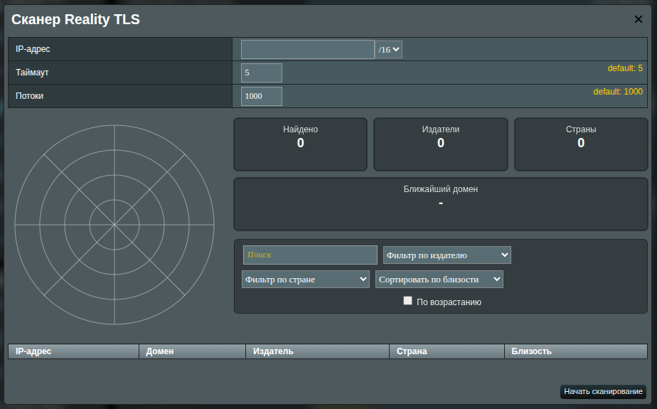
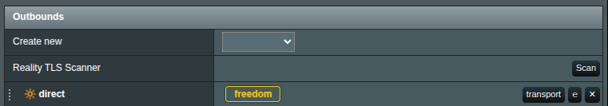
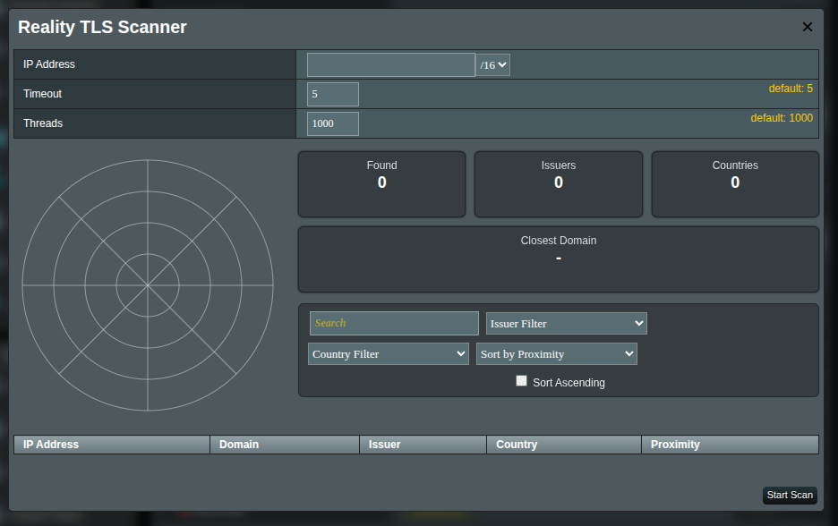
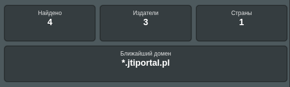
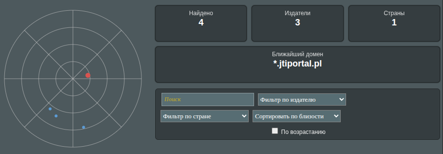
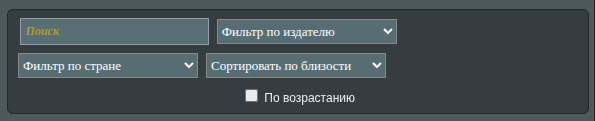
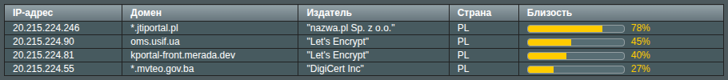

# Reality TLS Scanner (RTLS)

Сканер Reality TLS помогает находить публичные TLS-узлы в подсети и выделяет те, что находятся ближе всего к вашему целевому IP (например, VPS). Обнаруженные точки отображаются на «радаре» (`radar`) и в сортируемой таблице, чтобы вы могли быстро выбрать подходящие хосты для конфигураций на базе REALITY.

## Что делает инструмент

- Проверяет адреса в выбранной подсети (CIDR), поддерживают ли они TLS (HTTPS).
- Считывает сертификат сервера, чтобы извлечь **домен** и **издателя** (удостоверяющий центр, CA).
- Оценивает, насколько близок каждый найденный IP к вашему **целевому IP**, и показывает это как **Proximity**.
- Показывает краткую сводку и мини-карту «радар», где видно расположение результатов внутри подсети.

> [!NOTE]
> Не каждый IP в подсети обслуживает HTTPS; пустые результаты — нормальная ситуация для многих диапазонов.

## Открытие Reality TLS Scanner

1. Откройте `XRAYUI` в веб-интерфейсе.
1. В разделе `Outbounds` найдите строку `Reality TLS Scanner`.  
   
1. Нажмите кнопку `Scan`.
1. Откроется окно RTLS Scanner.  
   

## Поля ввода (верхняя панель)

Эти поля определяют, что именно сканировать:

| Поле              | Что указывать                                                                                 | По умолчанию    |
| ----------------- | --------------------------------------------------------------------------------------------- | --------------- |
| **IP Address**    | IP, вокруг которого сканировать. Это ваша **цель/VPS** для расчёта близости.                  | **обязательно** |
| **CIDR** dropdown | Диапазон подсети для сканирования (например, `/8`, `/16`, `/24`). Шире CIDR = больше адресов. | `/16`           |
| **Timeout**       | Время ожидания каждого запроса в секундах. Большее значение находит больше, но медленнее.     | `5`             |
| **Threads**       | Сколько проверок запускается одновременно. Больше = быстрее, но нагрузка на роутер выше.      | `1000`          |

> [!tip]
> В поле адреса указывайте непосредственно ваш ip ВПС. Сканер сам определит нужные подсети для сканирования относительно этого айпи. Это даст более точные результаты.

> [!WARNING]
> Слишком большое число потоков может сделать роутер неотзывчивым. Увеличивайте постепенно. Экспериментируйте и наблюдайте за `resources` на отдельной вкладке, чтобы подобрать подходящее значение для вашего устройства.

## Запуск и остановка сканирования

- Нажмите **Start Scan** для начала. Появится индикатор: «**Scanning is in progress…**».
- Нажмите **Stop Scan** в любой момент, чтобы остановить процесс.

Вы можете оставить окно открытым и наблюдать, как результаты появляются по мере нахождения.

## Чтение результатов

### Карточки сводки

- **Found** — общее число обнаруженных узлов в этом сканировании.
- **Issuers** — количество разных удостоверяющих центров (например, `Let’s Encrypt`).
- **Countries** — число разных стран по геолокации IP.
- **Closest** — один домен/IP, ближайший к вашей цели внутри выбранной подсети.  
  

### Радар

Компактная карта подсети: каждая точка — результат. Чем ближе к центру, тем ближе IP к вашей цели. Наведите курсор (или сфокусируйтесь), чтобы увидеть подсказку с IP/доменом.  

### Фильтры и сортировка

- **Поиск** — фильтрация по IP, домену или издателю.
- **Фильтр по издателю** — показать результаты от выбранного удостоверяющего центра.
- **Фильтр по стране** — показать результаты из выбранной страны.
- **Сортировать по** — порядок по **Близость**, **IP** или **Домен** (переключайте опцию **По возростанию** по необходимости).  
  

### Столбцы таблицы результатов

- **IP-адрес** — IP конечной точки.
- **домен** — имя хоста из сертификата сервера.
- **издатель (сертификата)** — кто выдал сертификат (например, DigiCert, Let’s Encrypt).
- **страна** — страна по геолокации IP (может отсутствовать или быть приблизительной).
- **близость** — насколько близок IP к цели внутри выбранной подсети. Более длинная полоса = ближе.  
  

> [!TIP]
> Высокий процент **Proximity** означает, что IP находится очень близко к цели внутри выбранного CIDR-блока.

## Рекомендуемые варианты начала

- Нужны несколько качественных, «похожих на браузер» целей?  
  Используйте **узкую подсеть** (например, `/24`) и оставьте значения по умолчанию **Timeout 5 / Threads 1000**. Если устройство загружается, снизьте **Threads** до 300–600.
- Нужен более широкий список для выбора?  
  Возьмите **более широкую подсеть** (например, `/16`) и терпение: проверок будет гораздо больше.

## Хорошая практика и этикет

- Сканируйте только диапазоны, которыми вы **владеете**, или на которые у вас есть **явное разрешение**.
- Если роутер начинает «тормозить», уменьшите **Threads** или сканируйте более узкий диапазон.
- Некоторые узлы возвращают дефолтные сертификаты (например, балансировщики нагрузки) — это нормально.

## FAQ

**Что означает “Closest”?**  
Это домен/IP с максимальным значением **Proximity** относительно вашей цели внутри выбранной подсети.

**Почему некоторые строки выглядят странно (например, общие или «аппаратные» имена)?**  
Многие устройства возвращают стандартные сертификаты (reverse-proxy, ingress-контроллеры, сетевые appliances). Это всё равно валидные находки.

**Сканирование законно?**  
Правила различаются. Сканирование публичных IP широко используется, но вы сами несёте ответственность за его применение. Сканируйте только те диапазоны, которыми вы управляете, или на которые у вас есть разрешение. Ваш провайдер может запрещать сканирование в условиях обслуживания.
