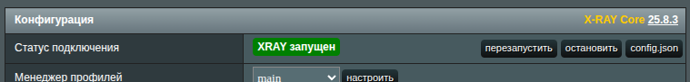
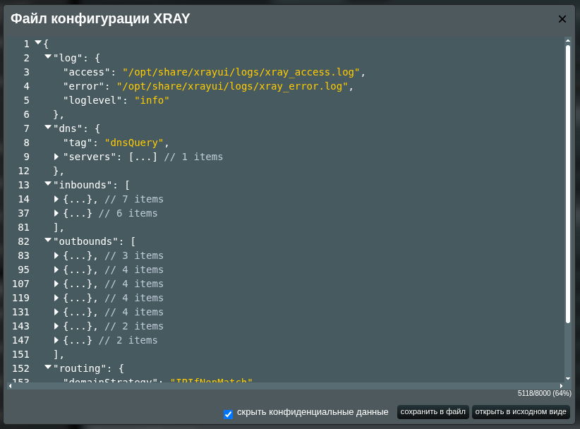

# Безопасный обмен файлом конфигурации

Файл конфигурации Xray — это JSON-файл, расположенный в `/opt/etc/xray`. Его структура может быть большой и сложной, и он _всегда_ содержит конфиденциальную информацию (например: учётные данные VPS, IP-адреса, закрытые и открытые ключи, идентификаторы пользователей и пароли).

При устранении неполадок может быть полезно поделиться вашей конфигурацией с [сообществом](https://t.me/asusxray). Перед этим вы должны замаскировать все конфиденциальные данные.

XRAYUI включает встроенный инструмент, который автоматически маскирует известные конфиденциальные поля в конфигурации.

## Как замаскировать и поделиться файлом конфигурации в XRAYUI

В разделе **Конфигурация** нажмите **`config.json`**.



Появится модальное окно с вашей текущей конфигурацией. Вы можете просмотреть активную конфигурацию в браузере.



::: warning
Не копируйте и не делитесь содержимым напрямую из модального окна. Данные не маскированы и показаны в исходном виде.
:::

В правом нижнем углу вы найдёте:

- **`Скрыть конфиденциальные данные` чекбокс** — при включении маскирует конфиденциальные значения в конфигурации символами `*`.
- **сохранить в файл** — сохраняет текущую конфигурацию как JSON-файл на вашем компьютере. Если флажок включён, сохранённый файл будет содержать замаскированные данные. Убедитесь, что все конфиденциальные значения замаскированы перед публикацией.
- **открыть в исходном виде** — открывает текущую конфигурацию напрямую в браузере.

Проверьте файл. Вы должны увидеть, что многие поля замаскированы:

```json
      "streamSettings": {
        "security": "reality",
        "realitySettings": {
          "dest": "dl.google.com:443",
          "serverNames": [
            "dl.google.com"
          ],
          "privateKey": "*******************************************",
          "shortIds": [
            "****************",
            "****************",
            "****************"
          ],
          "publicKey": "*******************************************",
          "spiderX": "*"
        },
        "sockopt": {
          "domainStrategy": "UseIP"
        }
      }
```

::: caution
Никогда не публикуйте исходную конфигурацию. Всегда используйте **сохранить в файл** с включённым **Скрыть конфиденциальные данные**.
:::

:::tip
Снимите флажок и нажмите **сохранить в файл**, чтобы быстро скачать текущий файл конфигурации в исходном виде.
:::
