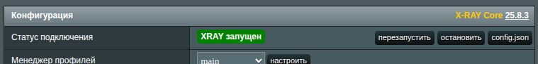
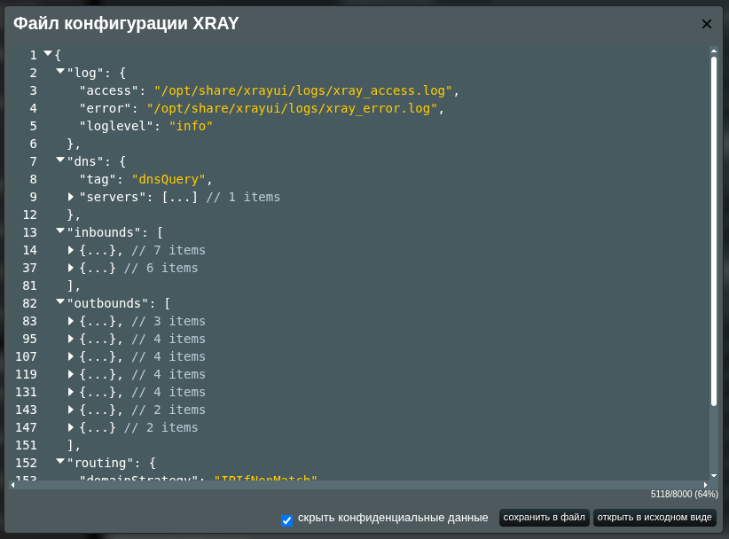

# Безопасный обмен файлом конфигурации

Файл конфигурации Xray — это JSON-файл, расположенный в `/opt/etc/xray`. Его структура может быть большой и сложной, и он _всегда_ содержит конфиденциальную информацию (например: учётные данные VPS, IP-адреса, закрытые и открытые ключи, идентификаторы пользователей и пароли).

При устранении неполадок может быть полезно поделиться вашей конфигурацией с [сообществом](https://t.me/asusxray). Перед этим вы должны замаскировать все конфиденциальные данные.

XRAYUI включает встроенный инструмент, который автоматически маскирует конфиденциальные данные в конфигурации. Полный список — в разделе [Что маскируется](#что-маскируется).

## Как замаскировать и поделиться файлом конфигурации в XRAYUI

В разделе **Конфигурация** нажмите **`config.json`**.



Появится модальное окно с вашей текущей конфигурацией. Вы можете просмотреть активную конфигурацию в браузере.



::: warning
Не копируйте содержимое напрямую из модального окна. Вложенные разделы в нём свёрнуты, поэтому скопированный текст получается неполным и не является корректным JSON. Используйте **сохранить в файл**.
:::

В правом нижнем углу вы найдёте:

- **`Скрыть конфиденциальные данные` чекбокс** — при включении маскирует конфиденциальные значения в конфигурации символами `*`. Флажок включается заново при каждом открытии модального окна.
- **сохранить в файл** — сохраняет текущую конфигурацию как JSON-файл. Если флажок включён, сохранённый файл содержит замаскированные данные. Убедитесь, что все конфиденциальные значения замаскированы перед публикацией.
- **открыть в исходном виде** — открывает файл конфигурации напрямую в браузере. Здесь данные никогда не маскируются.

Проверьте файл. Вы должны увидеть, что многие поля замаскированы:

```json
      "streamSettings": {
        "security": "reality",
        "realitySettings": {
          "dest": "*****************",
          "serverNames": [
            "*************"
          ],
          "privateKey": "*******************************************",
          "shortIds": [
            "****************",
            "****************",
            "****************"
          ],
          "publicKey": "*******************************************",
          "spiderX": "*"
        },
        "sockopt": {
          "domainStrategy": "UseIP"
        }
      }
```

::: caution
Никогда не публикуйте исходную конфигурацию. Всегда используйте **сохранить в файл** с включённым **Скрыть конфиденциальные данные**.
:::

:::tip
Снимите флажок и нажмите **сохранить в файл**, чтобы быстро скачать текущий файл конфигурации в исходном виде.
:::

## Что маскируется

- Пароли, идентификаторы пользователей, email и все закрытые и открытые ключи.
- Адреса и доменные имена серверов, пути и HTTP-заголовки.
- Ссылки подписок, включая ссылку на сервер, которая хранится у исходящих подключений с опцией **Пул авто-переключения**.
- Ссылки протоколов (`vless://`, `vmess://`, `trojan://` и другие) и UUID в любом поле.
- Отдельные публичные IP-адреса в правилах маршрутизации, хостах DNS и адресах прослушивания.
- Любое замаскированное значение, если оно повторяется в другом месте, например в правиле маршрутизации, которое направляет домен сервера в `direct`.

Протоколы, транспорты, порты, теги и большая часть правил маршрутизации (списки доменов, диапазоны IP и локальные адреса) остаются видимыми, поэтому опубликованная конфигурация по-прежнему полезна для диагностики.
