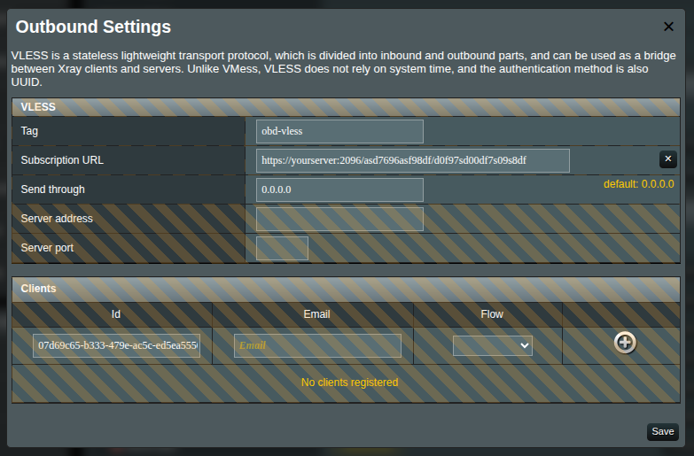
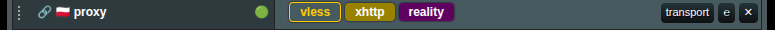
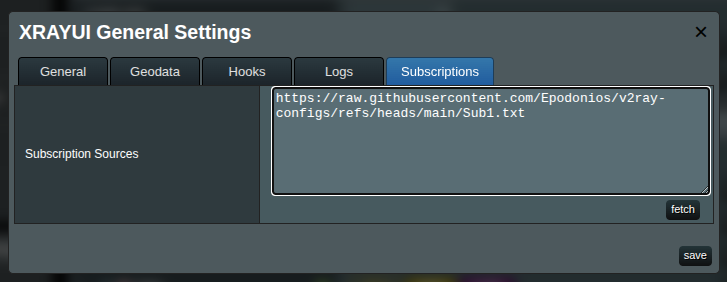
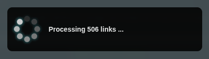
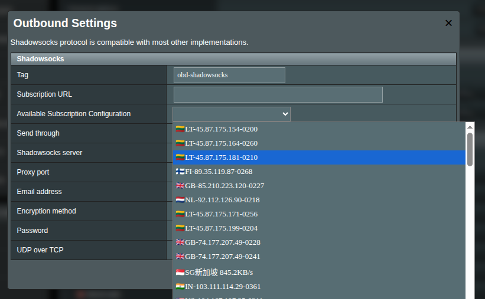
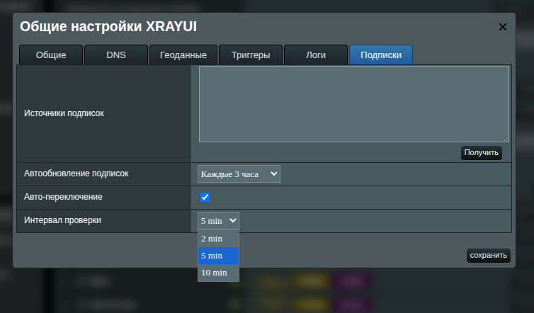
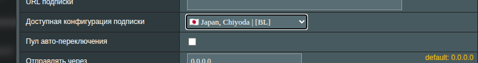
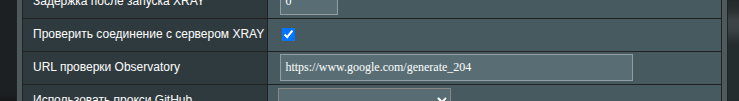
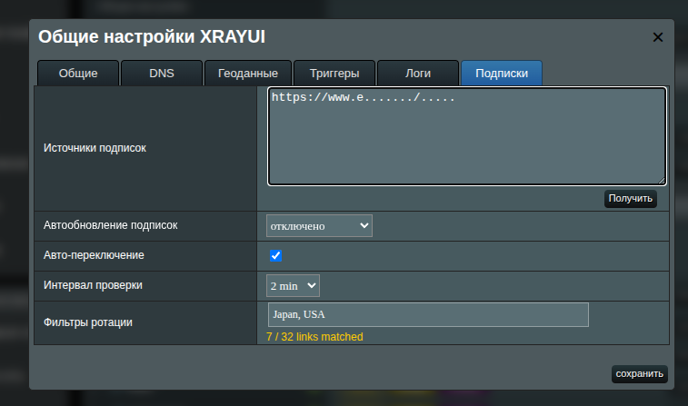

# Руководство по подпискам

Подписка в мире XRAY — удобный способ упростить обслуживание конфигурации между сервером и клиентом. После завершения настройки вашего сервера XRAY он может предоставить URL подписки, который может использовать любой клиент, совместимый с XRAY. Подписки не являются встроенной функцией самого XRAY Core — многие сторонние серверные панели и интерфейсы добавляют этот слой удобства.

Все больше проектов умеют генерировать URL подписки для вашего сервера. Загляните на [домашнюю страницу XRAY Core](https://github.com/XTLS/Xray-core), чтобы найти поддерживаемые инструменты и клиенты.

## Подписки «под капотом»

Есть два варианта URL подписок:

- **Ссылка протокола подписки (токен)**: начинается с префикса протокола прокси, такого как `ss://`, `vless://`, `vmess://` и т. д. Может быть закодирована в Base64, поэтому содержимое не читается напрямую.
- **Источник подписки**: список нескольких конфигураций прокси (каждая на своей строке, закодированы).

  > [!info]
  > Единственная по-настоящему важная разница — гранулярность: ссылка протокола отдаёт `один` прокси, источник — `много`.

  > [!warning]
  > Открытие любой из ссылок в браузере может показать "абракадабру" — это просто Base64. XRAYUI декодирует всё за вас. Если любопытно — не обязательно! — можете декодировать сами на [base64decode.org](https://www.base64decode.org/).

  > [!warning]
  > Разбор может быть непростым. Если что-то ведёт себя странно, загляните в наш [Telegram-группу](https://t.me/asusxray) — поможем.

### Ссылка протокола подписки

Одиночная ссылка на прокси — возможно, из `3x-u`, `Marzban` или любого другого [провайдера](https://github.com/XTLS/Xray-core). Пример декодированного содержимого может выглядеть так:

```text:no-line-numbers
vless://05519058-d2ac-4f28-9e4a-2b2a1386749e@1.1.1.1:22222?path=/telegram-channel-vlessconfig-ws&security=tls&encryption=none&host=somedomainname.com&type=ws&sni=telegram-channel-vlessconfig.sohala.uk#Telegram @VlessConfig
```

> [!info]
> Содержимое ссылки при открытии в браузере может быть закодировано, и вы не поймёте его сразу. Это нормально — просто предоставьте ссылку.

### Ссылка-источник подписки

Ссылка-источник подписки. Источник подписки — это ссылка, содержащая больше одного протокола. По сути это просто список протоколов (много строк со случайными `ss://`, `vless://` и т. п.).

## XRAYUI: Ссылка протокола

Начнём со ссылки протокола (надеемся, вы не пропустили важную предыдущую часть, верно?).

XRAYUI ожидает, что вы знаете протокол ссылки. Поэтому сначала нужно создать элемент outbound соответствующего протокола.

В разделе Outbounds выберите нужный протокол в выпадающем списке и создайте его. Например, у вас есть ссылка

```text:no-line-numbers
https://yourserver:2096/asd7696asf98df/d0f97sd00df7s09s8df
```

Вставьте её в поле `URL подписки`

Все зависящие от подписки поля становятся неактивными. Это означает, что эти поля и параметры будут управляться вашей подпиской.

Нажмите `сохранить`, чтобы сохранить изменения.

> [!warning]
> Помните: это не применяет изменения конфигурации. Всё равно нужно нажать `применить` в основной форме, чтобы изменения были отправлены на бэкенд и сохранены.

Когда вы примените изменения основной формы, правки вступят в силу, и страница перезагрузится. Рядом с вашим outbound появится значок ссылки, указывающий, что этот outbound управляется ссылкой подписки.


> [!info]
> Несмотря на слово «подписка» в названии, недостаточно просто обновить удалённую сторону. Чтобы изменения вступили в силу, каждый раз после изменения вашей подписки нажимайте кнопку `применить` в XRAYUI. В этом случае XRAYUI перезагрузит и применит обновлённые параметры.

Что происходит при каждом запуске или перезапуске Xray:

- XRAYUI загружает URL подписки и пересобирает по нему outbound. Тег и ваши собственные настройки — Mux, Send through, параметры сокета — сохраняются.
- Если подписка недоступна (провайдер не отвечает, DNS ещё не готов, страница ошибки), outbound сохраняет **последние рабочие настройки**, и Xray запускается как обычно.
- Если по ссылке приходит не один сервер, а список, XRAYUI оставляет сервер, который outbound уже использует, пока он есть в списке. Иначе берётся первая подходящая запись. Информационные записи, которые добавляют многие панели («Истекает …», «Осталось трафика …»), пропускаются, как и записи, указывающие на сам роутер.

> [!info]
> Опция **Пул авто-переключения** недоступна для outbound-ов с URL подписки — такой outbound всегда следует своей ссылке. Если нужно автоматическое переключение, используйте **источник** подписки и выпадающий список, описанный ниже.

## XRAYUI: Ссылка-источник

Ссылка-источник — это ссылка, содержащая более одного протокола. Она не будет работать как ссылка протокола, описанная выше, — настройка выполняется иначе.

Перейдите в `Общие настройки` в разделе конфигурации и переключитесь на вкладку `Подписки`.

Можно сохранить — окно будет перезагружено. Или укажите временную ссылку и нажмите кнопку `Получить` под текстовой областью.



Система получит ссылки из источника подписки. Визуально ничего не произошло — это нормально. Можно закрыть окно.

Если источник недоступен или возвращает не список ссылок (например, страницу технических работ или блокировки), XRAYUI использует последнюю удачную копию этого источника. Если пригодных ссылок не пришло вовсе, прежний список серверов сохраняется, а загрузка сообщает, что пригодные ссылки не найдены, — неудачная загрузка никогда не очищает список.

Однако если вы создадите новый исходящий прокси (outbound), вы получите список доступных подписок, из которого можно выбрать в списке `Доступная конфигурация подписки`


> [!warning]
> Выпадающий список доступен только если из URL был получен соответствующий тип подписки.

Теперь вы можете выбрать объект подписки в выпадающем списке, и параметры конфигурации применятся автоматически. Когда вы позже снова откроете outbound, в выпадающем списке будет показан сервер, который он использует сейчас.

> [!warning]
> Разница между источником подписки и ссылкой протокола — в гранулярности. Если ссылка содержит один элемент — вставьте её в поле URL подписки, и при перезапуске службы произойдёт автоматическая перезагрузка.
> Если же она содержит больше одного источника, для каждого outbound будет отображаться выпадающий список. Это потребует повторного применения настроек при изменениях на удалённой стороне — если только outbound не входит в [пул авто-переключения](#автоматическое-переключение-auto-fallback) и не включено [автообновление](#автоматическое-обновление-подписок): тогда такие изменения подхватываются автоматически.

## Автоматическое обновление подписок

По умолчанию источники подписок загружаются только при ручном нажатии кнопки `Получить`. Если ваш провайдер подписок часто обновляет эндпоинты серверов, можно включить автоматическое обновление, чтобы список серверов всегда оставался актуальным.



В `Общие настройки` → вкладка `Подписки` найдите настройку **Автообновление подписок** и выберите расписание:

- **Отключено** — только ручное обновление (по умолчанию)
- **Каждые 3 часа** — обновление каждые 3 часа
- **Каждые 6 часов** — каждые 6 часов
- **Каждые 12 часов** — каждые 12 часов

Обновление выполняется в фоновом режиме через cron-задачу. Используются те же ссылки подписок, которые вы уже настроили в текстовом поле выше (временная ссылка, использованная только с кнопкой `Получить`, не обновляется).

Неудачное обновление ничего не портит: недоступный источник заменяется его последней удачной копией, а если пригодных ссылок не пришло вовсе, прежний список серверов остаётся без изменений.

Если включено [автоматическое переключение](#автоматическое-переключение-auto-fallback), обновление также поддерживает в актуальном состоянии outbound-ы из пула авто-переключения. Провайдеры регулярно меняют ключи, UUID или порт сервера. Если ссылки, которую использует outbound, больше нет в обновлённом списке, XRAYUI ищет тот же сервер в новом списке — сначала по имени, затем по адресу и порту — и применяет новые данные. Если изменилось только имя (например, счётчик оставшегося трафика), ничего не перезапускается.

## Автоматическое переключение (Auto-Fallback)

Автоматическое переключение предназначено для ситуаций, когда ваш провайдер или сеть блокирует прокси-эндпоинт. При включении XRAYUI регулярно проверяет, доступен ли ваш активный прокси. Если эндпоинт недоступен, outbound переключается на другой рабочий сервер из пула подписки. Правила маршрутизации, DNS-настройки и собственные параметры outbound остаются нетронутыми — меняются только параметры подключения.

### Как включить

Настройка состоит из двух частей:

**1. Глобальный переключатель** — В `Общие настройки` → вкладка `Подписки`:

- Включите чекбокс **Авто-переключение**. Это активирует систему мониторинга состояния.
- Выберите **Интервал проверки** (2, 5 или 10 минут). Это определяет, как часто система проверяет доступность ваших эндпоинтов.

> [!important]
> Для работы автоматического переключения необходимо включить функцию **Проверка соединений Xray** в `Общие настройки` → вкладка `Общие`. Эта функция позволяет Xray отслеживать доступность ваших эндпоинтов. Если она отключена, в настройках авто-переключения будет отображено сообщение с пояснением.

**2. Включение для каждого outbound** — В настройках каждого outbound:

- Сначала выберите эндпоинт из выпадающего списка `Доступная конфигурация подписки` (для этого необходимо предварительно загрузить источники подписок).
- Затем включите чекбокс **Пул авто-переключения**. Это привязывает outbound к пулу подписки для автоматического восстановления.

> [!info]
> Только outbound-ы с включённым чекбоксом **Пул авто-переключения** участвуют в автоматическом переключении. Остальные outbound-ы остаются без изменений.

> [!warning]
> Нужны обе части. Если пул включён у outbound, но глобальный переключатель **Авто-переключение** выключен, ничего не переключается: в настройках outbound рядом с чекбоксом показывается предупреждение, а значок 🔄 в списке outbound-ов становится бледным.

Чекбокс **Пул авто-переключения** недоступен для outbound-ов с **URL подписки** — они следуют своей ссылке (см. [XRAYUI: Ссылка протокола](#xrayui-ссылка-протокола)).



### URL проверки (Probe URL)

По умолчанию проверка соединений выполняется путём отправки запроса на `https://www.google.com/generate_204`. Если этот URL не подходит для вашего окружения (например, если он заблокирован в вашем регионе), его можно изменить в `Общие настройки` → вкладка `Общие` в поле **URL проверки Observatory** (отображается при включённой опции **Проверить соединение с сервером XRAY**). Соседняя настройка **Интервал проверки Observatory** задаёт частоту проверок — увеличьте её, если подписки добавляют много outbound.



Успешной считается проверка с любым HTTP-ответом, пришедшим через outbound, — Xray не смотрит на код ответа. Используйте адрес `https://`, чтобы страница блокировки провайдера не выдавала себя за рабочее соединение.

Результат Observatory также виден в списке **Outbounds**: 🟢 работает (при наведении видна задержка), 🔴 недоступен (при наведении видна ошибка, которую сообщил Xray), 🟡 результата ещё нет.

### Фильтры ротации

Если ваш пул подписки содержит серверы во многих регионах, но вы хотите переключаться только между определённой подгруппой, можно задать **Фильтры ротации** в `Общие настройки` → вкладка `Подписки`.



Введите ключевые слова через запятую (например, `Canada, Denmark`). При поиске нового сервера рассматриваются только ссылки подписки, в имени которых есть хотя бы одно из ключевых слов (для ссылок без имени вместо него берётся адрес сервера). Регистр букв не важен, имена могут быть на любом языке — например, `канада`.

Если фильтры не заданы или ни одно ключевое слово не совпадает со ссылками в пуле, используется весь пул подписки, а в журнал роутера пишется предупреждение.

### Как это работает

При каждой проверке для каждого outbound из пула:

1. XRAYUI запрашивает у Xray **последний** результат проверки этого outbound. Учитывается только результат новее того, что был виден в прошлый раз, поэтому один и тот же результат никогда не считается дважды.
2. Одиночный сбой не приводит к переключению. XRAYUI ждёт **3 неудачные проверки подряд**, чтобы не реагировать на кратковременные сетевые проблемы. Если сам роутер сообщает об отсутствии интернета (WAN недоступен), сбои не засчитываются.
3. После 3 неудач XRAYUI выбирает следующий сервер. Первым пробуется сервер, который вы выбрали изначально (если outbound уже переключался с него), затем пул просматривается в порядке провайдера, начиная с сервера после текущего. Фильтры ротации учитываются. Пропускаются:
   - серверы, которые уже использует другой outbound, — два outbound-а не окажутся на одном сервере, пока есть альтернативы;
   - серверы, которые не работали в течение последних 6 часов;
   - информационные записи вроде «Истекает …» или «Осталось трафика …» (адреса вида `0.0.0.0`), а также записи, указывающие на сам роутер;
   - ссылки, которые установленная версия Xray не может использовать (например, устаревшие транспорты);
   - серверы, которые не принимают подключения с роутера (проверяется только для серверов на TCP; сервер, имя которого не удалось разрешить, по этой причине не пропускается).
4. Переключение выполняется через **Xray API** практически без простоя. Если это невозможно, Xray перезапускается. Если Xray не запускается с новым сервером, возвращается прежний.
5. Затем XRAYUI ждёт, пока Xray проверит новый сервер. Если он тоже недоступен, сразу пробуется следующий — до 3 серверов за одну проверку. Если интервал проверки Observatory больше 60 секунд, это откладывается до следующей проверки: только что выбранный сервер, не прошедший первую проверку, заменяется без ожидания трёх неудач.

Заменяются только параметры подключения (адрес, ключи, транспорт и безопасность). Тег outbound, **Send through**, **Mux**, параметры сокета, TCP-маски fragment/noise и настройки XHTTP `extra` сохраняются, поэтому правила маршрутизации и балансировщики, использующие этот тег, продолжают работать.

> [!info]
> Настройки пула подписки сохраняются при перезапуске Xray. Повторная настройка пула после перезапуска сервиса не требуется.

> [!info]
> Если страница XRAYUI была открыта ещё до автоматического переключения, нажатие **Применить** на ней сохранит новый сервер и не вернёт нерабочий — если только вы сами не выбрали на этой странице другой сервер.

### Ограничения безопасности

- Не более **10 переключений в час** на один outbound.
- Если все серверы пула недавно не работали, список неудачных серверов очищается, и пул пробуется снова при одной из следующих проверок.
- Если в пуле не осталось подходящих серверов, XRAYUI обновляет источники подписок (не чаще одного раза в час).
- За одну проверку просматривается не более 20 серверов на outbound; остальные проверяются в следующий раз.

Каждый шаг записывается в системный журнал роутера с префиксом `Failover:` (например, `logread | grep Failover`).
