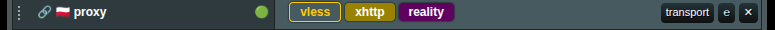
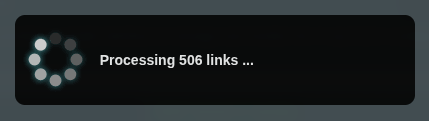
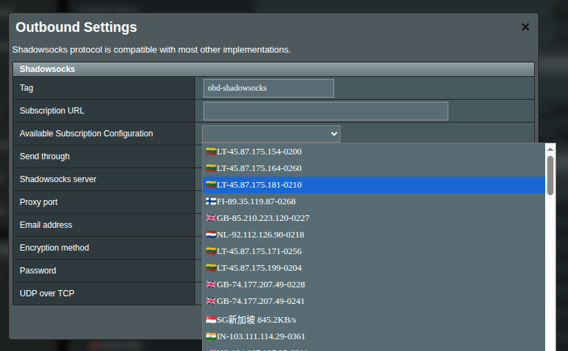

# Руководство по подпискам

Подписка в мире XRAY — удобный способ упростить обслуживание конфигурации между сервером и клиентом. После завершения настройки вашего сервера XRAY он может предоставить URL подписки, который может использовать любой клиент, совместимый с XRAY. Подписки не являются встроенной функцией самого XRAY Core — многие сторонние серверные панели и интерфейсы добавляют этот слой удобства.

Все больше проектов умеют генерировать URL подписки для вашего сервера. Загляните на [домашнюю страницу XRAY Core](https://github.com/XTLS/Xray-core), чтобы найти поддерживаемые инструменты и клиенты.

## Подписки «под капотом»

Есть два варианта URL подписок:

- **Ссылка протокола подписки (токен)**: начинается с префикса протокола прокси, такого как `ss://`, `vless://`, `vmess://` и т. д. Может быть закодирована в Base64, поэтому содержимое не читается напрямую.
- **Источник подписки**: список нескольких конфигураций прокси (каждая на своей строке, закодированы).

  > [!info]
  > Единственная по-настоящему важная разница — гранулярность: ссылка протокола отдаёт `один` прокси, источник — `много`.

  > [!warning]
  > Открытие любой из ссылок в браузере может показать "абракадабру" — это просто Base64. XRAYUI декодирует всё за вас. Если любопытно — не обязательно! — можете декодировать сами на [base64decode.org](https://www.base64decode.org/).

  > [!warning]
  > Разбор может быть непростым. Если что-то ведёт себя странно, загляните в наш [Telegram-группу](https://t.me/asusxray) — поможем.

### Ссылка протокола подписки

Одиночная ссылка на прокси — возможно, из `3x-u`, `Marzban` или любого другого [провайдера](https://github.com/XTLS/Xray-core). Пример декодированного содержимого может выглядеть так:

```text:no-line-numbers
vless://05519058-d2ac-4f28-9e4a-2b2a1386749e@1.1.1.1:22222?path=/telegram-channel-vlessconfig-ws&security=tls&encryption=none&host=somedomainname.com&type=ws&sni=telegram-channel-vlessconfig.sohala.uk#Telegram @VlessConfig
```

> [!info]
> Содержимое ссылки при открытии в браузере может быть закодировано, и вы не поймёте его сразу. Это нормально — просто предоставьте ссылку.

### Ссылка-источник подписки

Ссылка-источник подписки. Источник подписки — это ссылка, содержащая больше одного протокола. По сути это просто список протоколов (много строк со случайными `ss://`, `vless://` и т. п.).

## XRAYUI: Ссылка протокола

Начнём со ссылки протокола (надеемся, вы не пропустили важную предыдущую часть, верно?).

XRAYUI ожидает, что вы знаете протокол ссылки. Поэтому сначала нужно создать элемент outbound соответствующего протокола.

В разделе Outbounds выберите нужный протокол в выпадающем списке и создайте его. Например, у вас есть ссылка

```text:no-line-numbers
https://yourserver:2096/asd7696asf98df/d0f97sd00df7s09s8df
```

Вставьте её в поле `URL подписки`

Все зависящие от подписки поля становятся неактивными. Это означает, что эти поля и параметры будут управляться вашей подпиской.

Нажмите `сохранить`, чтобы сохранить изменения.

> [!warning]
> Помните: это не применяет изменения конфигурации. Всё равно нужно нажать `применить` в основной форме, чтобы изменения были отправлены на бэкенд и сохранены.

Когда вы примените изменения основной формы, правки вступят в силу, и страница перезагрузится. Рядом с вашим outbound появится значок ссылки, указывающий, что этот outbound управляется ссылкой подписки.


> [!info]
> Несмотря на слово «подписка» в названии, недостаточно просто обновить удалённую сторону. Чтобы изменения вступили в силу, каждый раз после изменения вашей подписки нажимайте кнопку `применить` в XRAYUI. В этом случае XRAYUI перезагрузит и применит обновлённые параметры.

## XRAYUI: Ссылка-источник

Ссылка-источник — это ссылка, содержащая более одного протокола. Она не будет работать как ссылка протокола, описанная выше, — настройка выполняется иначе.

Перейдите в `Общие настройки` в разделе конфигурации и переключитесь на вкладку `Подписки`.

Можно сохранить — окно будет перезагружено. Или укажите временную ссылку и нажмите кнопку `Получить` под текстовой областью.



Система получит ссылки из источника подписки. Визуально ничего не произошло — это нормально. Можно закрыть окно.

Однако если вы создадите новый исходящий прокси (outbound), вы получите список доступных подписок, из которого можно выбрать в списке `Доступная конфигурация подписки`


> [!warning]
> Выпадающий список доступен только если из URL был получен соответствующий тип подписки.

Теперь вы можете выбрать объект подписки в выпадающем списке, и параметры конфигурации применятся автоматически.

> [!warning]
> Разница между источником подписки и ссылкой протокола — в гранулярности. Если ссылка содержит один элемент — вставьте её в поле URL подписки, и при перезапуске службы произойдёт автоматическая перезагрузка.
> Если же она содержит больше одного источника, для каждого outbound будет отображаться выпадающий список. Это потребует повторного применения настроек при изменениях на удалённой стороне.

## Автоматическое обновление подписок

По умолчанию источники подписок загружаются только при ручном нажатии кнопки `Получить`. Если ваш провайдер подписок часто обновляет эндпоинты серверов, можно включить автоматическое обновление, чтобы список серверов всегда оставался актуальным.


В `Общие настройки` → вкладка `Подписки` найдите настройку **Автообновление подписок** и выберите расписание:

- **Отключено** — только ручное обновление (по умолчанию)
- **Каждые 3 часа** — обновление каждые 3 часа
- **Каждые 6 часов** — каждые 6 часов
- **Каждые 12 часов** — каждые 12 часов

Обновление выполняется в фоновом режиме через cron-задачу. Используются те же ссылки подписок, которые вы уже настроили в текстовом поле выше.

## Автоматическое переключение (Auto-Fallback)

Автоматическое переключение предназначено для ситуаций, когда ваш провайдер или сеть блокирует прокси-эндпоинт. При включении XRAYUI будет периодически проверять, доступен ли ваш активный прокси. Если будет обнаружено, что эндпоинт недоступен, система автоматически переключится на следующий рабочий сервер из пула подписки. Правила маршрутизации, DNS-настройки и всё остальное останутся нетронутыми — изменятся только параметры подключения.

### Как включить

Настройка состоит из двух частей:

**1. Глобальный переключатель** — В `Общие настройки` → вкладка `Подписки`:

- Включите чекбокс **Авто-переключение**. Это активирует систему мониторинга состояния.
- Выберите **Интервал проверки** (2, 5 или 10 минут). Это определяет, как часто система проверяет доступность ваших эндпоинтов.

> [!important]
> Для работы автоматического переключения необходимо включить функцию **Проверка соединений Xray** в `Общие настройки` → вкладка `Общие`. Эта функция позволяет Xray отслеживать доступность ваших эндпоинтов. Если она отключена, в настройках авто-переключения будет отображено сообщение с пояснением.

**2. Включение для каждого outbound** — В настройках каждого outbound:

- Сначала выберите эндпоинт из выпадающего списка `Доступная конфигурация подписки` (для этого необходимо предварительно загрузить источники подписок).
- Затем включите чекбокс **Пул авто-переключения**. Это привязывает outbound к пулу подписки для автоматического восстановления.

> [!info]
> Только outbound-ы с включённым чекбоксом **Пул авто-переключения** участвуют в автоматическом переключении. Остальные outbound-ы остаются без изменений.


### URL проверки (Probe URL)

По умолчанию проверка соединений выполняется путём отправки запроса на `https://www.google.com/generate_204`. Если этот URL не подходит для вашего окружения (например, если он заблокирован в вашем регионе), его можно изменить в `Общие настройки` → вкладка `Подписки` в поле **URL проверки**.


URL проверки должен возвращать HTTP-ответ `204 No Content`, чтобы считаться успешным. Подойдёт любой эндпоинт, возвращающий 204.

### Фильтры ротации

Если ваш пул подписки содержит серверы во многих регионах, но вы хотите переключаться только между определённой подгруппой, можно задать **Фильтры ротации** в `Общие настройки` → вкладка `Подписки`.


Введите ключевые слова через запятую (например, `Canada, Denmark`). При автоматическом переключении на новый сервер будут рассматриваться только ссылки подписки, в названии или URL которых содержится хотя бы одно из указанных ключевых слов. Ссылки, не соответствующие ни одному ключевому слову, пропускаются.

Если фильтры не заданы или ни одно ключевое слово не совпадает с ссылками в пуле, используется весь пул подписки, как и прежде.

### Как это работает

Система проверяет outbound-ы с включённым пулом по настроенному расписанию. Для каждого из них:

1. Проверяется доступность эндпоинта с помощью функции **Проверка соединений**. Xray непрерывно зондирует настроенные эндпоинты и предоставляет надёжные и актуальные данные о состоянии.
2. При одиночном сбое переключение не происходит. Система ждёт **3 последовательных неудачи**, чтобы не реагировать на временные сетевые проблемы.
3. После 3 неудач система переключается на следующий сервер в пуле подписки (с учётом фильтров ротации, если они заданы). Проверка соединений подтвердит доступность нового сервера в следующем цикле.
4. Переключение выполняется мгновенно через **Xray API** практически без простоя. Если API недоступен, система автоматически переключается на полный перезапуск Xray.

> [!info]
> Настройки пула подписки сохраняются при перезапуске Xray. Повторная настройка пула после перезапуска сервиса не требуется.

Встроенное ограничение безопасности предотвращает чрезмерное переключение — не более 5 переключений в час на один outbound. Если все эндпоинты в пуле недоступны, система очищает список неудачных и повторяет попытку в следующем цикле.
