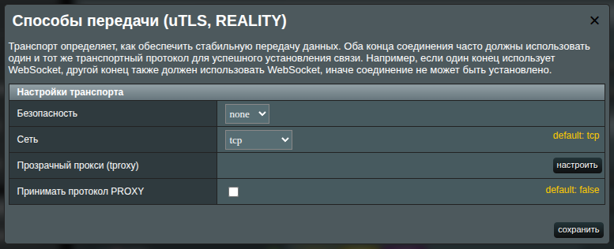
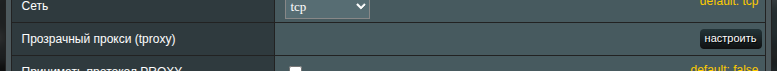
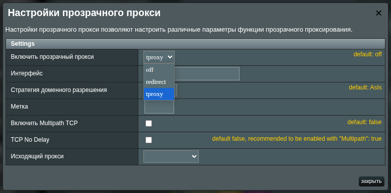

# Прозрачное проксирование (TPROXY)

XRAYUI поддерживает два режима маршрутизации:

- режим `REDIRECT`
- режим `TPROXY`

## Что такое REDIRECT

`REDIRECT` использует NAT (цели iptables `REDIRECT`/DNAT в цепочке `PREROUTING`) для перенаправления трафика на локальный порт прослушивания (ваш входящий **dokodemo**).

Ключевые особенности:

- Простой развёртывание; не требует политик `routing` и `fwmarks`.
- В первую очередь подходит для `TCP`. `UDP` и `QUIC/HTTP3` в этом режиме работают ненадёжно.
- Исходный адрес/порт назначения не сохраняется, что ограничивает продвинутую маршрутизацию и поведение некоторых протоколов.

## Что такое TPROXY

`TPROXY` (Transparent Proxy) использует цель iptables `TPROXY` (таблица mangle) вместе с `policy routing` и `fwmarks`. Xray привязывается с `IP_TRANSPARENT`, поэтому получает пакеты с сохранением исходных адресов назначения (и источника).  
Ключевые преимущества:

- Надёжно обрабатывает и `TCP`, и `UDP`, включая `QUIC/HTTP3`.
- Сохраняет исходный адрес назначения, что обеспечивает точные решения маршрутизации и меньше пограничных случаев.
- Рекомендуется для большинства установок.

> [!info]
> При включении `TPROXY` XRAYUI автоматически настраивает необходимые правила файрвола и policy routing.

## TPROXY против REDIRECT на Asuswrt-Merlin

XRAYUI на Asuswrt-Merlin берёт на себя сложную часть. Выберите режим под ваши сценарии и нажмите **Apply**.

| Что вы делаете                     | Выберите     | Почему это помогает                                                                                    |
| ---------------------------------- | ------------ | ------------------------------------------------------------------------------------------------------ |
| Онлайн-игры и голосовой чат        | **TPROXY**   | Стабильнее для игрового трафика и чатов; меньше случайных обрывов.                                     |
| Видеостриминг — YouTube, 4K, IPTV  | **TPROXY**   | Современные стримы могут использовать QUIC/HTTP3; с TPROXY меньше буфера.                              |
| Видеозвонки — Zoom/Teams/Meet      | **TPROXY**   | Более надёжные аудио/видео-каналы.                                                                     |
| Загрузки и торренты                | **TPROXY**   | Лучше, когда приложения используют UDP-трекеры и DHT.                                                  |
| Повседневный веб, почта, сайты     | **REDIRECT** | Просто и стабильно для классического серфинга. Если сайт капризничает — обход.                         |
| Смарт-ТВ, консоли, приставки       | **TPROXY**   | Лучший выбор для смешанных приложений и стриминга на технике в гостиной.                               |
| Умный дом, принтеры, локальный NAS | **REDIRECT** | Проще — лучше; такой трафик в основном локальный.                                                      |
| Старый/маломощный роутер           | **REDIRECT** | Легче и быстрее. **TPROXY требует больших ресурсов**. При необходимости позже переключитесь на TPROXY. |

### Ну, короче говоря

- Если вы играете, стримите или часто звоните — начинайте с **TPROXY**. Большая нагрузка на роутер.
- Если в основном просто просматриваете сайты и простой онлайн — подойдёт **REDIRECT**. Меньшая нагрузка на роутер.

> [!tip]
> Разные устройства дома? Используйте **TPROXY** по умолчанию, а затем исключайте устройство или порт через **Bypass/Redirect Policy**, если что-то работает некорректно.

> [!note]
> После смены режима у входящего **dokodemo** вернитесь на главную страницу и нажмите **Apply**, чтобы XRAYUI обновил правила роутера.

> [!warning]
> Большинство современных маршрутизаторов ASUS (AC/AX/BE) поддерживают `TPROXY`. Если ваша прошивка не поддерживает `TPROXY` на этой модели, выберите **REDIRECT**. Позже можно переключиться после обновления.

## Как переключиться на TPROXY

В целом XRAY/XRAYUI лучше работает в режиме TPROXY. Рекомендуется перевести основной inbound на TPROXY.

1. В **Входящие подключения** найдите ваш основной входящий **dokodemo** (часто с тегом `all-in`).  
   Нажмите кнопку **транспорт** рядом с ним.

   Откроется модальное окно **Способы передачи (uTLS, REALITY)**.

   

2. Найдите строку **Прозрачный прокси (tproxy)** и нажмите **настроить**.  
   

3. В модальном окне **Настройки прозрачного прокси** установите **Включить прозрачный прокси** в значение `tproxy`.  
   

4. Нажмите **сохранить**. Убедитесь, что рядом с входящим dokodemo появился оранжевый бейдж `tproxy`.

5. Вернитесь на главную страницу и нажмите **применить**, чтобы отправить изменения на роутер и при необходимости перезапустить Xray.
